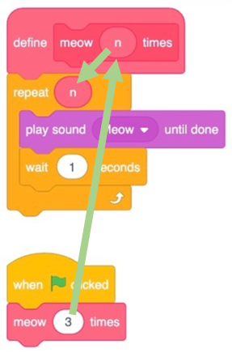

title: Introducción a la abstracción

## Introducción

El objetivo de la abstracción es simplificar la programación y promover la reutilización de código.

Al dividir un programa en tareas más simples, se maneja la complejidad de manera más eficiente, se organiza el código de forma modular y escalable y permite cambios sin afectar otras partes del programa.

## Definición

``` title="abstracción" linenums="1" 
Acción y efecto de abstraer o abstraerse.
```

``` title="abstraer" linenums="1"
Apartar, separar por medio de una operación intelectual un rasgo o una cualidad de algo para analizarlos aisladamente o considerarlos en su pura esencia o noción.
Hacer caso omiso de algo, o dejarlo a un lado.
```

El objetivo de la abstracción es simplificar la programación y promover la reutilización de código, ya que, en términos generales, se refiere al proceso de separar o distanciar los aspectos esenciales de un problema de sus detalles concretos y particulares. 

En esencia, la abstracción implica centrarse en los elementos fundamentales y generales, ignorando o dejando de lado los detalles específicos y menos relevantes.

Es un proceso de simplificación y generalización que permite comprender, comunicar y trabajar con ideas y elementos complejos de manera más eficiente.

## Abstracción en el contexto de la programación y la informática

La abstracción es un concepto fundamental en la programación y se encuentra en varios tópicos, pero es más prominente en los siguientes:

1. **Programación Orientada a Objetos (POO)**: La abstracción es un pilar de la POO. Se utiliza para ocultar la complejidad de los detalles y mostrar solo la funcionalidad al usuario. Por ejemplo, cuando se crea una clase (que es una abstracción de un objeto del mundo real), no necesitamos entender cómo funciona internamente para poder usarla.

2. **Diseño de Software y Arquitectura**: La abstracción ayuda a separar las preocupaciones y a crear componentes de software más manejables. Por ejemplo, en el diseño de sistemas, se pueden crear capas de abstracción para separar la lógica de negocio de la lógica de acceso a datos.

3. **Algoritmos y Estructuras de Datos**: Al diseñar algoritmos y estructuras de datos, a menudo se utiliza la abstracción para simplificar el problema y concentrarse en lo que realmente importa.

Por lo tanto, la abstracción puede entrar en varios tópicos de programación dependiendo del contexto.

!!! success "¡Recuerda!"
    En el contexto de la programación y la informática, la abstracción se refiere proceso que tiene la capacidad de representar un conjunto de datos, conceptos y elementos complejos del mundo real de manera simplificada, concisa y generalizada, a través de modelos o estructuras que permiten trabajar con ellos de manera más eficiente y comprensible en un programa.

La abstracción busca capturar los aspectos esenciales y relevantes de una entidad o problema, omitiendo los detalles innecesarios.

En la programación, se utilizan técnicas de abstracción, como la encapsulación y la creación de interfaces, para ocultar los detalles internos y complejos de un componente o sistema, y proporcionar una forma más fácil de interactuar con él.
Puede manifestarse en diferentes niveles y paradigmas:

* En un nivel más alto, puede implicar la creación de interfaces, clases o módulos que encapsulan la funcionalidad y ocultan los detalles de implementación subyacentes. Esto permite que los usuarios o programadores interactúen con estas abstracciones sin tener que preocuparse por los detalles internos.
* En un nivel más bajo, la abstracción puede involucrar la creación de funciones, procedimientos o bloques de código que agrupan instrucciones relacionadas y se utilizan para resolver tareas específicas. Estas abstracciones ayudan a modularizar y organizar el código, facilitando su mantenimiento y reutilización.

## Abstracción en programación imperativa: funciones y procedimientos

En programación imperativa, la abstracción se refiere a la capacidad de agrupar un conjunto de instrucciones en una sola unidad lógica y tratarla como una entidad única. La idea es simplificar y organizar el código para facilitar su comprensión y mantenimiento.

En este paradigma, la abstracción se logra mediante el uso de **funciones** o **procedimientos** (también conocidos como **subrutinas**):

* Una **función** es un bloque de código que toma ciertos valores de entrada, realiza una serie de operaciones y devuelve un resultado. 
* Un **procedimiento** es similar a una función, pero no devuelve un valor específico, sino que realiza una serie de acciones.

Al utilizar funciones y procedimientos, se **pueden agrupar instrucciones relacionadas en una única entidad abstracta**. Esto permite separar la lógica del programa en módulos más pequeños y manejables, lo que facilita la comprensión del código y su reutilización en diferentes partes del programa.

La abstracción en programación imperativa también puede lograrse mediante el uso de **estructuras abstractas de datos**. Estas son estructuras que **definen un conjunto de operaciones y reglas de acceso**, pero **ocultan los detalles internos de implementación**. 

Al utilizar estructuras de datos abstractas, se puede trabajar con datos de manera más abstracta y enfocarse en la forma en que se manipulan y acceden, en lugar de preocuparse por los detalles específicos de almacenamiento y organización.

Por ahora no te preocupes. Suena complejo, pero lo entenderás muy bien cuando veamos el tema en profundidad, más adelante.


## Introducción a la abstracción en el contexto de la programación visual

Al igual que con la plataforma de [Pilas Bloques](https://pilasbloques.program.ar/){: target="_blank"}, [Scatch](https://scratch.mit.edu/){: target="_blank"} es una excelente manera de ingresar a la programación de computadoras porque te permite jugar con bloques de construcción de una manera visual, sin tener que preocuparte por la sintaxis de llaves, puntos y comas, paréntesis y similares.

Scratch es un lenguaje de programación visual desarrollado por el MIT. Y utiliza bloques de construcción de codificación esenciales similares a los vistos en Pilas Bloques. Posee un IDE (entorno de desarrollo integrado) muy amigable que te permitirá resolver una gran variedad de problemas computacionales, aunque no es tema para esta bibliografía. Solo te contaremos que Scratch posee un gato estrella que nos ayudará a comprender el concepto de abstracción.

{: class="center back-white border-round"}

!!! info "Te interesaría saber:" 
    Al gato, por cierto, podemos llamarlo **sprite**: un término general utilizado en la programación de juegos para un objeto o personaje en la pantalla con el que el jugador interactuará.

Si quieres echarle un vistazo, puedes ingresar en [https://scratch.mit.edu/](https://scratch.mit.edu/){: target="_blank"}

Junto con la pseudocodificación, la abstracción es una habilidad y un concepto esencial dentro de la programación informática.

!!! abstract "Definición"
    Dijimos que la abstracción es el acto de simplificar un problema en problemas cada vez más pequeños.

Por ejemplo, si estuviera organizando una gran cena para sus amigos, ¡el problema de tener que cocinar toda la comida podría ser bastante abrumador! Sin embargo, si divide la tarea de cocinar la comida en tareas (o problemas) cada vez más pequeños, la gran tarea de crear esta deliciosa comida puede parecer menos desafiante.

En programación, e incluso dentro de Scratch, podemos ver la abstracción en acción. Realicemos un programa que haga que el gato haga 3 maullidos:


Date cuenta de que estamos haciendo lo mismo, repitiendo bloques una y otra vez. De hecho, si te ves codificando repetidamente las mismas declaraciones, es probable que puedas programar de manera más ingeniosa, abstrayendo el código repetitivo.

Puedes modificar tu código de la siguiente manera, usando un **bucle**, **ciclo** o **bloque de repetición**:


Ahora nuestro programa logra los mismos resultados, pero con menos bloques. 

Podemos considerar que **tiene un mejor diseño**: si hay algo que quisiéramos cambiar, **solo tendríamos que cambiarlo en un solo lugar en lugar de tres**.

Observe que el ciclo hace exactamente lo que hizo el programa anterior. Sin embargo, el **problema se simplifica abstrayendo la repetición a un bloque que repite el código** para nosotros.

Podemos usar la idea de **abstracción** para combinar **varias acciones como si fuera una sola**, para que podamos usarlas y pensar en ellas más fácilmente. Para ello, debemos implementar un procedimiento. Este concepto lo veremos más adelante, pero por el momento hay que entenderlo como un bloque de código independiente que realizar una tarea específica, y tienen un identificador único para ser llamado:

{: class="center back-white border-round"}

Nota que estamos definiendo nuestro propio **procedimiento** (bloque de código aislado) llamado **meow**. La función reproduce el sonido _meow_, y luego espera un segundo. Así, la lógica del procedimiento queda aislada de su implementación.

Ahora, nuestro bloque principal del programa solo puede usar el procedimiento **meow**, y podremos leer este código más tarde y entender lo que hace más fácilmente.

Aquí puedes ver que cuando se hace clic en la bandera verde, la llamada al procedimiento **meow** se repite tres veces.

Incluso, el procedimiento puede tener un parámetro **n**, y recibir un valor como **argumento** que le indique que debe repetir el bloque de código varias veces:

{: class="center back-white border-round"}

Nota como **n** toma el valor pasado desde la llamada **meow 3 times**.

Ahora, el procedimiento **meow** consigue el mismo efecto, pero podemos reutilizarlo fácilmente o cambiar el número de veces que nuestro gato dice miau.

!!! success "¡Recuerda!"
    Una buena estrategia cuando se programa es dividir un problema más grande en problemas más pequeños y resolverlos primero.

## Ejemplo de abstracción en programación imperativa

Un ejemplo de abstracción en programación imperativa se puede ver en el uso de funciones o procedimientos para encapsular un conjunto de instrucciones relacionadas y reutilizables. Estas abstracciones permiten simplificar y modularizar el código, evitando la repetición y mejorando la legibilidad.

Supongamos que tenemos un programa que necesita calcular el área de diferentes figuras geométricas, como cuadrados, círculos y triángulos. 

Podemos utilizar funciones para abstraer la lógica de cálculo del área para cada una de estas figuras. 

Aquí hay un ejemplo en Python:

``` py title="Python"
def calcular_area_cuadrado(lado):
  return lado * lado

def calcular_area_circulo(radio):
  PI = 3.14159265359 
  return PI * radio * radio

def calcular_area_triangulo(base, altura):
  return base * altura / 2

lado = 5
area_cuadrado = calcular_area_cuadrado(lado)
print("El área del cuadrado de lado", lado, "es:", area_cuadrado)

radio = 3
area_circulo = calcular_area_circulo(radio)
print("El área del círculo de radio", radio, "es:", area_circulo)

base = 4
altura = 6
area_triangulo = calcular_area_triangulo(base, altura)
print("El área del triángulo de base", base, "y altura", altura, "es:", area_triangulo)
```

En este ejemplo, hemos creado tres funciones:
* calcular_area_cuadrado
* calcular_area_circulo
* calcular_area_triangulo

Cada una de estas funciones recibe los parámetros necesarios para realizar el cálculo del área y devuelve el resultado correspondiente.

``` py title="Python"
def calcular_area_cuadrado(lado):
  return lado * lado

def calcular_area_circulo(radio):
  PI = 3.14159265359 
  return PI * radio * radio

def calcular_area_triangulo(base, altura):
  return base * altura / 2
```

Gracias a estas abstracciones, podemos utilizar estas funciones en diferentes partes de nuestro programa para calcular el área de las diferentes figuras geométricas sin tener que repetir el código de cálculo en cada instancia. 

En este caso, las funciones abstractas nos permiten calcular el área de diferentes figuras geométricas sin preocuparnos por los detalles específicos de cada cálculo. Esto simplifica y organiza el código, y facilita su reutilización en diferentes partes del programa donde sea necesario calcular áreas.

``` py title="Python"
lado = 5
area_cuadrado = calcular_area_cuadrado(lado)
print("El área del cuadrado de lado", lado, "es:", area_cuadrado)

radio = 3
area_circulo = calcular_area_circulo(radio)
print("El área del círculo de radio", radio, "es:", area_circulo)

base = 4
altura = 6
area_triangulo = calcular_area_triangulo(base, altura)
print("El área del triángulo de base", base, "y altura", altura, "es:", area_triangulo)
```

## Abstracción en programación orientada a objetos: clases, interfaces y objetos

Como dijimos, la abstracción se refiere proceso que tiene la capacidad de representar un conjunto de datos, conceptos y elementos complejos del mundo real de manera simplificada, concisa y generalizada, a través de modelos o estructuras que permiten trabajar con ellos de manera más eficiente y comprensible en un programa.

Es una técnica que permite aislar ciertos aspectos relevantes de un problema y enfocarse únicamente en ellos, ignorando los detalles innecesarios.

!!! success "¡Recuerda!"
    En la programación orientada a objetos, la abstracción se logra mediante la creación de clases, que son plantillas o moldes para crear objetos. Una clase define las propiedades y comportamientos que los objetos de ese tipo pueden tener. Los objetos, a su vez, son instancias concretas de esas clases. 

    Por el momento, es todo lo que debes saber. Este paradigma de programación se estudiará en profundidad mucho más adelante. Un paradigma es una manera o estilo de programación de software

La abstracción permite ocultar los detalles internos de una clase u objeto y proporcionar una interfaz clara y bien definida para interactuar con ellos. Esto significa que un usuario o programador puede utilizar un objeto sin necesidad de conocer cómo está implementado internamente. Solo necesita saber qué métodos o funciones están disponibles y cómo usarlos.

## Ejemplo de abstracción en programación orientada a objetos 

Un ejemplo de abstracción en programación orientada a objetos se puede ver en el uso de una clase en lenguajes de programación como Java o Python. Una clase es una abstracción que encapsula datos y comportamientos relacionados en un solo objeto. No te preocupes, lo veremos mucho más adelante.

Supongamos que estamos desarrollando un sistema para una biblioteca y necesitamos representar los libros.
Podemos crear una clase llamada **Libro** que abstraiga las propiedades y acciones asociadas a un libro. 

Aquí hay un ejemplo en Python:

``` py title="Python"
class Libro:

   def __init__(self, titulo, autor):
     self.titulo = titulo
     self.autor = autor

   def mostrar_informacion(self):
     print("Título:", self.titulo, " | ", "Autor:", self.autor)

   def prestar(self):
     print("El libro", self.titulo, "ha sido prestado.")

   def devolver(self):
     print("El libro", self.titulo, "ha sido devuelto.")

mi_libro = Libro("El Gran Gatsby", "F. Scott Fitzgerald") # Crear un objeto Libro
mi_libro.mostrar_informacion() # Mostrar información del libro
mi_libro.prestar() # Prestar el libro
mi_libro.devolver() # Devolver el libro
```

En este ejemplo, la clase Libro abstrae las propiedades o atributos de un libro, como el título y el autor; y las acciones o métodos asociados, como mostrar la información del libro, prestarlo y devolverlo.

Gracias a esta abstracción, podemos crear objetos individuales basados en esta clase y utilizar sus métodos para interactuar con los libros de manera más sencilla.

``` py title="Python"
class Libro:

   def __init__(self, titulo, autor):
     self.titulo = titulo
     self.autor = autor

   def mostrar_informacion(self):
     print("Título:", self.titulo, " | ", "Autor:", self.autor)

   def prestar(self):
     print("El libro", self.titulo, "ha sido prestado.")

   def devolver(self):
     print("El libro", self.titulo, "ha sido devuelto.")
```

En este caso, la clase Libro nos permite abstraer los detalles específicos de cada libro y proporcionar una interfaz clara y coherente para interactuar con ellos. 

Esta abstracción simplifica el manejo y la manipulación de los libros en nuestro sistema de biblioteca.

``` py title="Python"
mi_libro = Libro("El Gran Gatsby", "F. Scott Fitzgerald") # Crear un objeto Libro
mi_libro.mostrar_informacion() # Mostrar información del libro
mi_libro.prestar() # Prestar el libro
mi_libro.devolver() # Devolver el libro
```