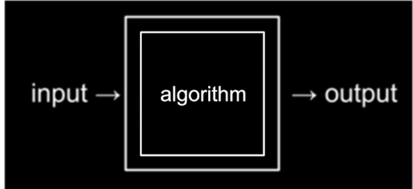
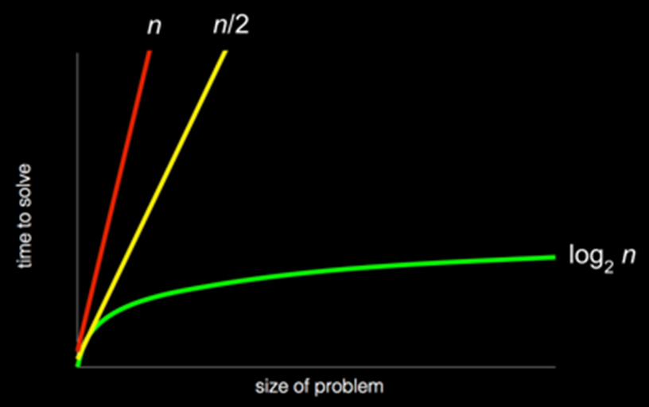

title: Introducción a los algoritmos

## Introducción

Un algoritmo es una serie de instrucciones o secuencia de pasos bien definidos y ordenados que resuelve un problema o realiza una tarea específica.

La aplicación de algoritmos se extiende a diversas áreas y disciplinas, y son la base de la ciencia de la computación y la programación.

## Resolución de un problema

Recordemos que la programación de computadoras equivale a pensar en la resolución de un problema como el proceso de tomar alguna entrada (un problema que queremos resolver) y generar alguna salida (la solución a nuestro problema), resolviendo así dicho problema.

Ahora que podemos representar entradas y salidas, podemos trabajar en la resolución de problemas. La caja negra que transforma las entradas en salidas contiene algoritmos, instrucciones paso a paso para resolver problemas:



!!! important "¡Para recordar!"
    La resolución de problemas es fundamental para las ciencias de la computación y la programación de computadoras.

Imagina el problema básico de tratar de localizar un solo nombre en una guía telefónica impresa. El viejo equivalente a una aplicación en nuestros teléfonos que almacene nuestros contactos, con sus nombres y números de teléfono ordenados alfabéticamente. ¿Cómo podrías hacer esto?

Un enfoque podría ser abrir la guía y comenzar desde la primera página, buscando el nombre una página a la vez hasta otra página, hasta llegar a la última página. Este enfoque sería correcto, ya que eventualmente encontraríamos el nombre si está en el libro.

Otro enfoque podría ser buscar el nombre hojeando la guía de a dos páginas a la vez, aunque este enfoque no será correcto ya que podríamos saltarnos la página que tiene el nombre buscado.

El enfoque final, y quizás mejor, podría ser abrir la guía telefónica por la mitad y preguntar:

1. “¿El nombre que estoy buscando está a la izquierda o a la derecha?” 

2. Decidir si el nombre estará en la mitad izquierda o derecha del libro (porque el libro está alfabetizado) y reducir el tamaño de nuestro problema a la mitad. 

3. Luego, repetir este proceso hasta encontrar nuestro nombre, dividiendo el problema por la mitad cada vez.

!!! info
    Cada uno de estos enfoques podría definirse como **algoritmo**. 

## ¿Qué es un algoritmo?

Día a día empleamos, de manera frecuente, distintos algoritmos que nos permiten resolver un sinfín de problemas en todos y cada uno de los aspectos de nuestras vidas. 

Por ejemplo, un manual de usuario es, en cierta manera, un algoritmo que nos enseña cómo usar un aparato.
Las instrucciones que recibimos para realizar una tarea específica constituyen un algoritmo también.

!!! abstract "Definición"
    Un **algoritmo** es una secuencia finita de instrucciones lógicas, precisas y sin posibilidad de ambigüedad, ordenadas paso a paso, que permite resolver un problema o realizar una tarea específica de manera eficiente y sistemática. 

En términos simples, es una serie de instrucciones que se utilizan en programación, matemáticas, ciencias de la computación y muchas otras áreas para resolver un problema de manera eficiente.

Están compuestos por una serie finita de instrucciones que procesan los datos de entrada de un problema convirtiéndolos en información de salida como solución a este. 

!!! important "¡Para recordar!"
    A través de un lenguaje de programación, podemos escribir un programa que represente a un algoritmo determinado, de manera tal que pueda ser ejecutado por una computadora. Pero esto lo veremos más adelante.

## ¿Para qué sirve un algoritmo?

Los algoritmos sirven para resolver problemas o realizar tareas específicas de manera eficiente y sistemática. Aquí hay algunas áreas en las que los algoritmos desempeñan un papel fundamental:

* Programación: en el desarrollo de software, son la base para escribir código eficiente y solucionar problemas. 
Permiten realizar tareas de búsqueda, ordenación, filtrado y procesamiento de datos entre otras operaciones computacionales.

* Ciencias de la computación: son fundamentales para diseñar y analizar estructuras de datos eficientes y algoritmos 
avanzados. Ayudan a resolver problemas complejos como la optimización, la inteligencia artificial, la criptografía, la visión por computadora y el procesamiento de lenguaje natural.

* Matemáticas: juegan un papel importante en la resolución de problemas matemáticos, como encontrar la raíz de una 
ecuación, calcular el factorial de un número, resolver sistemas de ecuaciones lineales, entre otros.

* Optimización: los algoritmos de optimización se utilizan para encontrar la mejor solución posible dentro de un 
conjunto de posibles soluciones. Estos algoritmos se aplican en la planificación de rutas, la asignación de recursos, la programación de tareas y otras situaciones en las que se busca maximizar o minimizar un objetivo determinado.

* Búsqueda de información: los algoritmos de búsqueda se utilizan para encontrar información relevante en grandes 
conjuntos de datos, como motores de búsqueda en internet o sistemas de recomendación en aplicaciones y plataformas.

* Automatización: permiten automatizar tareas repetitivas y realizar cálculos complejos de manera rápida y precisa. 
Se usan en sistemas de control, robótica, procesamiento de señales, análisis de datos, entre otras áreas de automatización.


## Refinamiento de un algoritmo

¿Cómo sería el algoritmo para determinar el mayor de tres números enteros?

``` title="Pseudocódigo"
Inicio
    Comparar el primer número con el segundo, deduciendo cuál es el mayor número.
    Comparar el mayor número anterior con el tercer número y deducir cuál es el mayor número. 
    Este último mayor número será el mayor número de los tres.
Fin
```

Así como está planteado, este algoritmo es muy difícil de implementar como programa, puesto que las instrucciones son muy generales y seguramente no existan comandos en ningún lenguaje que las representen.

Por lo tanto, será necesario descomponer el algoritmo en instrucciones más simples. Este procedimiento se denomina **refinamiento del algoritmo**.

### Atomicidad de las instrucciones indivisibles o de un conjunto de instrucciones como un todo

En informática, se denomina instrucción atómica o instrucción particular única a un conjunto de instrucciones que al ser ejecutadas son vistas por el resto del sistema como una sola instrucción indivisible.

Para cumplir esto, se requieren dos condiciones:

1. Ningún otro proceso puede tomar conocimiento de los cambios realizados hasta que se completen todas las instrucciones del conjunto

2. Si no puede realizarse al menos una de las instrucciones del conjunto, el estado del sistema debe retrotraerse al inicio de las operaciones, tal como si ninguna hubiese sido ejecutada

Para el resto del sistema no es accesible ningún estado intermedio durante la ejecución del conjunto de operaciones.

Teniendo esto en mente, deberemos seguir refinando nuestro algoritmo hasta cumplir con estas dos condiciones.

# ¿Qué es la eficiencia de un algoritmo?

La **eficiencia** de un algoritmo se refiere a la cantidad de recursos (tiempo y espacio) que requiere para ejecutarse. Se utilizan medidas como la complejidad temporal (cuánto tiempo tarda en ejecutarse) y la complejidad espacial (cuánta memoria utiliza) para analizar la eficiencia de un algoritmo. La teoría de la complejidad computacional clasifica los algoritmos en función de su eficiencia relativa.

## Eficiencia de resolución y velocidad: notación de O grande (Big-O)

Podemos representar la eficiencia y velocidad de resolución de cada uno de estos algoritmos de la siguiente manera en lo que se denomina notación de O grande (Big-O):



El primer algoritmo, que busca una página a la vez, y representado con la línea roja, tiene una Big-O de n: el tiempo para resolver aumenta linealmente a medida que aumenta el tamaño del problema. n es un número que representa el tamaño del problema, por lo que con n páginas en nuestra guía telefónica, tenemos que dar hasta n pasos para encontrar un nombre. Por ejemplo, si hay 100 nombres en la guía telefónica, podría tomar hasta 100 intentos para encontrar el nombre correcto. 

El segundo algoritmo, que busca dos páginas a la vez, y representado con la línea amarilla, tiene una Big-O de n/2: la pendiente es menos pronunciada, pero sigue siendo lineal. Ahora, solo necesitamos (aproximadamente) n / 2 pasos, ya que pasamos dos páginas a la vez (el doble de rápido).

El algoritmo final, que divide la guía telefónica por la mitad cada vez, y representado con la línea verde, tiene una Big-O de log~2~ n: con una relación fundamentalmente diferente entre el tamaño del problema y el tiempo para resolverlo, si la guía telefónica duplicara su tamaño de (por ejemplo, de 1000 a 2000 páginas), solo necesitaríamos un paso más para encontrar el nombre y resolver el problema.

## Complejidad algorítmica: Análisis de la eficiencia de los algoritmos

La **complejidad algorítmica** se refiere al estudio de cuántos recursos computacionales, como tiempo y espacio, requiere un algoritmo para resolver un problema. Es decir que se refiere al crecimiento de sus requisitos de tiempo y espacio a medida que el tamaño del problema aumenta.
Los análisis de complejidad permiten comparar y clasificar algoritmos según su eficiencia.

Por lo tanto, es importante evaluar la eficiencia de un algoritmo para determinar cuánto tiempo y recursos requerirá su ejecución. Dos aspectos clave son:

1. **Complejidad temporal**: determina cómo aumenta el tiempo de ejecución a medida que crece el tamaño de la entrada.

2. **Complejidad espacial**: estima la cantidad de memoria requerida por el algoritmo en función del tamaño de la entrada.

Otras clases de complejidad son la complejidad constante, la complejidad logarítmica, la complejidad lineal, la complejidad polinómica y la complejidad exponencial, entre otras. El análisis de complejidad permite evaluar el rendimiento de un algoritmo en diferentes escenarios.

## Características de un buen algoritmo

* **Precisión**: Debe ser claro y no ambiguo, indicando el orden de realización de cada instrucción. Si se ejecuta más de una vez de exacta manera, el resultado obtenido debe ser siempre el mismo.

* **Eficiencia**: Debe resolver el problema de manera efectiva, utilizando el menor número de pasos y la menor cantidad de recursos posibles, como tiempo y memoria.

* **Finitud**: Debe tener un número finito de pasos, lo que significa que debe iniciar y terminar en un momento determinado.

* **Generalidad**: Debe ser aplicable a diferentes situaciones o problemas similares.

## ¿Qué es la corrección de un algoritmo?

Un algoritmo se considera correcto si produce el resultado esperado para todos los casos de entrada válidos. 
La teoría de la verificación y validación de algoritmos se ocupa de demostrar la corrección de los algoritmos mediante técnicas formales, como demostraciones matemáticas y pruebas exhaustivas.

