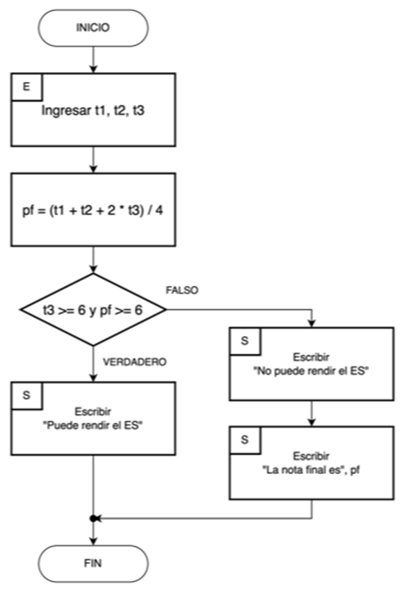

## Problema propuesto

Se cuenta con las notas del trimestre 1 (t1), trimestre 2 (t2) y trimestre 3 (t3) de un alumno.

Se sabe que el promedio final ( pf ) se calcula con la fórmula: pf = (t1 + t2 + 2 * t3) / 4

Si el alumno cumple con la siguiente condición: t3 >= 6 y pf >= 6 tiene opción a rendir un examen sustitutorio ( ES )

Escriba un algoritmo que reciba las notas y luego muestre un mensaje indicando si el alumno puede rendir o no el examen sustitutorio.

En el caso que ya no pueda rendir el examen sustitutorio, debe mostrar solamente el promedio final.

## Resolución

``` title="Análisis"
Datos de entrada: 
    t1, t2, t3
Salida: 
    si (t3 >= 6 y pf >= 6) mostrar que puede rendir ES;
    si no, mostrar que no puede rendir ES y mostrar la nota final pf
```

``` title="Algoritmo"
Inicio
   Ingresar las notas del alumno en t1, t2, t3
   Calcular pf con la siguiente fórmula: (t1 + t2 + 2 * t3) / 4
   Si cumple la condición t3 >= 6 y pf >= 6 entonces
      Mostrar el mensaje "Puede rendir el ES"
   Si no cumple la condición entonces 
      Mostrar el mensaje "No puede rendir es" y mostrar pf
Fin
```

{: class="center back-white border-round"}

Si la lógica del algoritmo es correcta y el diagrama de flujo es válido, el siguiente paso será transcribir ambos diseños en **pseudocódigo**.

El pseudocódigo es una versión legible, en lenguaje humano natural, de un algoritmo. Es decir, que es una representación de dicho algoritmo en idioma, ya con especificaciones de implementación como programa pero sin ser un lenguaje de programación específico aún.

Estudiaremos como se utiliza el pseudocódigo dentro del proceso de creación de software, más adelante.

## recuerda siempre

{: class="center back-white border-round"}


