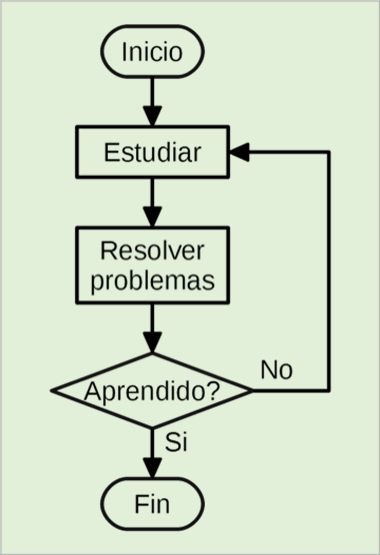

title: Diagramas de flujo

## Introducción

Son una notación para implementar algoritmos, basada en la utilización de símbolos gráficos denominados bloques, donde se escriben las instrucciones que tiene que realizar el algoritmo.

Estos bloques están conectados entre sí por líneas indicando el orden de ejecución de las instrucciones.

## ¿Qué es un diagrama de flujo?

Un diagrama de flujo es una notación gráfica para implementar algoritmos.

Se basa en el uso de símbolos gráficos denominados bloques, donde se escriben las instrucciones que tiene que realizar el programa. Es decir, que cada instrucción es representada por un símbolo diferente que contiene una breve descripción de lo que hace. 

Estos bloques están conectados entre sí por líneas, indicando el orden de ejecución las instrucciones.

En todo diagrama de flujo siempre habrá un solo bloque de inicio y otro de fin.

## Características de los diagramas de flujo

* Cumple un rol vital en la concepción de la solución a un problema.
* Es extremadamente útil en la comprensión de la lógica de problemas difíciles y extensos.
* Debe ser una representación diagramática que ilustre el flujo de instrucciones necesarias para solucionar el problema.
* Debe ser dibujado en la etapa anterior al desarrollo del pseudocódigo.
* Debe facilitar la comunicación entre el diseñador de la solución y los programadores del código.
* Es obligatorio realizarlo para incluirlo en cualquier documentación de desarrollo.

## Limitaciones de los diagramas de flujo

* **Lógica compleja**: en algunos casos, la lógica de se vuelve complicada y los diagramas se tornan complejos y confusos.
* **Alteraciones y modificaciones**: si fuera necesario alterar alguna parte del diagrama, en casi todos los casos sería necesario redibujarlos completamente (aunque si el trabajo se realizara con un software, sería menos tedioso, pero aún así, requeriría de tiempo y mucha atención para no romper la lógica del algoritmo).
* **La esencia de “lo que está hecho” puede perderse fácilmente en los detalles técnicos de “¿cómo está hecho?”**: se debe evitar caer en la trampa de preocuparse demasiado por los detalles técnicos en la etapa de diseño del algoritmo, ya que esto podría conducir a una pérdida de perspectiva del panorama general y hacer que el proceso de diseño sea más complicado de lo necesario.

## Ventajas del uso de diagramas de flujo

* **Comunicación**: los diagramas son la mejor forma de comunicar la lógica de un sistema a todo el equipo de desarrollo.
* **Análisis efectivo**: con la ayuda de los diagramas, el problema puede ser analizado de manera más efectiva.
* **Documentación adecuada**: sirven como herramienta de comunicación en la documentación de un programa.
* **Codificación eficiente**: los diagramas actúan como guías durante el proceso de análisis y diseño de código.
* **Correcciones precisas**: ayudan a realizar correcciones más precisas de los programas cuando fallan o son testeados.
* **Mantenimiento eficiente del programa**: el mantenimiento de un programa que se encuentra operando resulta más fácil con la ayuda de los diagramas, ayudando al programador a poner sus esfuerzos de manera más eficiente sobre cada parte del programa.

## Reglas para la realización de diagramas de flujo

!!! Warning "Terminar de armar esta sección"

* El diagrama de flujo debe ser claro, simple y fácil de leer. No debe existir lugar para las ambigüedades.
* La dirección usual del flujo de procedimientos debe ser de izquierda a derecha y de arriba hacia abajo.
* Cada instrucción necesaria en un diagrama de flujo debe ser listada en un orden lógico. Lo mismo para bloques de sentencias, estructuras de control y demás partes que compongan al algoritmo.
* Sólo puede haber una línea de entrada de flujo y una línea de salida de flujo de cada bloque. En caso de ser necesario, es posible unificar las líneas de entrada en una sola antes de ingresar al bloque.
* Sólo una línea de flujo puede ingresar a un símbolo de decisión, pero puede salir una línea por cada respuesta posible.
* Sólo puede utilizarse una línea de flujo en conjunto con un símbolo Terminal.
* Las líneas de flujo deben ser verticales u horizontales. Salvo que un símbolo determine lo contrario (por ejemplo, los condicionales), cada línea de flujo debe ingresar a un símbolo por su parte superior.
* Escriba sintácticamente dentro de cada símbolo. Si fuera necesaria mayor descripción, emplee referencias.
* Si el diagrama se torna complejo, es mejor utilizar conector para eliminar líneas de flujo. Evite las intersecciones de líneas de flujo lo más que pueda.
* Asegúrese que el diagrama de flujo posea un Inicio y un Fin lógicos.
* Es útil testear la validez del diagrama, recorriéndolo con valores simples de prueba.

## Estructuras de control

Un algoritmo debe ser creado empleando estructuras de control que definen el flujo de ejecución de las instrucciones a lo largo del programa.

Estas instrucciones se dividen en tres categorías generales:

* Estructura de control secuencial

* Estructura de control selectiva
    * Selectiva (o alternativa) simple 
    * Selectiva (o alternativa) doble
    * Selectiva (o alternativa) doble anidada
    * Selectiva (o alternativa) múltiple
  
* Estructura de control iterativa (repetitiva)
    * Repetir Mientras (_While_) con la expresión condicional a la entrada o a la salida
    * Repetir Hasta (_Until_) con la expresión condicional a la entrada o a la salida
    * Repetir Para…Siguiente (_For…Next_)

Analizaremos estas estructuras más adelante cuando veamos la simbología de cada una.