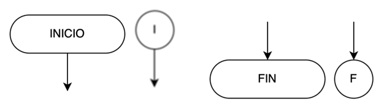
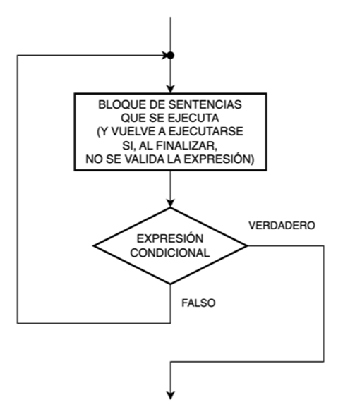
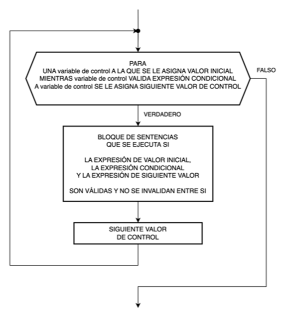

title: Simbología de los diagramas de flujo

## Líneas de flujo

Cada línea de flujo se representa con una línea recta con una sola flecha de sentido que permite conectar los bloques del diagrama. Esta flecha indica la secuencia en la que se van a ejecutar las acciones.

{: class="center back-white border-round"}

!!! tip "Consejos útiles"
    Las líneas de flujo, siempre que se pueda, deben ir de arriba hacia abajo, de izquierda a derecha.
    
    Su trazado debe ser siempre en forma recta.
    
    Se debe evitar el cruce de líneas de flujo para facilitar la legibilidad del diagrama. En caso de no ser posible, se deberá optar por alguna solución que no entorpezca el diagrama.

## Inicio y Fin

Todo algoritmo y por lo tanto, todo diagrama de flujo tiene un inicio y un fin.
La silueta del bloque es la misma y se coloca la palabra INICIO o FIN según corresponda. 

{: class="center back-white border-round"}

!!! tip "Consejos útiles"
    Del bloque de INICIO solo puede salir una línea de flujo.

    Al bloque de FIN solo puede llegar una línea de flujo.

    Puedes utilizar el bloque completo o su versión abreviada.

## Instrucción o Sentencia (también conocido como proceso, tarea, acción o paso): 

En este bloque se escribe la instrucción que debe realizar el programa. Si son varias, se escriben una debajo de la otra, sin olvidarse que se ejecutan, una a una, en forma secuencial según el orden en que fueron escritas.

{: class="center back-white border-round"}

## Comentarios

Los comentarios son elementos del algoritmo que sirven como referencia del código fuente. Generalmente comentan que es lo que hace una parte del código o sirven de información para futuras intervenciones de los programadores. 

{: class="center back-white border-round"}

!!! tip "Consejos útiles"
    Un comentario es una aclaración para comprender mejor el código del programa.

    No forma parte del código y por lo tanto no se ejecuta.

## Entrada y Salida

Estos bloques representan acciones de entrada desde un teclado, por ejemplo, o de salida hacia una pantalla. 

Es decir, si debemos ejecutar una acción que consiste en leer un dato que se ingresa mediante el teclado de una PC y almacenarlo en la variable de nombre “a”, entonces dicha acción se describe dentro de este bloque como “leer a”.

{: class="center back-white border-round"}

## Conectores

!!! warning "Falta completar"

Permiten unir diagramas de flujo cuando éstos no caben en una misma columna de la hoja por completo. Es decir, cuando debemos, por cuestiones de espacio en la hoja, fragmentar el programa entonces utilizamos estos bloques para indicar los puntos de unión. Cada par de puntos que se deben unir llevarán dentro de este bloque la misma referencia.

## Estructura secuencial

La estructura secuencial es aquella en la que una instrucción sigue a otra en secuencia. 

Las instrucciones se suceden de tal modo que la salida de una es la entrada de la siguiente y así sucesivamente hasta el final de la estructura secuencial o, en su defecto, el final del del programa. 

Planteado de este modo, la estructura secuencial tiene una sola entrada y una sola salida. 

{: class="center back-white border-round"}

!!! tip "Consejos útiles"
    Las instrucciones del programa se ejecutan en el orden que se encuentran escritas.

## Bloque de sentencias

{: class="center back-white border-round"}

!!! tip "Consejos útiles"
    Para simplificar la lectura de un diagrama, se puede representar un conjunto de sentencias (cualquier sea su estructura) como un único bloque identificado que, opcionalmente, puede tener una referencia hacia otro diagrama de flujo que lo detalle.

## Estructura selectiva (o alternativa) simple

En la **estructura selectiva simple**, la ejecución de las instrucciones depende de la validación de una expresión condicional. En caso de no ser validada la expresión, se pasan por alto las instrucciones en cuestión y el control de flujo continúa con el resto del programa.

{: class="center back-white border-round"}

!!! important "¡Para recordar!"
    El bloque de sentencias se ejecuta solo si la expresión condicional es verdadera.

## Estructura selectiva (o alternativa) doble

En la **estructura selectiva doble**, la ejecución de determinadas instrucciones depende de la validación, o no, de una expresión condicional. Si la expresión se valida, se ejecutan unas instrucciones. Caso contrario, se ejecutan otras instrucciones. Al finalizar, en ambos casos, el control de flujo continúa con el resto del programa.

{: class="center back-white border-round"}

!!! important "¡Para recordar!"
    Si la expresión condicional es verdadera, se ejecuta el bloque de sentencias verdadero.

    Si la expresión condicional es falsa, se ejecuta el bloque de sentencias falso.

## Estructura selectiva (o alternativa) doble anidada

!!! warning "Corregir que el else puede ser vacio"

El funcionamiento de la **estructura selectiva doble anidada** es igual que el de la **estructura selectiva doble**.

{: class="center back-white border-round"}

Si la expresión condicional 1 es verdadera, se ejecuta el bloque de sentencias verdadero.

Si la expresión condicional 1 es falsa, se evalúa la expresión condicional 2.

Si la expresión condicional 2 es verdadera, se ejecuta el bloque de sentencias verdadero.

Si la expresión condicional 2 es falsa, se ejecuta el bloque de sentencias falso.

!!! important "¡Para recordar!"
    Esta estructura puede contener tantas estructuras selectivas como sea necesario. 

    La regla de cálculo para saber la cantidad de estructuras selectivas doble necesarias es:

    CANTIDAD DE ESTRUCTURAS = CANTIDAD DE BLOQUES DE SENTENCIAS DISTINTOS – 1

    Y recuerda que el último bloque de sentencias siempre se ejecuta por el camino falso de la última estructura selectiva doble.

## Estructura selectiva (o alternativa) múltiple

La **estructura selectiva múltiple** evalúa una expresión condicional que puede tomar "n" valores. Según este valor, se ejecuta el bloque de sentencias correspondiente.

{: class="center back-white border-round"}

!!! important "¡Para recordar!"
    Esta estructura puede contener tantos casos como sean necesarios. 

    Puede caber la posibilidad que exista un bloque de sentencias por defecto (default) que se ejecute en el caso que la expresión condicional no valide ninguno de los casos existentes. 

## Estructura iterativa (o repetitiva) _Mientras (While)_ con la condición a la entrada

La estructura iterativa Mientras (While) con la condición a la entrada, primero, evalúa la expresión condicional antes de ejecutar por primera vez el bloque de sentencias incluido en dicha estructura. 

Si la expresión es válida (verdadero), se ejecuta el bloque de sentencias una vez y, al finalizar, se evalúa nuevamente la expresión condicional. 

Si la expresión vuelva a ser válida (verdadero), se ejecuta el bloque de sentencias nuevamente una vez y, al finalizar, se evalúa nuevamente la expresión condicional. Y así sucesivamente, mientras el resultado de la expresión sea válido (verdadero).

En el momento que el resultado de la expresión no sea válido (falso), el control de flujo saldrá del bucle sin ejecutar el bloque de sentencias y continuará con la ejecución del programa.

{: class="center back-white border-round"}

!!! question "¿Cómo saber cuándo emplear esta estructura?"

    Cuando NO se conoce el número de repeticiones del bucle, se emplea esta estructura.

    La regla dice que la ejecución del bloque de sentencias dependerá de una condición que debe validarse a partir de algo que ocurra previamente en el programa, antes de llegar a la ejecución de esta estructura.

!!! important "¡Para recordar!"
    Al evaluarse la expresión condicional al principio del bucle, antes de ejecutar por primera vez el bloque de sentencias, si esta no es válida (falso), nunca será ejecutado el bloque de sentencias.

    Por lo tanto, esta estructura con la condición a la entrada se utiliza obligatoriamente en el caso de que exista la posibilidad de que el bucle pueda no ejecutarse nunca (es decir, ejecutarse 0 veces). Pero, en caso de ser válida la expresión condicional, las sucesivas repeticiones dependerán del resultado de esta, en cada repetición.

## Estructura iterativa (o repetitiva) _Mientras (While)_ con la condición a la salida

La estructura iterativa Mientras (While) con la condición a la salida, primero, ejecuta el bloque de sentencias incluido en dicha estructura, una vez, sin evaluar ninguna expresión condicional y, al finalizar la ejecución, recién se evalúa la expresión condicional.

Si la expresión es válida (verdadero), se ejecuta el bloque de sentencias nuevamente una vez y, al finalizar, se evalúa nuevamente la expresión condicional. Y así sucesivamente, mientras el resultado de la expresión sea válido (verdadero).

En el momento que el resultado de la expresión no sea válido (falso), el control de flujo saldrá del bucle sin ejecutar el bloque de sentencias y continuará con la ejecución del programa.

{: class="center back-white border-round"}

!!! question "¿Cómo saber cuándo emplear esta estructura?"
    La regla dice que las sucesivas ejecuciones del bloque de sentencias dependerá de una condición que debe validarse a partir de algo que ocurra dentro de dicho bloque al ejecutarse obligatoriamente una vez (y, eventualmente, en conjunto con algo que ocurra previamente en el programa antes de llegar a la ejecución de esta estructura).

!!! important "¡Para recordar!"
    Al evaluarse la expresión condicional al final del bucle, el bloque de sentencias se ejecuta al menos una vez, incluso aunque luego el resultado de la expresión condicional no sea válido (falso).
    
    Por lo tanto, esta estructura con la condición a la salida se utiliza obligatoriamente en el caso de que el bucle deba ejecutarse, si o si, una vez. Luego, las sucesivas repeticiones dependerán del resultado de la expresión condicional en cada repetición.

    Cuando NO se conoce el número de repeticiones del bucle, se usa esta estructura.

### Diferencia entre ambas estructuras

Observa las diferencias de la estructura con la condición a la entrada respecto de la estructura con la condición a la salida:

|||
|---|---|
| {: class="center back-white border-round"} | {: class="center back-white border-round"} |

¡No te las confundas! ¡Su principio de funcionamiento es parecido, pero no son iguales!

## Estructura iterativa (o repetitiva) _Hasta (Until)_ con la condición a la entrada

La estructura iterativa Hasta (Until) con la condición a la entrada, primero, evalúa la expresión condicional antes de ejecutar por primera vez el bloque de sentencias incluido en dicha estructura. 

Si la expresión NO es válida (falso), se ejecuta el bloque de sentencias una vez y, al finalizar, se evalúa nuevamente la expresión condicional. 

Si la expresión vuelva a NO ser válida (falso), se ejecuta el bloque de sentencias nuevamente una vez y, al finalizar, se evalúa nuevamente la expresión condicional. Y así sucesivamente, mientras el resultado de la expresión NO sea válido (falso).

En el momento que el resultado de la expresión SI sea válido (verdadero), el control de flujo saldrá del bucle sin ejecutar el bloque de sentencias y continuará con la ejecución del programa.

{: class="center back-white border-round"}

!!! question "¿Cómo saber cuándo emplear esta estructura?"
    La regla dice que la ejecución del bloque de sentencias dependerá de una condición que NO debe validarse a partir de algo que ocurra previamente en el programa, antes de llegar a la ejecución de esta estructura.

!!! important "¡Para recordar!"
    Al evaluarse la expresión condicional al principio del bucle, antes de ejecutar por primera vez el bloque de sentencias, si esta ES válida (verdadero), nunca será ejecutado el bloque de sentencias.

    Por lo tanto, esta estructura con la condición a la entrada se utiliza obligatoriamente en el caso de que exista la posibilidad de que el bucle pueda no ejecutarse nunca (es decir, ejecutarse 0 veces). Pero, en caso de NO ser válida la expresión condicional, las sucesivas repeticiones dependerán del resultado de esta, en cada repetición.

    Cuando NO se conoce el número de repeticiones del bucle, se usa esta estructura.

## Estructura iterativa (o repetitiva) _Hasta (Until)_ con la condición a la salida

La estructura iterativa Hasta (Until) con la condición a la salida, primero, ejecuta el bloque de sentencias incluido en dicha estructura, una vez, sin evaluar ninguna expresión condicional y, al finalizar la ejecución, recién se evalúa la expresión condicional.

Si la expresión NO es válida (falso), se ejecuta el bloque de sentencias nuevamente una vez y, al finalizar, se evalúa nuevamente la expresión condicional. Y así sucesivamente, mientras el resultado de la expresión NO sea válido (falso).

En el momento que el resultado de la expresión SI sea válido (verdadero), el control de flujo saldrá del bucle sin ejecutar el bloque de sentencias y continuará con la ejecución del programa.

{: class="center back-white border-round"}

!!! question "¿Cómo saber cuándo emplear esta estructura?"
    La regla dice que las sucesivas ejecuciones del bloque de sentencias dependerán de una condición que debe validarse a partir de algo que ocurra dentro de dicho bloque al ejecutarse obligatoriamente una vez (y, eventualmente, en conjunto con algo que ocurra previamente en el programa antes de llegar a la ejecución de esta estructura).

!!! important "¡Para recordar!"
    Al evaluarse la expresión condicional al final del bucle, el bloque de sentencias se ejecuta al menos una vez, incluso aunque luego el resultado de la expresión condicional SI sea válido (verdadero).

    Por lo tanto, esta estructura con la condición a la salida se utiliza obligatoriamente en el caso de que el bucle deba ejecutarse, si o si, una vez. Luego, las sucesivas repeticiones dependerán del resultado de la expresión condicional en cada repetición.

    Cuando NO se conoce el número de repeticiones del bucle, se usa esta estructura.

### Diferencia entre ambas estructuras

Observa las diferencias de la estructura con la condición a la entrada respecto de la estructura con la condición a la salida:

|||
|---|---|
| {: class="center back-white border-round"} | {: class="center back-white border-round"} |

¡No te las confundas! ¡Su principio de funcionamiento es parecido, pero no son iguales!

## Estructura iterativa (o repetitiva) _Para…Siguiente (For…Next)_

La estructura iterativa Para…Siguiente (For…Next) es similar a las estructuras iterativas anteriores, solo que contiene una variable de control o "índice", a la que se le asigna un valor inicial para que, luego, repetición tras repetición, se vaya modificando dicho valor por otro "valor de control" que permita evaluarlo frente a una expresión condicional que deberá ser válida (verdadero) para permitir cada nueva ejecución del bloque de sentencias.

En el momento que el resultado de la evaluación del valor almacenado en la variable de control frente a la la expresión condicional no sea válido (falso), el control de flujo saldrá del bucle sin ejecutar el bloque de sentencias y continuará con la ejecución del programa.

{: class="center back-white border-round"}

!!! question "¿Cómo saber cuándo emplear esta estructura?"
    Esta estructura tiene como finalidad repetir un mismo bloque de sentencias un conocido número de veces, cuando SI se conoce el número de repeticiones del bucle, y no dependerá de una condición que debe validarse a partir de algo que ocurra previamente en el programa, antes de llegar a la ejecución de esta estructura, o de algo que ocurra en la propia estructura. 

!!! important "¡Para recordar!"
    A diferencia de las estructuras anteriores donde, según el caso, no se ejecutaban nunca o lo hacían, si o si, al menos una vez, el espíritu de esta estructura es el de SI ejecutarse siempre, y el de hacerlo un número conocido de veces.

    Se asigna un valor inicial a la variable de control, que debe cumplir con la expresión condicional que controla la cantidad de repeticiones del bloque de sentencias.

    Tras cada ejecución de dicho bloque, a la variable de control se le asignará el siguiente valor de control y se volverá a efectuar la validación de la expresión condicional.

    Este procedimiento se continuará repitiendo hasta que el valor de la variable de control no valide la expresión condicional (verdadero). 

    Cuando SI se conoce el número de repeticiones del bucle, se usa esta estructura.

## Ejercitación

!!! question "¿Puedes identificar cada uno de los bloques empleadas en estos dos diagramas de flujo?"

{: class="center back-white border-round"}
