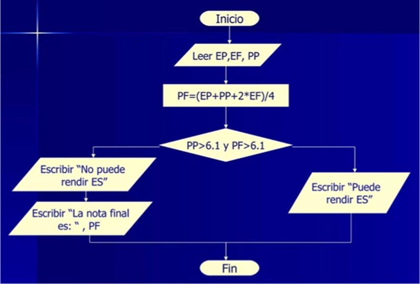
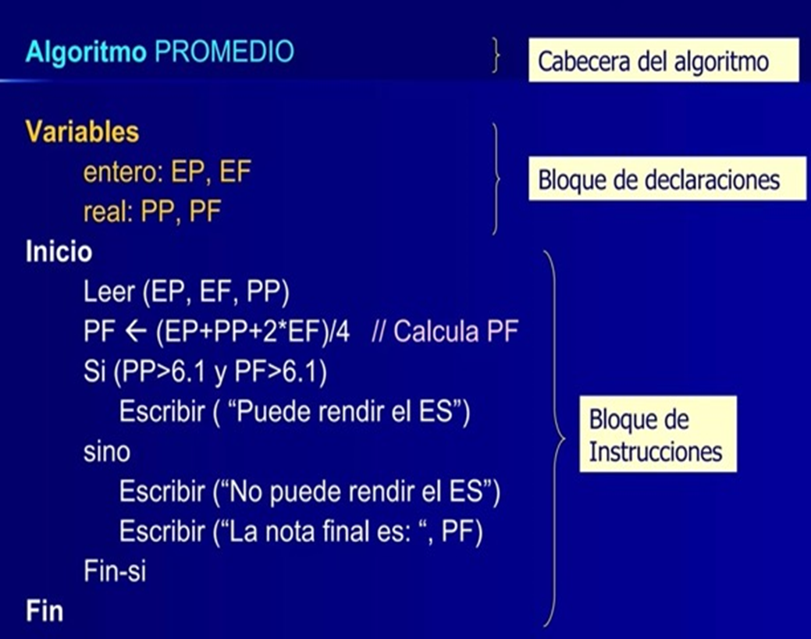

title: Análisis de problema y diseño de algoritmo

## Análisis de problema y diseño de algoritmo

Se cuenta con las notas del trimestre 1 (t1), trimestre 2 (t2) y trimestre 3 (t3) de un alumno.

Se sabe que el promedio final ( pf ) se calcula con la fórmula: pf = (t1 + t2 + 2 * t3) / 4

Si el alumno cumple con la siguiente condición: t3 >= 6 y pf >= 6 tiene opción a rendir un examen sustitutorio ( ES )

Escriba un algoritmo que reciba las notas y luego muestre un mensaje indicando si el alumno puede rendir o no el examen sustitutorio.

En el caso que ya no pueda rendir el examen sustitutorio, debe mostrar solamente el promedio final.

``` title="Análisis"
Datos de entrada: t1, t2, t3
Salida: si (t3 >= 6 y pf >= 6) mostrar mensaje; si no, mostrar que no puede rendir ES y mostrar pf
```

``` title="Algoritmo"
Inicio del algoritmo
   1. Ingresar las notas del alumno en t1, t2, t3
   2. Calcular pf con la siguiente fórmula: (t1 + t2 + 2 * t3) / 4
   3. Si cumple la condición t3 >= 6 y pf >= 6 entonces
      4. Mostrar el mensaje "Puede rendir el ES"
   5. Si no cumple la condición entonces 
      6. Mostrar el mensaje "No puede rendir ES" y mostrar pf
Fin del algoritmo
```

## Representación del diseño en diagrama de flujo



## Representación del diseño en pseudocódigo

