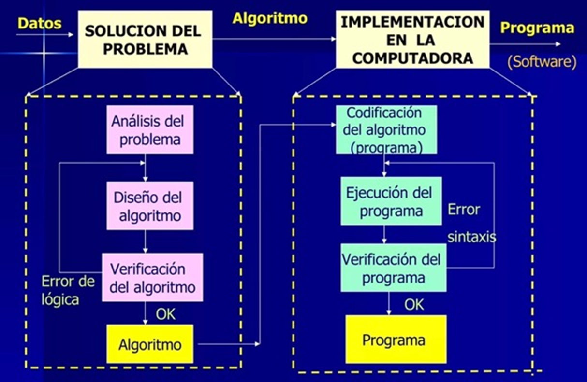

title: Diseño de algoritmos

## Introducción

Un algoritmo es una serie de instrucciones o secuencia de pasos bien definidos y ordenados que resuelve un problema o realiza una tarea específica.

La aplicación de algoritmos se extiende a diversas áreas y disciplinas, y son la base de la ciencia de la computación y la programación.

## Pasos para diseñar un algoritmo

1. **Definir el problema claramente**: comprender claramente cuál es el problema que se va a resolver y qué resultado se espera obtener.

1. **Analizar el problema**: descomponer el problema en partes más pequeñas y comprender las relaciones entre ellas.

1. **Identificar los datos de entrada necesarios**: comprender cuales son los valores que el programa deberá procesar dentro de un contexto determinado para producir la solución adecuada.

1. **Diseñar una solución**: determinar los pasos necesarios, organizándolos en un orden lógico, para resolver el problema, utilizando diferentes técnicas algorítmicas, como algoritmos de búsqueda, ordenación, recursividad, etc., para diseñar una solución para cada parte del problema.

1. **Escribir el algoritmo**: expresar la solución paso a paso en un lenguaje adecuado, como pseudocódigo o un lenguaje de programación específico.

1. **Probar y depurar**: ejecutar el algoritmo con diferentes casos de prueba para asegurarse de que funcione correctamente y verificar si produce los resultados esperados. Si hay errores, depurar el algoritmo identificando y corrigiendo los problemas.

## ¿Qué son las instrucciones?

Son las acciones o comandos que van a ser ejecutados por la computadora para resolver un problema. Conforman un algoritmo que, a partir de un lenguaje de programación específico, se convertirá en un programa donde cada instrucción será una sentencia.

* Instrucciones de Inicio/Fin: indican el Inicio y el Fin del algoritmo
* Instrucciones de lectura: solicitan al usuario el ingreso de datos desde un dispositivo de entrada como, por ejemplo, el teclado.
* Instrucciones de escritura: muestras los resultados a través de un dispositivo de salida como, por ejemplo, la pantalla.
* Instrucciones de asignación: almacenan un valor en una variable, perdiéndose cualquier otro valor almacenado en ella.
* Instrucciones selectivas: permiten ejecutar unas u otras tareas de acuerdo al resultado de una expresión condicional.
* Instrucciones repetitivas: permiten la repetición de un grupo de instrucciones, generando un bucle (loop).

## Fases para la construcción de un programa

!!! warning "Esta sección no va acá"

