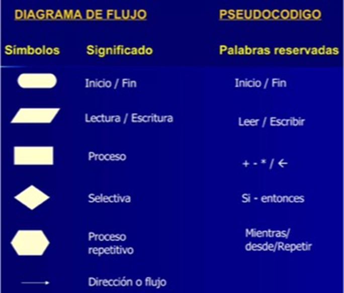

title: Herramientas para la representación de algoritmos

## Herramientas para la representación de algoritmos

Para representar los algoritmos en forma estandarizada, contamos con las siguientes herramientas:

* Diagrama de flujo: es una notación gráfica para implementar algoritmos.

* Pseudocódigo: es un lenguaje de especificación (palabras reservadas) en lenguaje natural

* Diagrama de Nassi-Scheneiderman: es una combinación de las dos anteriores

A continuación, veremos un ejemplo de creación de un algoritmo utilizando estas herramientas.

No te preocupes si te parece difícil. Estudiaremos cada herramienta en profundidad más adelante. Así verás que, en realidad, es mucho más simple y fácil de lo que parece.
