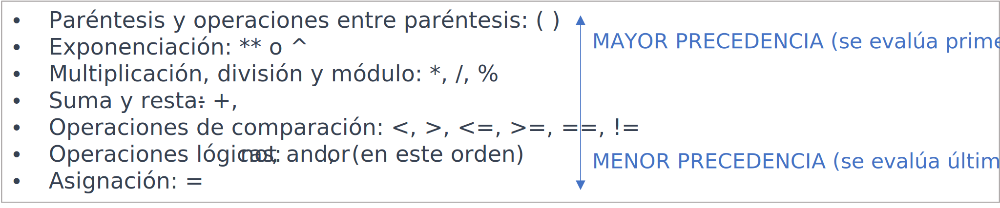

title: Expresiones

## Introducción

Las expresiones son segmentos de código formados por una combinación de operandos y operadores que se evalúan, realizan cálculos y devuelven valores como resultado. 

Una expresión es siempre parte de una declaración, también conocida como instrucción o sentencia. Incluso si la sentencia consiste únicamente en una expresión.

Y un programa consiste en una o más sentencias que al ejecutarse resuelven un problema procesando datos para convertirlos en información.

## ¿Qué es una expresión?

!!! success "Definición"
    Una expresión está conformada por un operando (variable, constante literal o resultado de una llamada a función o método) **o la combinación de uno o más operandos y operadores** (aritméticos, lógicos o relacionales), construida de acuerdo con la sintaxis del lenguaje, **que, al ser procesada** (evaluada o sometida a un cálculo u operación), **devuelve como resultado un valor**.

Más simplificadamente, una expresión es cualquier palabra o grupo de palabras o símbolos que representan un valor; o una instrucción que se ejecuta y termina siendo un valor.

Es necesario entender que un valor es único. Por ejemplo, const, let, 2, 4, s, a, true, false y "mundo" son valores porque cada uno de ellos es único en significado o carácter.

Cualquier expresión válida puede ser tan simple como una variable, constante literal o resultado de una llamada a función o método; o tan compleja como una combinación de múltiples operadores y operandos de todo tipo:

``` js title="Expresión de cálculo simple"
(x + 3) * 2
```

``` js title="Expresión de cálculo complejo"
(calcular_factorial(y) * COEF_CORRECCION) > (valor % 4) && !(vol1 == vol2 || distorsión ** (1/y)) 
```

> El ejemplo anterior es a modo referencial para demostrar como puede ser de compleja una expresión.
 
Como se puede observar en el ejemplo de expresión compleja, también puede haber una expresión como parte de otra, o como argumento de una función. Esto se denomina **anidamiento de expresiones**.

## Operandos y operadores aplicados en expresiones 

* Expresiones con **operadores de asignación**:
    * x = 5 asigna el valor 5 a la variable x
    * x += 3 es equivalente a x = x + 3
* Expresiones con **operadores aritméticos**: 
    * 5 + 3 devuelve 8
    * 10 / 2 devuelve 5
    * 7 % 3 devuelve 1 y equivale al residuo o resto de la división de 7 entre 3
* Expresiones con **operadores de comparación**:
    * 5 == 5 devuelve verdadero (True)
    * 10 != 5 devuelve verdadero (True)
    * 7 > 3 devuelve verdadero (True)
    * 4 < 2 devuelve falso (False)
    * 5 >= 5 devuelve verdadero (True)
    * 2 <= -1 devuelve falso (False)
* Expresiones con **operadores de concatenación**:
    * "Hola" + " " + "Mundo!"  "Hola Mundo!"
* Expresiones con **Operadores de repetición**:
    * "Hola " * 3 -> "Hola Hola Hola"
* Expresiones con **operadores lógicos**:
    * True && True devuelve verdadero (True)
    * True && False devuelve falso (False)
    * False && True devuelve falso (False)
    * False && False devuelve falso (False)
    * True || True devuelve verdadero (True)
    * True || False devuelve verdadero (True)
    * False || True devuelve verdadero (True)
    * False || False devuelve falso (False)
    * !True devuelve falso (False)
    * !False devuelve verdadero (True)
* Expresiones con **operadores de pertenencia**:
    * in devuelve True si un valor se encuentra en la secuencia y False de lo contrario
    * not in devuelve True si un valor no se encuentra en la secuencia y False de lo contrario.
* Expresiones con **operadores de incremento**:
    * x++ devuelve el siguiente valor de x (le suma 1)
* Expresiones con **operadores de decremento**:
    * X-- devuelve el anterior valor de x (le resta 1)

Estos son solo ejemplos simples de expresiones en programación. Ten en cuenta que las expresiones pueden volverse más complejas y combinar diferentes operadores y elementos para realizar cálculos y tomar decisiones en tus programas.

## Expresiones literales

De una manera simplificada, una expresión siempre devuelve un valor:

``` js title="Código generalizado"
2+2 // devuelve 4
true && false  // devuelve el resultado de la conjunción (AND)
llamada_a_funcion() // devuelve el valor retornad por la función llamada_a_funcion()
variable_declarada // devuelve el valor actual almacenado en la variable
```

Existe otro tipo de expresiones:

``` js title="Código generalizado"
"foo"
{foo:'bar'}
[1,2,3,4]
53
true
```

Como se puede observar, estas expresiones no son variables, ni constantes, ni llamadas a funciones. Tampoco poseen operadores.

!!! info "Definición"
    A estas expresiones las llamamos **expresiones literales** y son el ejemplo más simple de expresión porque representan directamente a su valor. 

## Expresiones compuestas, tipo de datos y precedencia de operadores

Cada lenguaje de programación permite construir expresiones compuestas y sentencias a partir de varias expresiones más pequeñas siempre que el tipo de datos requerido por una parte de la expresión coincida con el tipo de datos de la otra. He aquí un ejemplo de una expresión compuesta:

``` js title="Código generalizado"
x * y * z
```

> En este ejemplo particular, el orden en que se evalúa la expresión no es importante porque los resultados de la multiplicación son independientes del orden; el resultado es siempre el mismo, sin importar el orden en que apliques las multiplicaciones. 

Sin embargo, esto no es cierto para todas las expresiones. Por ejemplo, la siguiente expresión da resultados diferentes, dependiendo de si se realiza primero la operación de suma o de división:

``` js title="Código generalizado"
x + y / 100 
```

> Aquí, si no conociéramos la precedencia de operadores, no podríamos indicar si se efectúa primero la suma o la división.

Por otra parte, podemos especificar exactamente cómo deseamos que se evalúe una expresión, utilizando paréntesis equilibrados. 

Por ejemplo, para cambiar el orden de cálculo en la expresión anterior, podríamos escribir:

``` js title="Código generalizado"
(x + y) / 100 
```

### Reglas de precedencia

> Los paréntesis indican la precedencia de operadores, eliminando un posible resultado ambiguo.

Si no indicamos explícitamente el orden en el que deseamos que se realicen las operaciones en una expresión compuesta, el orden será determinado por la precedencia asignada a los operadores en uso dentro de la expresión. **Los operadores con una precedencia más alta se evalúan primero**. 

Las reglas de precedencia y asociatividad definen el orden en el cual se evalúan los operadores en una expresión. Estas reglas son importantes para comprender cómo se realizarán las operaciones y para evitar ambigüedades en el resultado final. 
A continuación, se presentan las reglas generales de precedencia y asociatividad que se aplican en muchos lenguajes de programación:

**Precedencia de operadores**: establece el orden en el cual se evalúan los operadores en una expresión. 

Los operadores con mayor precedencia se evalúan antes que los operadores con menor precedencia. 

Por ejemplo, en la expresión `3 + 4 * 2` la multiplicación tiene mayor precedencia que la suma, por lo tanto, se evalúa primero la multiplicación y luego la suma.



!!! info "Importante"
    Hay que tener en cuenta que estas reglas pueden variar ligeramente dependiendo del lenguaje de programación específico que estés utilizando. Por lo tanto, es recomendable consultar la documentación del lenguaje para obtener las reglas de precedencia exactas que se aplican en ese contexto.

#### Ejemplos

Por ejemplo, el operador de división tiene mayor precedencia que el operador de suma. Por lo tanto, las dos declaraciones siguientes son equivalentes:

``` js title="Código generalizado"
x + y / 100
x + (y / 100)
```

> En este ejemplo particular, si el propósito del cálculo es realizar la división primero, y luego efectuar la suma, el uso de paréntesis es innecesario.

* Los operadores con mayor precedencia se evalúan antes que los operadores con una precedencia relativamente menor. 
* Los operadores en la misma línea tienen la misma precedencia. Cuando aparecen operadores de igual precedencia en la misma expresión, una regla debe regir cuál se evalúa primero. 
* Todos los operadores binarios excepto los operadores de asignación se evalúan de izquierda a derecha. 
* Los operadores de asignación se evalúan de derecha a izquierda.

### Reglas de asociatividad

Es importante recordar que, a diferencia de otras ciencias exactas como la matemática, se reemplaza la precedencia de paréntesis, corchetes y llaves solamente por paréntesis, resolviéndose desde el paréntesis más interno hacia el más externo: 

#### Asociatividad de operadores

Define el orden en el cual se evalúan los operadores del mismo nivel de precedencia cuando no hay paréntesis para establecer un orden explícito. La asociatividad puede ser izquierda o derecha:

* **Asociatividad izquierda**: cuando los operadores tienen asociatividad izquierda, se evalúan de izquierda a derecha. Por ejemplo, en la expresión 4 - 2 - 1, se evalúa primero 4 - 2 y luego se resta 1 al resultado.

* **Asociatividad derecha**: cuando los operadores tienen asociatividad derecha, se evalúan de derecha a izquierda.  Por ejemplo, en la expresión 2 ** 3 ** 2, se evalúa primero 3 elevado al cuadrado y, luego, se eleva al cuadrado a ese resultado.

Es importante recordar que, a diferencia de otras ciencias exactas como la matemática, se reemplaza la precedencia de paréntesis, corchetes y llaves solamente por paréntesis, resolviéndose desde el paréntesis más interno hacia el más externo: 

``` js
52 / { 2 * [ 3 + 5 * ( 6 – 4 ) ] }   →   52 / ( 2 * ( 3 + 5 * ( 6 – 4 ) ) )
                                                              ---------
                                                                  ↓   
                                         52 / ( 2 * ( 3 + 5 *     2     ) )
                                                            ↓
                                         52 / ( 2 * ( 3 +   10          ) ) 
                                                    ---------------------
                                                              ↓ 
                                         52 / ( 2 *           13          )
                                              -----------------------------
                                                            ↓ 
                                         52 /               26
                                            ↓ 
                                            2
```

La asociatividad puede ser relevante cuando hay operadores con la misma precedencia en una expresión. 

**Si los operadores tienen la misma precedencia y asociatividad, la evaluación se realiza de izquierda a derecha**.

Es importante tener en cuenta que las reglas de precedencia y asociatividad pueden modificarse utilizando paréntesis para establecer un orden explícito de evaluación en una expresión.

Veamos un ejemplo mucho más complejo:

Consideremos la siguiente expresión, con n = 2:

``` js
15 + 59 * 75 / 9 < 2 ** 3 ** 2 and (15 + 59) * 75 % n == 1
                          ↓  
15 + 59 * 75 / 9 < 2 **   9    and (15 + 59) * 75 % n == 1
                     ↓
15 + 59 * 75 / 9 <   512       and (15 + 59) * 75 % n == 1
        ↓
15 +    4425 / 9 <   512       and (15 + 59) * 75 % n == 1
             ↓
15 +         491 <   512       and (15 + 59) * 75 % n == 1
   ↓
   506           <   512       and (15 + 59) * 75 % n == 1
                 ↓
                 False         and (15 + 59) * 75 % n == 1
                                   ---------
                                       ↓
                 False         and     74    * 75 % n == 1
                                             ↓
                 False         and           5550 % n == 1
                                                    ↓
                 False         and           5550 % 2 == 1
                                                  ↓
                 False         and                0   == 1
                                                      ↓
                 False         and                    False
                               ↓
                               False
```

> La operación entre paréntesis (15 + 59) debe ser evaluada antes de la multiplicación por 75, ya que es necesario conocer su resultado para poder calcular el producto. El momento preciso en que ello ocurre no es importante.

> Lo mismo ocurre con la evaluación de la variable n: sólo importa que sea evaluada antes de ser usada por el operador de módulo.

En el ejemplo, ambos casos fueron evaluados inmediatamente antes de que su valor sea necesario.
El resultado de la expresión es False.

## Expresiones simples vs. expresiones compuestas

<table class="full-width">
    <tr>
        <td class="col-2">

``` js title="Expresiones simples"
// Expresión de asignación:
x = 10

// Expresión aritmética:
5 + 3

// Expresión booleana:
true && false

// Expresión de concatenación de cadenas:
"Hola" + " " + "mundo"

// Expresión de comparación:
7 > 3
```

        </td>
        <td class"col-2">

``` js title="Expresiones compuestas"
// Expresión compuesta de asignación:
resultado = (x + y) * z

// Expresión compuesta aritmética:
(5 + 3) * (2 - 1)

// Expresión compuesta booleana:
(x > 0) && (y < 10) || (z == 5)

// Expresión compuesta de concatenación de cadenas:
"Hola, " + nombre + ". Tienes " + edad + " años."

// Expresión compuesta de comparación:
(a > b) && (c != d) || (e <= f)
```

        </td>
    </tr>
</table>

## Preguntas importantes sobre el uso de paréntesis en expresiones compuestas

!!! question "¡Recordemos, pensemos!" 
    ¿Qué significa linealizar una expresión? ¿Porqué se deben linealizar las expresiones?
    Linealizar una expresión significa expresarla en una sola línea para lo cual se hace imprescindible la buena utilización de paréntesis. Esta es una buena práctica, debido a que los lenguajes de programación aún no tienen integrada la facilidad de entender las expresiones tal como nosotros las entendemos. Por esta razón deben escribirse en una sola línea para que puedan ser procesadas apropiadamente.

    ¿Qué papel juegan los paréntesis en la alteración de jerarquía de operadores en una expresión?
    Permiten la alteración de la jerarquía de operadores establecida para la resolución de la expresión original de manera tal que se resuelvan las operaciones en un orden diferente, al dividirla en grupos de expresiones más pequeñas que se resuelven primero, facilitando el entendimiento y la interpretación global.

    Entonces, ¿Cuándo se deben utilizar paréntesis en una expresión?
    Toda vez que necesitemos alterar la jerarquía original de operadores para que la computadora resuelva la expresión en un orden distinto al que se daría con la aplicación de la jerarquía original.

    ¿Cuántos paréntesis se pueden involucrar en una expresión?
    Todos los que se necesiten. 

    ¿Qué pasa cuando faltan o sobran paréntesis en una expresión?
    Se tiene un alto riesgo de que la computadora interprete la expresión de una manera diferente y resuelva las operaciones en un orden distinto al pensado. Debe tenerse en cuenta que en una expresión si sobran paréntesis es muy posible que eso no genere dificultades en la interpretación de la expresión, el gran problema se presentará si faltan.

    ¿Cómo se resuelve una expresión que contenga paréntesis?
    Se resuelve comenzando desde los paréntesis mas internos y aplicando dentro de ellos toda la jerarquía estándar y, a medida que se van obteniendo valores parciales y por tanto se van eliminando los paréntesis, se van resolviendo los paréntesis externos con la misma filosofía de la jerarquía de operadores estándar.

    ¿Cómo se resuelve la pequeña expresión que se encuentra dentro de un paréntesis?
    Aplicando la jerarquía estándar de operadores (revisa la tabla de jerarquías si no la recuerdas o tienes dudas).

!!! success "Recuerda"
    Al escribir expresiones compuestas, debe ser explícito e indicar entre paréntesis qué operadores deben evaluarse primero. Esta práctica hará que tu código sea más fácil de leer y mantener.

    También recuerda que las expresiones se evalúan siguiendo ciertas reglas de precedencia y asociatividad. 

    Es importante tener en cuenta estas reglas para obtener los resultados deseados al combinar diferentes operadores y expresiones en tus programas.

## Expresiones y sentencias

Una expresión es siempre parte de una sentencia, también conocida como instrucción o declaración. Incluso si es una sola expresión únicamente.

Por lo tanto, las expresiones realizan el trabajo de un programa. 
Entre otras cosas, las expresiones **se utilizan para calcular y asignar valores a las variables** y para ayudar a **controlar el flujo de ejecución del programa**. 

El trabajo de una expresión es doble: 
1. realizar el cálculo indicado por los elementos de la expresión; y 
1. devolver un valor que es el resultado de dicho cálculo.

Asi, cada expresión realiza una operación y devuelve un valor:

|Expresión			        |Acción					                                 | Valor devuelto                                |
|---------------------------|--------------------------------------------------------|-----------------------------------------------|
| char letra = "S”			| Asigna el caracter "S" a la variable letra		     | El valor de letra luego de la asignación      |
| esMayusculas(letra)		| llama a la función esMayusculas con el argumento letra | El valor de retorno: true                     |
| "La nota es " + letra		| Concatena la cadena "La nota es " y el valor de letra  | La cadena resultante: "La nota es S"          |

El **tipo de datos del valor devuelto** por una expresión **dependerá de los elementos utilizados en la expresión**. La primera expresión devolverá un caracter porque el operador de asignación devuelve un valor del mismo tipo de datos que sus operandos. Como se puede ver en las otras expresiones, una expresión podrá devolver un valor booleano o una cadena, entre otros resultados.

``` py title="Python"
x = 5                    # Asignación de un valor a la variable x
y = 10                   # Asignación de un valor a la variable y
x = 5 + 3                # Suma
y = 10 - 2               # Resta
z = 4 * 6                # Multiplicación
w = 15 / 3               # División
z = x > y                # Comprobación si x es mayor que y
y += 5                   # Incremento de la variable y en 5
z = (x > 0) and (y < 20) # Comprobación si x es mayor que 0 y sy y es menor que 20
```

!!! info "Para tener en cuenta"
    Cada operación tiene su propia sintaxis y reglas de uso específicas. 

    Algunos lenguajes pueden tener reglas específicas sobre el redondeo y el tratamiento de los números negativos.

Es importante consultar la documentación del lenguaje de programación específico que estés utilizando para obtener información precisa sobre las operaciones disponibles y cómo utilizarlas correctamente en tu programa. 

A continuación, estudiaremos cada operador y como se comporta dentro de una determinada expresión. 

Veamos un ejemplo:

``` js
const precio = 500;
```

A juzgar por el código anterior, const, precio, el símbolo igual (=) y 500 son expresiones porque cada una de ellas tiene un significado o valor definido y único. Pero si los tomamos todos juntos const price = 500, entonces tenemos una sentencia.

Veamos otro ejemplo:

``` js
let multiplicar = function (numeroUno, numeroDos) {
    return numeroUno * numeroDos;
}
```

Mirando el código anterior, podemos ver que una función anónima está asignada a una variable. Aún no sabemos que es una función, y adelantándote que cualquier función es una sentencia, ¿puede ser también una expresión?

¡Por supuesto! 

Una función y una clase (veremos ambos conceptos más adelante) son sentencias y expresiones porque pueden realizar acciones (hacer o no hacer tareas) y aun así ejecutarse y retornar un valor.

Este concepto nos lleva a las sentencias. 

Entonces, ¿qué son las sentencias? Las veremos próximamente. Por ahora, nos enfocaremos en las expresiones, aunque precisaremos interactuar con sentencias para poder entender perfectamente el rol que cumplen las expresiones.

## Expresiones con operandos con diferentes tipos de datos (casting)

Algunas operaciones se llevan a cabo de manera directa y otras mediante una conversión (casting) implícita de los tipos de datos, si es necesario, dependiendo de las reglas del lenguaje específico. 

Así, La manera en que se realizan las asignaciones puede variar según las operaciones y el tipo de dato utilizado.

``` py title="Python"
x = 5
x *= 3
print(x)  # Salida: 15
```

> En este ejemplo, se inicializa la variable x con el valor 5. Luego, se utiliza el operador (*=) para multiplicar x por 3 y almacenar el resultado nuevamente en x. Después de la operación, el valor de x se actualiza a 15.

``` py title="Python"
x = 10
x /= 2
print(x)  # Salida: 5.0
```

> En este ejemplo, se inicializa la variable x con el valor 10. Luego, se utiliza el operador (/=) para dividir x entre 2 y almacenar el resultado nuevamente en x. Después de la operación, el valor de x se actualiza a 5.0, ya que la división de dos enteros en Python produce un resultado en punto flotante.

!!! success "¡Importante!"
    Es importante tener en cuenta que estos operadores se pueden utilizar con diferentes tipos de datos, valores numéricos o expresiones válidas que el lenguaje de programación permita. 

    Por ejemplo, en Python, se puede utilizar con números, cadenas de caracteres y listas, entre otros tipos de datos.


!!! warning "Elaborar el siguiente material"

* Expresiones condicionales
* Operador ternario (condición ? expresión1 : expresión2)
* Expresiones y evaluación de expresiones
* Composición de expresiones utilizando operadores y variables
* Orden de evaluación de operaciones
* Operadores bit a bit
* Operador AND bit a bit (&)
* Operador OR bit a bit (|)
* Operador XOR bit a bit (^)
* Operador desplazamiento a la izquierda (<<)
* Operador desplazamiento a la derecha (>>)

Ejemplos:

Expresión de llamada a función:
calcularPromedio(80, 95, 75)
Expresión de acceso a elemento:
array[2]

!!! info "Para tener en cuenta"
    Estos son solo ejemplos simples de expresiones en programación. Recuerda que las expresiones pueden volverse más complejas y combinar diferentes operadores y elementos para realizar cálculos y tomar decisiones en tus programas.

Las expresiones compuestas son combinaciones más complejas de expresiones simples que se utilizan para realizar operaciones más avanzadas:

Expresión compuesta de bucle while:
while (i < 10 && !terminado) {
  // código a repetir mientras se cumpla la condición
  i++
}

Expresión compuesta de llamada a función:
calcularPromedio(nota("Matemáticas"), nota("Física"))
Expresión compuesta de acceso a elemento:
valor = array[indice] + matriz[fila][columna]


Expresión compuesta condicional (if-else):
if (x > 0 && y < 10) {
  // código a ejecutar si se cumple la condición
} else {
  // código a ejecutar si no se cumple la condición
}

!!! info "Para tener en cuenta"
    Estos son solo ejemplos de expresiones compuestas en programación. Puedes combinar expresiones simples utilizando operadores y agrupando las expresiones con paréntesis para obtener resultados más complejos y realizar tareas más avanzadas en tus programas.


## Ejercicios de aplicación

1. Escribe un programa que escriba en la pantalla el resultado de sumar 3 + 5.

    Ver resultado (1)
    { .annotate }

    1. :material-code-tags-check:  

        ``` py title="Python"
        # Ejemplo 1
        suma = 3 + 5
        print(suma)
        
        # Ejemplo 2
        print("Suma 3 + 5 = ", 3 + 5)

        # Ejemplo 3
        print("Resultado de sumar 3 + 5:", end="")
        print(3 + 5)

        # Ejemplo 4
        print("Resultado de sumar 3 + 5: " + str(3 + 5))
        ```
