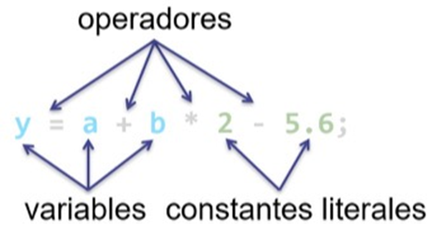

title: Sentencias de un programa


## Introducción

En programación, una sentencia significa cualquier línea de código que instruye al compilador para realizar una tarea específica. 

Un programa de computadora es un conjunto de sentencias. 

También se las llama instrucciones (y hasta declaraciones).

Puede haber varios tipos de sentencias en un código que controlen la entrada y salida de las acciones y los procesos para los que está diseñado un programa. 

## ¿Qué es una sentencia?

!!! success "Definición"
    Las **sentencias** (en inglés **statements**) son aproximadamente equivalentes a oraciones en lenguajes naturales. También se las conoce como **instrucciones** (y en algunos casos, hasta como **declaraciones**) y cada una **forma una unidad completa de ejecución**. 
    
    Así, una sentencia es un **conjunto de expresiones que permiten ejecutar una determinada acción**.

Más simplificadamente, una sentencia es un grupo de expresiones y/o sentencias que es diseñada para llevar a cabo una tarea o una acción.

Una sentencia **es una declaración completa y coherente que expresa una idea o un comando en un lenguaje de programación o en lenguaje natural**.

En el contexto de la programación, una sentencia es una unidad básica de ejecución que realiza una acción o produce un resultado. Puede ser una instrucción simple, como asignar un valor a una variable o mostrar un mensaje en pantalla, o una instrucción más compleja, como una estructura de control (por ejemplo, un bucle o una declaración condicional) que controla el flujo de ejecución del programa.

En el contexto del lenguaje natural, una sentencia es una expresión gramaticalmente completa que comunica una idea o información específica. Por ejemplo, "El perro está corriendo" o "Me gustaría una taza de café". En este caso, una sentencia puede constar de una o varias oraciones.

Cuando escribimos un programa, lo que hacemos es dar instrucciones a la computadora para que resuelva un problema de una manera determinada. 

**Cada línea de código que escribimos** (salvo unas cuantas excepciones) **no es más que la instrucción** u orden que damos **para que se lleve a cabo una acción determinada**. Es por eso que sentencia e instrucción suelen utilizarse para referirse a lo mismo.

Es el programa de computadora que le dice a la computadora que realice o tome acción. Una declaración puede ser un conjunto de símbolos, números o mnemónico utilizados en un programa. 

### ¿ Cuál es el rol de una sentencia en un programa?

Un _lenguaje en mnemónico o lista de instrucciones_ consiste en un conjunto de códigos simbólicos, cada uno de los cuales corresponde a una instrucción en lenguaje de máquina. Es de aquí de donde se aplica el concepto de lenguaje ensamblador.

{: class="center back-white border-round"}

!!! success "¡Recuerda!"
    Cuando escribimos un programa, lo que hacemos es dar instrucciones a la computadora para que resuelva un problema de una manera determinada. 

    Cada línea de código que escribimos (salvo unas cuantas excepciones) no es más que la instrucción u orden que damos para que se lleve a cabo una acción determinada. Es por eso que sentencia e instrucción suelen utilizarse para referirse a lo mismo.

## Sentencias por todos lados… ¿dónde?
Las sentencias se enseñan en diferentes temas relacionados con la programación. Algunos de estos temas son:

* **Introducción a la programación**: se enseñan como parte fundamental del lenguaje de programación, aprendiendo cómo escribir y utilizar sentencias básicas como la declaración de variables, la asignación de valores y la ejecución de operaciones aritméticas y de comparación.
* **Estructuras de control**: las sentencias de control de flujo condicional (if, else, else if, switch) y de bucles (for, while) se enseñan para tomar decisiones y repetir bloques de código según ciertas condiciones, aprendiendo como guiar y controlar el flujo de ejecución de un programa.
* **Funciones y procedimientos**: estas sentencias se enseñan en el contexto de definir y utilizar funciones y procedimientos, aprendiendo a escribir sentencias dentro de funciones para realizar tareas específicas y reutilizables a lo largo de la ejecución de un programa.
* **Estructuras de datos**: en el contexto de las estructuras de datos, las sentencias se enseñan en relación con la manipulación y el acceso a los elementos de una estructura de datos, como listas, arrays o diccionarios, aprendiendo a utilizar sentencias para agregar, eliminar, buscar y modificar elementos en estas estructuras.
* **Programación orientada a objetos**: en la programación orientada a objetos, estas sentencias se enseñan en relación con la definición y el uso de clases y objetos, aprendiendo a escribir sentencias dentro de métodos de clase para describir el comportamiento y las acciones de los objetos.
* **Gestión de errores y excepciones**: estas sentencias se enseñan en relación con la gestión de errores y excepciones en un programa, aprendiendo a utilizar sentencias como try, except y finally para manejar situaciones excepcionales y evitar que un error interrumpa la ejecución del programa.

Estos son solo algunos de los temas principales en los que se enseñan las sentencias en programación, existiendo otros temas adicionales donde se aborden las sentencias de manera más específica y avanzada.

## Tipos de sentencias

Las sentencias puede ser de dos clases:
* Sentencias que hacen tareas
* Sentencias que no hacen tareas

Pero a su vez, un programa consta de varios tipos de sentencias.  

Mientras que las sentencias de asignación y declaración ayudan a una variable a comprender su tipo de datos y asignar su valor, las sentencias de control de flujo dirigen la secuencia de ejecución del programa.  

Cada lenguaje de programación tiene su propio formato y sintaxis que debe seguir el programador mientras escribe el código.  
Hay esencialmente nueve tipos de declaraciones de programación. Echemos un vistazo:

* **Sentencias de declaración** (_declaration statements_)  
* **Sentencias de inicialización** (_inline initialization statements_)  
* **Sentencias de asignación** (_assignment statements_)  
* **Sentencias de expresión** (_expression statements_) 
* **Sentencias de control de flujo** (_flow control statements_)
    * **Sentencias de selección** (_selection statements_) 
    * **Sentencias de iteración** (_iteration statements_) 
    * **Sentencias de salto** (_jump statements_) 
    * **Sentencias de manejo de excepciones** (_exception handling statements_)
* **Sentencias etiquetadas** (_labeled statements_) 
* **Sentencias de llamada a función** (_function call statements_)
* **sentencias compuestas** (_compound statements_) 

### Sentencias de declaración 

Se utilizan para declarar una variable o una constante en el programa.

``` js title="Código generalizado"
let variable_declarada; // una declaración de una variable es una sentencia
int age;
const PI = 3.14159;
```

### Sentencias de inicialización

Se utilizan para inicializar una variable en el programa. Este tipo de sentencias se encuentra dentro de las sentencias de declaración.

``` js title="Código generalizado"
let otra_variable_declarada = 0; // una inicialización de variable también es una sentencia
int age = 15;
```

### Sentencias de asignación

Se utilizan para asignar un valor a una variable. 

``` js title="Código generalizado"
x = 5;
```

### Sentencias de expresión

Se utilizan para realizar una operación o proceso o evaluar una expresión. 

Los comandos de entrada/salida, como las declaraciones _print_ e _input_, son un ejemplo típico de declaraciones de expresión. 

``` js title="Código generalizado" hl_lines="2"
y = x + 3;
print("El resultado de x + 3 es ” + y);
```

### Sentencias de control de flujo

Las sentencias de control de flujo modifican la ejecución secuencial de las sentencias que forman el programa.

Las estudiaremos en profundidad más adelente. Por el momento, solo haremos una breve mención.

Se clasifican en cuatro grupos:

#### Sentencias de selección

Se utilizan para ejecutar selectivamente un conjunto de sentencias, según se satisfaga o no una condición.

* control de flujo condicional _if_ | _if … else_ | _if … else_ anidada

    ``` js title="Código generalizado" 
    if (x > 10) {
    print ("El número es mayor a 10.")
    }

    if (x > 10) {
    print ("El número es mayor a 10.")
    } else {
    print ("El número no es mayor a 10.")
    }

    if (x > 10) {
    print ("El número es mayor a 10.")
    } else if (x == 10) {
    print ("El número es igual a 10.")
    } else {
    print ("El número no es mayor y no es igual a 10. Es menor.")
    }
    ```

* control de flujo condicional _switch_

    ``` js title="Código generalizado"
    int opcion = 2;
    
    switch (opcion) {
        case 1:
            print("Esta rama de flujo del programa se recorre cuando se elige la opción 1.");
            break;

        case 2:
            print("Esta rama de flujo del programa se recorre cuando se elige la opción 2.");

        default:
            print("Esta rama de flujo del programa se recorre por defecto si no hay una opción case que concuerde.");
            break;   
    }  	
    ```

#### Sentencias de iteración

Se utilizan para seguir ejecutando una sentencia o un bloque de sentencias mientras se cumpla o hasta que se cumpla una cierta condición. 

* bucle o ciclo cerrado _for … next_ 
    
    ``` js title="Código generalizado"
    for (i = 1; i <= 5; i++) {
        print (i);
    } // la llave cerrada representa next i
    ```

* bucle o ciclo abierto _while … loop_ | _until … loop_ | _do … loop while_ | _do … loop until_

    ``` js title="Código generalizado"
    j = 0;
    while (j < 5) {
        print (j);
        j++;
    } // la llave cerrada representa loop

    // El ejemplo de arriba tiene el mismo comportamiento que el de abajo. 
    // La diferencia está en como se arma la condición para que el ciclo 
    // se repita bajo los mismos parámetros de evaluación.

    j = 0;
    until (j >= 5) {
        print (j);
        j++;
    } // la llave cerrada representa loop    
    ```
    
    ``` js title="Código generalizado"
    do {
        n = input("Ingrese un número o 0 para terminar");
    } loop while (n != 0)

    // El ejemplo de arriba tiene el mismo comportamiento que el de abajo. 
    // La diferencia está en como se arma la condición para que el ciclo 
    // se repita bajo los mismos parámetros de evaluación.

    do {
        n = input("Ingrese un número o 0 para terminar");
    } loop until (n == 0)
    ```

    > Como se puede observar, la palabra reservada `while` está de un color mientras que `until` no lo está.
    > Esto se debe a que no es común encontrar disponible la segunda opción en la mayoría de los lenguajes.  
    > Sin embargo, corresponde informar acerca de su existencia ya que en caso de existir, es válido utilizarla si con ella se mejora la formulación de la condición de repitancia del ciclo.

#### Sentencias de salto

También conocidas como sentencias de decisión o branching, se utilizan para salir de un bucle o de una función antes de que se complete; o para transferir el control de flujo a otro punto del programa.

Es decir, que se utilizan para alterar de manera incondicional el orden de ejecución de las sentencias de un programa. Sólo deberían utilizarse con el fin de simplificar o mejorar los algoritmos.

* _break_ | _continue_
    
    ``` js title="Código generalizado"
    for (i = 1; i <= 5; i++) {
    if (i == 3) break
    print (i)
    }
    ```

    ``` title="Terminal (Entrada/Salida)"
    1
    2
    ```

    ``` js title="Código generalizado"
    Código generalizado
    for (i = 1; i <= 5; i++) {
    if (i == 3) continue
    print (i)
    }
    ```

    ``` title="Terminal (Entrada/Salida)"
    1
    2
    4
    5
    ```

* _goto_
  
    ``` js title="Código generalizado"
    ejecutar_salto = true;
    if (ejecutar_salto) {
    goto etiqueta_de_salto; 
    }
    etiqueta_de_salto:
        print("El salto se efectuó con éxito!")
    ```

    ``` title="Terminal (Entrada/Salida)"
    El salto se efectuó con éxito!
    ```

* _return_

    ``` js title="Código generalizado"
    a = 3, b = 4;
    resultado = multiplicar(a, b);
    print("El resultado de de 3 x 4 es ” + resultado);
    function multiplicar(a, b) {
    return a * b;
    }
    ```


    ``` title="Terminal (Entrada/Salida)"
    El resultado de de 3 x 4 es 12
    ```
    
    !!! warning "!Muy importante para tener en cuenta!"
        Al usar sentencias de salto, todo programador debe tener en cuenta que cuando el control salta fuera de un bloque o bucle, puede implicar la destrucción que todo lo que se haya declarado en el ámbito local. 

#### Sentencias de manejo de excepciones

El manejo de excepciones es un tipo de técnica de programación que se utiliza para tratar los errores de ejecución. Consiste en detectar cualquier error que se produzca durante la ejecución del programa y responder adecuadamente en lugar de finalizar abruptamente y de manera inadecuada el programa.

* _try … catch … finally_

    ``` js title="```

* _throw_

    ``` js title="```

### Sentencias etiquetadas

Suelen contener una etiqueta y se utilizan para dirigir el flujo de ejecución de un programa. 

Las etiquetas **se utilizan para identificar una ubicación en el código, solicitada a partir del redireccionamiento del control de flujo**. 

Puede ser una etiqueta de caso (case) o una etiqueta predeterminada (default) en una declaración switch. 

Dependiendo del lenguaje de programación, generalmente se utilizan los dos puntos ( : ) para definirlas. 

``` js title="Código generalizado"
int opcion = 2;
switch (opcion) {
    case 1:
      print("Esta rama de flujo del programa se recorre cuando se elige la opción 1.");
      break;

    case 2:
      print("Esta rama de flujo del programa se recorre cuando se elige la opción 2.");
      goto end_switch;

    default:
      print("Esta rama de flujo del programa se recorre por defecto si no hay una opción case que concuerde.");
      break;   
}  
end_switch:
    print("Declaración switch completada!");
```

> Aquí, el control del programa saltará a case 2 y luego saltará a la etiqueta *end_switch*.


### Sentencias de llamada a función

Se utilizan para llamar a una función, con la posibilidad de pasarle argumentos para realizar una acción determinada y luego recibir un valor retornado desde dicha función para ser utilizado de alguna manera.

``` js title="Código generalizado"

function una_funcion_cualquiera() { … } // una declaración de función es una sentencia

print (variable_declarada) // una función predefinida (palabra reservada) del lenguaje es una sentencia

function calcular_promedio(lista_de_valores) {
   int suma_de_valores = 0

   for (valor in lista_de_valores) {
      suma_de_valores += valor	
   }
 
   // esta línea devuelve la suma de valores dividida por la cantidad de valores 	
   return suma_de_valores / lista_de_valores.length()
}

…

promedio = calcular_promedio([2, 4, 6, 8])

print("El promedio de 2, 4, 6 y 8 es " + promedio)
```

``` title="Terminal (Entrada/Salida)"
El promedio de 2, 4, 6 y 8 es 5
```

> length() es un método que devuelve la cantidad de elementos que contiene.
> Por el momento no te preocupes por la terminología o su funcionamiento.

### sentencias compuestas

!!! warning "chequear este item"

Es un grupo de sentencias combinadas, también conocido como bloque de sentencias (statement block). Los programas generalmente necesitan llaves para vincular más de una declaración, formando una sentencia compuesta.  

Pueden contener (secuencias de) declaraciones, anidadas a cualquier profundidad razonable, y generalmente involucran pruebas para decidir si obedecer o repetir estas declaraciones contenidas.

Además, las variables que se declaran entre llaves tienen un alcance limitado solo a ese bloque.  

``` js title="Código generalizado"
y = x + 3;
print("El resultado de x + 3 es ” + y);
```

!!! warning "Esto está bien?"

Cualquier sentencia que pueda devolver un valor se califica automáticamente como una expresión. Es por eso que una función o 
clase puede ser una sentencia y también una expresión.

``` js
let multiplicar = function (numeroUno, numeroDos) {
    return numeroUno * numeroDos;
}
```

Si se observa el ejemplo anterior, se puede ver que se asigna y ejecuta a un valor pasado a una variable. Por eso es una expresión en ese caso.

!!! success "Para tener en cuenta"
    **Cada lenguaje de programación tiene su propia sintaxis** y conjunto de sentencias disponibles, pudiendo existir otros tipos más especializados y propios de cada lenguaje; **aunque los conceptos básicos se mantienen consistentes** en la mayoría de los casos.

## ¿Qué es el terminador de sentencias?

El término **terminador de sentencias** generalmente se refiere a un **carácter especial** o secuencia de caracteres utilizados para **indicar el final de una sentencia** en un lenguaje de programación o en un lenguaje de consulta. 

!!! info "Para recordar"
    El terminador de sentencias se coloca al final de cada sentencia para indicar que se ha completado su ejecución y que la siguiente sentencia puede comenzar a ejecutarse.

Algunos ejemplos comunes de terminadores de sentencias son:

* **Punto y coma**: es utilizado en lenguajes como C, C++, Java y JavaScript para finalizar y separar las sentencias.

    ``` js title="Javascript" 
    var x = 5;
    console.log(x);
    ```

* **Salto de línea**: en lenguajes como Python y Ruby, no es necesario un terminador de sentencias explícito.  En su lugar, se utiliza un salto de línea para indicar el final de una sentencia.

    ``` py title="Python" 
    x = 5
    print(x)
    ```

!!! warning "¡Importante!"
    Hay que tener en cuenta que el uso del terminador de sentencias puede variar según el lenguaje de programación o consulta que estés utilizando. Algunos lenguajes pueden tener reglas específicas para el uso del terminador de sentencias, mientras que otros pueden ser más flexibles en cuanto a su presencia o ausencia. 
    
    Es recomendable consultar la documentación del lenguaje específico que estés utilizando para comprender cómo se utiliza el terminador de sentencias en ese contexto.

!!! info "Para recordar"
    En la mayoría de los lenguajes de programación, dependiendo de su sintaxis, se debe colocar un punto y coma ( ; ) al final de cada sentencia para indicar su finalización. 
    Pero en otros no es obligatorio. Simplemente, con un salto de línea alcanza.

    Para saber si debemos hacerlo, será necesario consultar el manual del lenguaje en cuestión. 

    Es importante recordar que NO se coloca el punto y coma (;) cuando la línea de comandos abre o cierra un bloque de código.

## ¿Qué es una sentencias en línea (_inline statement_)?

``` js
let cantidad = 2000;
```

Todo el código anterior es una sentencia porque lleva a cabo la tarea de asignar el valor 2000 a la variable cantidad. Es seguro decir que una línea de código es una sentencia porque la mayoría de los compiladores o intérpretes no ejecutan ninguna expresión de manera independiente.

Una **sentencia de declaración** declara una variable:

``` js
int valor; // Declaración una variable llamada valor de tipo entero
```

Los siguientes **tipos de expresiones** se pueden convertir en una sentencia terminando la expresión con un punto y coma:

``` js
valor = 45; // Expresiones de asignación
valor++; // Uso de operadores incrementales (++) o decrementales (--)
imprimir_en_pantalla(valor); // Llamadas a métodos
int objetoEntero = new ObjetoEntero(valor); // Expresiones de creación de objetos
```

Una **sentencia de flujo de control** regula el orden en que se ejecutan las declaraciones. Los ciclos y las alternativas condicionales son ejemplos de sentencias de flujo de control. Estas, por su sintaxis, **requieren** ser escritas utilizando **bloques de sentencias**.

