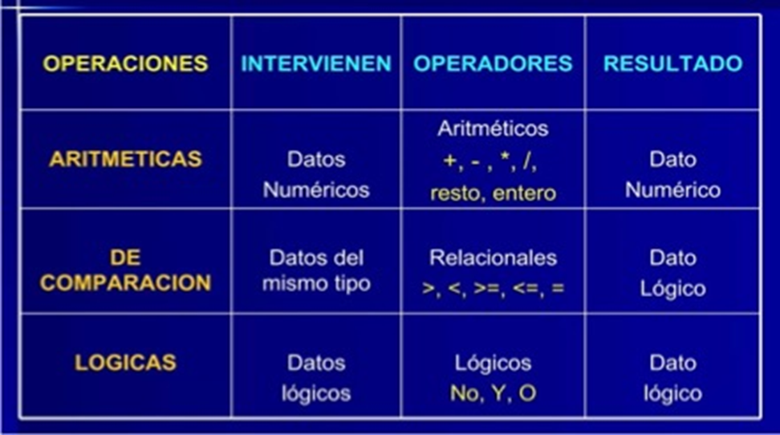

title: Operandos y operadores

## Introducción

Un operando (variable, constante literale o resultado de una llamada a función o método) es un valor que representa un dato que será procesado en una expresión para obtener un valor como resultado.

Un operador es un símbolo en una expresión que representa una operación aplicada a los operandos sobre los que actúa. 
Por lo tanto, los operandos y los operadores son componentes básicos de un programa.

## ¿Qué es un operando?

!!! abstract "Definición"
    En una expresión, un **operando** es un término utilizado en programación para referirse a un dato o conjunto de datos a los que se les aplican operadores para realizar una operación y devolver un resultado.

Estos **datos** pueden ser variables que contienen valores almacenados en la memoria, valores literales (numéricos, cadenas de caracteres, booleanos, etc.), constantes que se especifican en el código directamente, llamadas a funciones o incluso expresiones más complejas que combinan múltiples operandos y operadores. 

``` py title="Python"
x = 10  # x es una variable con el valor 10
y = 5   # y es otra variable con el valor 5

# aquí, x e y son operandos de la expresión que los suma y suma es la variable que almacenará el valor resultante
suma = x + y
```
> En este ejemplo, tanto la variable x como la variable y son operandos de las dos expresiones de asignación; y también son operandos de la expresión que realiza una suma de sus valores almacenados, asignando el resultado en la variable suma.

### Tipos de operandos

Los diferentes **tipos de operandos** que se encuentran en una expresión de programación **pueden variar según el lenguaje de programación** utilizado, pero aquí hay algunos ejemplos comunes:

    * **Números**: los operandos numéricos pueden ser:
        * **Números enteros**: representan números enteros sin decimales, como 1, 10, -5, etc.
        * **Números de punto flotante**: representan números con decimales, como 3.14, -2.5, 0.75, etc.
    * **cadenas de caracteres**: las cadenas de caracteres **son secuencias de caracteres** como "Hola", "OpenAI", o incluso números tratados como texto, por ejemplo, "20" se lee dos cero y no veinte, y **se utilizan para representar texto** en un programa. Estos operandos pueden ser concatenados o ser modificados mediante otras operaciones relacionadas con las cadenas de caracteres.
    * **Booleanos** (lógicos): los operandos booleanos representan un valor lógico que puede ser verdadero o falso (true o false). **Se utilizan** en expresiones relacionales y lógicas (de comparación) para **evaluar condiciones** o **manipular el control de flujo del programa**.
    * **Variables**: las variables son operandos que pueden contener valores numéricos, cadenas de caracteres, valores booleanos u otros tipos de dato.
    * **Arreglos** o **listas**: los operandos pueden ser **elementos individuales dentro de un arreglo o lista**, y se pueden realizar operaciones en ellos, como acceso por índice o recorrido.
    * **Objetos**: En lenguajes de programación orientados a objetos, los operandos pueden ser **instancias de clases u objetos**, y se pueden realizar operaciones en ellos llamando a métodos o accediendo a propiedades.
    * **Expresiones**: Los operandos **pueden ser expresiones completas que deben evaluarse antes de que se realice una operación**. Por ejemplo, en la expresión (2 + 3) * 4, la subexpresión (2 + 3) se evalúa antes de ser multiplicada por 4. Es decir, los operandos pueden ser subexpresiones que deben calcularse antes de realizar la expresión principal.

!!! important "¡Para recordar!"
    La disponibilidad y los tipos de operandos pueden variar según el lenguaje de programación específico que estés utilizando.

## Operadores

!!! abstract "Definición"
    En programación, los operadores son símbolos especiales que se utilizan para realizar diferentes operaciones con los datos.

    Estas operaciones pueden incluir cálculos matemáticos, comparaciones de valores, asignaciones de un valor a una variable, combinar cadenas de caracteres y operar la manipulación de bits, entre otras cosas.

Además de realizar la operación, un operador devuelve un valor. El valor devuelto y su tipo dependen del operador y del tipo de sus operandos. Por ejemplo, los operadores aritméticos, que realizan operaciones aritméticas básicas como la suma y la resta, devuelven números, el resultado de la operación aritmética. El tipo de dato devuelto por un operador aritmético depende del tipo de sus operandos: si suma dos enteros, obtiene un entero de vuelta. Se dice que una operación evalúa su resultado.

Los operadores se clasifican en diferentes categorías según el tipo de operación que realizan.

 lenguaje de programación tiene su propio conjunto de operadores con reglas y funcionalidades específicas que pueden variar entre los diferentes lenguajes. 

### Operaciones con los datos



> Estas operaciones pueden tener **reglas de precedencia y asociatividad** que determinen el orden en que se evalúan las expresiones. 

Es importante entender las reglas para obtener los resultados esperados en tus programas. Por ello, las estudiaremos más adelante. 

Pero antes recuerda que estas son reglas generales y pueden variar dependiendo del lenguaje de programación específico que estés utilizando. Es recomendable consultar la documentación del lenguaje para obtener información precisa sobre las reglas de precedencia y asociatividad que se aplican en ese contexto particular.

!!! info "Ten en cuenta"
    Siempre consulta la documentación para obtener información detallada sobre cada tema.

### Operador unario, binario y ternario

Un operador que requiere un operando (un argumento) se llama operador unario. 

Por ejemplo, op1++ es un operador unario que incrementa el valor de su operando en 1. Ya lo estudiaremos más adelante.

Un operador que requiere dos operandos (dos argumentos) es un operador binario.

Aquí, op1 = op2 es un operador binario que asigna el valor de su operando de la derecha a su operando de la izquierda. 

Y finalmente, un operador ternario es aquel que requiere tres operandos (tres argumentos). 

Por ejemplo, la sentencia abreviada  if-else  op1 ? op2 : op3

Es importante entender estas reglas para obtener los resultados esperados en tus programas. Y es por ello que las estudiaremos más adelante. 

Pero antes recuerda que estas son reglas generales y pueden variar dependiendo del lenguaje de programación específico que estés utilizando. Es recomendable consultar la documentación del lenguaje para obtener información precisa sobre las reglas de precedencia y asociatividad que se aplican en ese contexto particular.

### Operadores de asignación

Se utilizan para asignar valores:

* Asignación simple: el símbolo ( = ), se utiliza para asignar un valor a una variable. 
        
    ``` py
    x = 3
    ```
    
* Asignación compuesta: existen operadores compuestos que combinan una operación y una asignación en un solo paso:
  
    * suma y asignación o adición compuesta ( += ) se suma el valor del lado derecho del operador al valor actual de la variable del lado izquierdo del operador y se asigna el resultado nuevamente a la misma variable en la misma operación.  En otras palabras, es una manera conveniente y abreviada de escribir la operación de suma y asignación en un solo paso.

    ``` py
    x += 3 # equivale a x = x + 3
    ```

    * resta y asignación o sustracción compuesta ( -= ) se resta el valor del lado derecho del operador al valor actual de la variable del lado izquierdo del operador y se asigna el resultado nuevamente a la misma variable en la misma operación.  
    En otras palabras, es una manera conveniente y abreviada de escribir la operación de resta y asignación en un solo paso.

    ``` py
    x -= 3 # equivale a x = x - 3
    ``` 
    
    * multiplicación y asignación o multiplicación compuesta ( *= ) se multiplica el valor del lado derecho del operador al valor actual de la variable del lado izquierdo del operador y se asigna el resultado nuevamente a la misma variable en la misma operación.  
    En otras palabras, es una manera conveniente y abreviada de escribir la operación de multiplicación y asignación en un solo paso.

    ``` py
    x *= 3 # equivale a x = x * 3
    ``` 
  
    * división y asignación o división compuesta ( /= ) se divide el valor la variable del lado izquierdo del operador por el valor del lado derecho del operador y se asigna el resultado nuevamente a la misma variable en la misma operación.  
    En otras palabras, es una manera conveniente y abreviada de escribir la operación de división y asignación en un solo paso.

    ``` py
    x /= 3 # equivale a x = x / 3
    ``` 

!!! important "¡Para recordar!"
    Para conocer los distintos operadores de asignación compuesta disponibles para un lenguaje de programación particular, te recomiendo que revises la documentación existente del lenguaje en cuestión.

### Operadores aritméticos

Se utilizan para realizar operaciones matemáticas básicas:

* suma ( + ) 
* resta ( - )
* multiplicación ( * )
* división ( / )
* división entera ( // ) Se utiliza para realizar una división entera entre dos números y obtener el cociente redondeado hacia abajo al número entero más cercano. Se lo conoce como Floor Division y es especialmente útil cuando se desea obtener solo la parte entera del cociente de una división y descartar la parte decimal.
* módulo ( % )
* exponenciación ( ** ) o ( ^ ) También existen funciones como pow(base, exponente), dependiendo del lenguaje de programación.
* radicación ( ** (1/x) ) o ( ^ (1/x) ) En muchos lenguajes de programación, no existe un operador específico para la operación de radicación (cálculo de raíces). En su lugar, se utiliza el operador de potenciación junto con expresiones matemáticas para calcular raíces.  También existen funciones como math.sqrt(), dependiendo del lenguaje de programación.

### Operador de concatenación

Se utiliza para unir dos cadenas de caracteres:

* concatenación ( + ) opera con cadenas de caracteres.
  
    ``` js
    print("Hola" + " " + "Mundo!")
    ```

    ``` title="Terminal (Entrada/Salida)" linenums="1"
    Hola Mundo!
    ```

### Operador de repetición (_repetition operator_)

El operador ( * ) en Python se llama operador de repetición cuando se usa con cadenas de caracteres.

``` py title="Python"
cadena = "Ay "
cadena_repetida = cadena * 3
print(cadena_repetida)
```

 ``` title="Terminal (Entrada/Salida)"
 Ay Ay Ay
 ```

### Operador de desempaquetado (_unpacking operator_)

!!! Warning "Ver https://towardsdatascience.com/unpacking-operators-in-python-306ae44cd480"

El operador ( * ) en Python se llama operador de desempaquetado cuando se usa para desempaquetar colecciones en variables individuales

``` py title="Python"
# Tenemos una lista de tres elementos
numeros = [1, 2, 3]

# Usamos el operador * para desempaquetar los elementos de la lista
a, b, c = numeros

# Ahora las variables a, b y c contienen los valores de la lista
print(a)  
print(b)  
print(c)  
```

``` title="Terminal (Entrada/Salida)"
1
2
3
```

> En este código, `a, b, c = numeros` desempaqueta los elementos de la lista `numeros` en las variables `a`, `b` y `c`.  
> Después de esta línea, `a` contiene el primer elemento de la lista, `b` contiene el segundo elemento y `c` contiene el tercer elemento.

En el ejemplo anterior, el desempaquetado es implícito y no precisa incluir al operador.

Pero existen casos donde esta sintaxis no es posible y entonces resulta necesario aplicar el operador:

    Aquí tienes un ejemplo donde se aplica el operador de desempaquetado ( * ) para pasar los elementos de una lista como argumentos a una función:

    ```py title="Python"
    def suma(a, b, c):
        return a + b + c

    # Tenemos una lista de tres elementos
    numeros = [1, 2, 3]

    # Usamos el operador * para desempaquetar los elementos de la lista y pasarlos como argumentos a la función suma
    resultado = suma(*numeros)

    print(resultado)
    ```
    
    ``` title="Terminal (Entrada/Salida)"
    6
    ```

    > En este código, `suma(*numeros)` desempaqueta los elementos de la lista `numeros` y los pasa como argumentos a la función `suma()`.  
    La función `suma()` luego suma estos argumentos y retorna el resultado.

### Operadores de incremento y de decremento

Son útiles en situaciones donde se necesita aumentar o disminuir el valor de una variable de manera rápida y sencilla:

* incremento ( ++ ) aumenta el valor de una variable en 1.

    ``` js
    x++ # es equivalente a x = x + 1
    ```

* decremento ( -- ) disminuye el valor de una variable en 1.

    ``` js
    y-- # es equivalente a y = y – 1
    ```

!!! info "¡Importante!"
    Es importante tener en cuenta que los operadores de incremento y decremento también se pueden utilizar con otros tipos de dato como enteros, números decimales o incluso caracteres en algunos lenguajes. 

    Sin embargo, su comportamiento podría variar dependiendo del lenguaje de programación que estés utilizando, por lo que es recomendable consultar la documentación específica del lenguaje para obtener más información sobre su uso y posibles limitaciones.

#### Sufijo y prefijo

Pueden ser utilizados en dos maneras diferentes: sufijo y prefijo. Dependerá de cómo desees que se realicen las operaciones en tu código.

* Sufijo (x++, x--): cuando utilizas el operador con sufijo, la notación de sufijo significa que el operador de incremento o de decremento se coloca después del operando, es decir, después del nombre de la variable. 

    Así, al ejecutarse la sentencia, primero se asigna el valor actual almacenado en la variable de referencia a la variable de almacenamiento y luego se realiza el incremento o decremento de dicho valor. 
    
    ``` js title="Ejemplo de sufijo incremental"
    x = 5
    y = x++
    print(x)
    print(y)
    ```

    ``` title="Terminal (Entrada/Salida)"
    6
    5
    ```

    > Si tienes una variable x con valor 5 y se ejecuta `y = x++`, se asignará el valor actual de x a y, y luego se incrementará el valor de x en 1. 
    > Por lo tanto, la variable y tendrá almacenado un 5 y la variable x tendrá almacenado un 6 después de la operación.

    ``` js title="Ejemplo de sufijo decremental"
    x = 5
    y = x--
    print(x)
    print(y)
    ```

    ``` title="Terminal (Entrada/Salida)"
    4
    5
    ```

    > Si tienes una variable x con valor 5 y ejecuta `y = x--`, se asignará el valor actual de x a y, y luego se decrementará el valor de x en 1. 
    > Por lo tanto, la variable y tendrá almacenado un 5 y la variable x tendrá almacenado un 4 después de la operación.

* Prefijo (++x, --x): por otro lado, cuando utilizas el operador con prefijo, la notación de prefijo significa que el operador de incremento o de decremento se coloca antes de su operando, es decir, antes del nombre de la variable.
 
    Así, al ejecutarse la sentencia, primero se realiza el incremento o decremento del valor almacenado en la variable de referencia y luego se asigna el nuevo valor de dicha variable a la variable de almacenamiento. 

    ``` js title="Ejemplo de prefijo incremental"
    x = 5
    y = ++x
    print(x)
    print(y)
    ```

    ``` title="Terminal (Entrada/Salida)"
    6
    6
    ```

    > Si tienes una variable x con valor 5 y ejecuta `y = ++x`, primero se incrementará el valor de la variable x en 1 y luego se asignará el nuevo valor de x a la variable y. 
    > En este caso, la variable y tendrá almacenado un 6 y la variable x también también tendrá almacenado 6 después de la operación.

    ``` js title="Ejemplo de prefijo incremental"
    x = 5
    y = --x
    print(x)
    print(y)
    ```

    ``` title="Terminal (Entrada/Salida)"
    4
    4
    ```

    > Si tienes una variable x con valor 5 y se ejecuta `y = --x`, primero se decrementará el valor de la variable x en 1 y luego se asignará el nuevo valor de x a la varianble y. 
    > En este caso, la variable y tendrá almacenado un 4 y la variable x también también tendrá almacenado 6 después de la operación.

En resumen, la elección entre el sufijo y el prefijo dependerá de si deseas utilizar el valor original o el nuevo valor de la variable en una operación. 

Ambos tienen sus usos en diferentes situaciones y dependerá de tus necesidades específicas en el código que estés escribiendo.

### Operadores de comparación

Se utilizan para comparar dos valores y devolver un resultado de tipo lógico o _booleano_ (verdadero / True o falso / False):

* igualdad ( == ) compara si dos valores son iguales
* desigualdad ( != ) compara si dos valores son diferentes
* mayor que ( > ) compara si el valor a la izquierda es mayor
* menor que ( < ) compara si el valor a la izquierda es menor
* mayor o igual que ( >= ) compara si el valor a la izquierda es mayor o igual
* menor o igual que ( <= ) compara si el valor a la izquierda es menor o igual

### Operadores lógicos (_booleanos_)

Se utilizan para combinar o negar expresiones lógicas o _booleanas_, es decir, para realizar pruebas condicionales y tomar decisiones en un programa:

* negación lógica NOT ( ! ) invierte el valor de verdad de una expresión
* conjunción lógica AND ( && ) devuelve true si ambos operandos son true 
* disyunción lógica OR ( || ) devuelve true si al menos uno de los operandos es true

{: class="center back-white border-round"}


### Operadores de pertenencia

Los operadores de pertenencia se utilizan para verificar si un valor o variable se encuentra en una secuencia, como una lista, una tupla, un diccionario, un conjunto o una cadena.

* **in** devuelve True si un valor se encuentra en la secuencia y False de lo contrario.
* **not in** devuelve True si un valor no se encuentra en la secuencia y False de lo contrario.

```py title="Python"
lista = [1, 2, 3, 4, 5]

print(3 in lista)  # Output: True
print(6 in lista)  # Output: False

print(3 not in lista)  # Output: False
print(6 not in lista)  # Output: True

cadena = "Hola, mundo!"

print("mundo" in cadena)  # Output: True
print("adios" in cadena)  # Output: False

print("mundo" not in cadena)  # Output: False
print("adios" not in cadena)  # Output: True
```

Estos operadores son muy útiles para verificar la presencia de un elemento en una secuencia sin tener que recorrerla explícitamente.

### El operador coma y las expresiones compuestas

El operador coma ( , ) es utilizado en varios lenguajes de programación para unir, combinar, múltiples expresiones en una sola expresión más grande. Este evalúa cada una de las expresiones en orden, de izquierda a derecha, y devuelve el resultado de la última expresión (pero puede depender de la evaluación de las otras expresiones).

El operador coma es el operador de menor precedencia.

**Declaraciones de variables:**   
El operador coma se puede utilizar en la declaración de variables para inicializar múltiples variables en una sola sentencia.  

En el siguiente ejemplo, se declaran e inicializan las variables a, b y c en una sola línea separando cada inicialización con el operador coma.

``` js title="JavaScript"
int a = 1, b = 2, c = 3;
```

**Secuencia de expresiones:**   
El operador coma se puede utilizar para separar varias expresiones en una secuencia. Cada expresión se evalúa, pero solo el resultado de la última expresión se toma como resultado final.

En el siguiente ejemplo, las expresiones (a++, b++, c++) forman una secuencia donde los valores de a, b y c se incrementan en 1.  
La variable resultado almacena el valor de c antes del incremento en la última expresión de la secuencia, es decir, 3.  
Luego, vemos como x adopta, en ambos casos, el valor de la última expresión, pero la variable y va cambiando de valor en las expresiones previas.

``` js title="JavaScript" 
let a = 1, b = 2, c = 3; let resultado = (a++, b++, c++); console.log(resultado); // Imprime 3
let m = (n = 3, n + 1); console.log(m); // m vale 4
let x = (y = 20, y = y - 5, 30/y) console.log(x) // x vale 2
```

**Bucles y funciones:**
el operador coma se puede utilizar en bucles y funciones para combinar múltiples expresiones en un solo lugar.  

En el siguiente ejemplo, se utiliza el operador coma para combinar las expresiones i++ y j-- en el incremento y decremento de las variables i y j, respectivamente, dentro del bucle for.  
El bucle se va a repetir, imprimiendo los valores almacenados en i y en j mientras que el valor de i sea menor que el valor de j.

``` js title="JavaScript"
for (i = 0, j = 10; i < j; i++, j--) {
    console.log(i, j);
}
```

``` title="Terminal (Entrada/Salida)"
0 10
1 9
2 8
3 7
4 6
```

!!! info "¡Importante!"
    Hay que tener en cuenta que el uso del operador coma debe hacerse con precaución, ya que puede complicar la legibilidad y el mantenimiento del código si se utiliza en exceso o de manera confusa. 

    Es recomendable utilizarlo de manera clara y comprensible para evitar confusiones.
