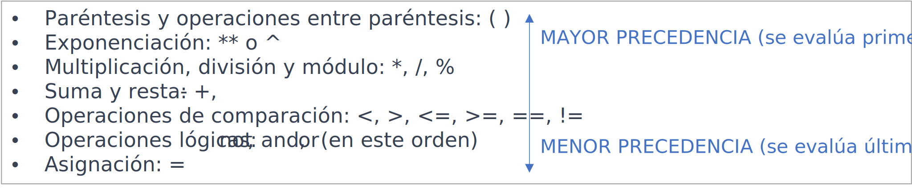

title: Operandos y operadores: resumen

!!! warning "Revisar todo el resumen. Hay cosas mezcladas"

En una expresión, un operando es un término utilizado en programación para referirse a un dato o conjunto de datos a los que se les aplican operadores para realizar una operación y devolver un resultado.

Estos datos pueden ser variables que contienen valores almacenados en la memoria, valores literales (numéricos, cadenas de caracteres, booleanos, etc.), constantes que se especifican en el código directamente, llamadas a funciones o incluso expresiones más complejas que combinan múltiples operandos y operadores. 

Existen diferentes tipos de operandos cuya disponibilidad y variedad puede variar según el lenguaje:

* Números (enteros  y de punto flotante)
* cadenas de caracteres
* Booleanos (valor lógico true o false)
* Variables (incluyendo a todos sus tipos de datos)
* Arrays 
* Listas
* Objetos
* Expresiones

En programación, los operadores son símbolos especiales que se utilizan para realizar diferentes operaciones (cálculos matemáticos, comparaciones de valores, asignaciones de un valor a una variable, combinar cadenas de caracteres, etc.) con los datos.

Existen diferentes tipos de operadores cuya disponibilidad y variedad puede variar según el lenguaje:

* Operadores de asignación (simple y compuesta)
* Operadores aritméticos
* Operadores de concatenación
* Operadores de incremento y de decremento (utilizándolos con sufijo x++ o prefijo ++x)
* Operadores de comparación
* Operadores lógicos

Las operaciones pueden tener reglas de precedencia y asociatividad que determinen el orden en que se evalúan las expresiones. 

Precedencia de operadores: establece el orden en el cual se evalúan los operadores en una expresión. 

Asociatividad de operadores: define el orden en el cual se evalúan los operadores del mismo nivel de precedencia cuando no hay paréntesis para establecer un orden explícito. La asociatividad puede ser izquierda o derecha. Si los operadores tienen la misma precedencia y asociatividad, la evaluación se realiza de izquierda a derecha.

Estas reglas pueden variar ligeramente dependiendo del lenguaje de programación específico que se esté utilizando. Por lo tanto, es recomendable consultar la documentación del lenguaje para obtener las reglas de precedencia exactas que se aplican en ese contexto.

En resumen, cada lenguaje de programación tiene su propio conjunto de operadores con reglas y funcionalidades específicas que pueden variar entre los diferentes lenguajes. 

Por ejemplo, algunos lenguajes pueden tener reglas específicas sobre el redondeo y el tratamiento de los números negativos.

Por lo tanto, **cada operación tiene su propia sintaxis y reglas de uso específicas**. 

Consulta la documentación para obtener información detallada sobre los operadores disponibles y cómo se utilizan.
