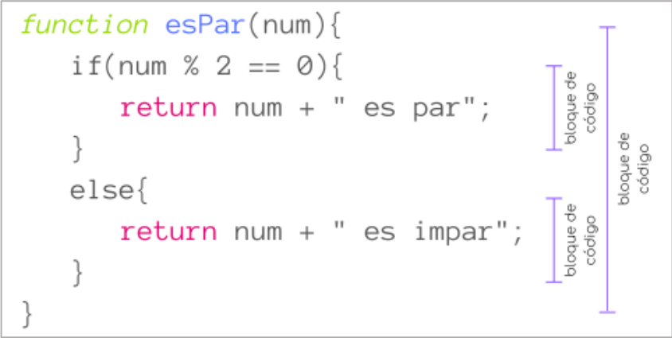

title: Alcance de una variable: resumen

Un concepto muy importante en la programación es el concepto de alcance.

El alcance define en que partes del código existe y puede ser accedida una variable, ya que mientras algunas variables pueden ser accedidas en cualquier parte del programa, otras solo pueden ser utilizadas en ciertas partes del código.

Se le denomina bloque de código al código que se encuentra delimitado entre llaves { }. 

Los bloques de código nos permiten agrupar una o más sentencias.

{: class="center back-white border-round"}

En el alcance global, las variables se declaran fuera de los bloques de código. 

Por esto mismo, como las variables no pertenecen exclusivamente a un solo bloque pueden ser utilizadas desde cualquier región del código. 

A estas variables se les conoce como variables globales.

``` js title="JavaScript"
function bienvenida() {
   console.log("¡Hola, " + nombre + "!")
}
function colorFavorito() {
   console.log("Me llamo " + nombre + " y mi color favorito es el " + color)
}
{ // Bloque principal (main)
   var nombre = "Juan"
   var color = "azul"
   bienvenida()
   colorFavorito()
}
```

``` title="Terminal (Entrada/Salida)"
¡Hola, Juan!
Me llamo Juan y mi color favorito es el azul
```

> Como podemos ver en el ejemplo, ambas funciones pueden utilizar las variables nombre o color pues estas fueron definidas fuera de los bloques de código.

Cuando una variable es definida dentro de un bloque de código, esta solo puede ser accedida por el código dentro del mismo bloque o de los bloques contenidos dentro del bloque donde es definida la variable. 

Las variables que son definidas dentro de un bloque de código se conocen como variables locales.

``` js title="JavaScript"
function sumar () {
   let a = 10
   if(a > 5) {
      let b = 15
      console.log(a + b)  //Se imprime en consola 25
   }
   return a + b; // Error
}
{ // Bloque principal (main)
   sumar()
}
```

``` js title="Terminal (Entrada/Salida)"
25
index.js:7

  return a + b
             ^
ReferenceError: b is not defined
```

> En este caso, obtenemos un error al ejecutar la función sumar(), pues, aunque la condición del if se cumple y dentro del bloque de código (bloque verdadero) se ejecuta la inicialización de la variable b con el valor 15, esta se elimina al finalizar dicho bloque, no existiendo ya fuera de las llaves (ámbito) donde fue creada, por lo que no podemos utilizarla en la línea de retorno (return)

Es importante recordar que los parámetros de una función se inicializan como variables locales dentro del cuerpo de la función.

``` js title="JavaScript"
function ubicacion(ciudad) {
   console.log("Mi ciudad favorita es: " + ciudad)
}
{ // Bloque principal (main)
   ubicacion("San Francisco")
   console.log(ciudad)  // Error
}
```

``` js title="Salida
Mi ciudad favorita es: San Francisco

index.js:5
  console.log(ciudad)  
              ^
ReferenceError: ciudad is not defined
```

> Aquí, los argumentos que reciben estos parámetros al ser invocada la función solamente existirán mientras se ejecute dicha función.

La vida de una variable comienza cuando es declarada.

Las variables locales son destruidas (eliminadas), y dejan de ser accesibles, cuando la ejecución del programa abandona el bloque de código donde han sido declaradas , mientras que las variables globales son destruidas cuando la ejecución del programa termina por completo. 

Sin embargo, también es posible destruir una variable local o global en cualquier momento del ciclo de vida, con la instrucción de destrucción correspondiente.

El término destruir hace referencia a que la dirección de memoria asociada a la variable pasa a estar disponible para albergar otra variable que se defina en el programa, posteriormente, y que eventualmente sobrescribirá los bits antiguos almacenados en dicha dirección.

!!! success "Buenas prácticas"
    Aunque en principio podría parecer más sencillo crear a todas las variables accesibles desde cualquier ámbito para nuestro código (variables globales), esto se considera una muy mala práctica de programación pues conforme el programa vaya creciendo esto podría ocasionar serios problemas:
    
    * Disminuye la legibilidad
    * Su uso puede producir efectos colaterales, al producirse alteraciones no previstas de su valor en una parte del programa (un bloque de código) que afectan a su uso en otra parte del programa (otro bloque de código o, incluso, en el bloque principal del programa).
    * Dificultan la modularidad del código.
    
    Si bien las variables globales se justifican solamente cuando se necesitan en casi todas las partes del programa, la regla de oro es no utilizarlas.
    
    Es por ello que siempre debemos intentar utilizar variables locales. De esta forma no solo se pueden evitar errores o confusiones con los nombres y valores de estas variables, sino que el utilizar variables locales hará el código más legible pues los bloques de código proporcionan una mejor organización e incluso permitirán ahorrar espacio reservado en memoria, pues las variables dejarán de existir en cuanto el bloque donde fueran declaradas termine de ejecutarse.


