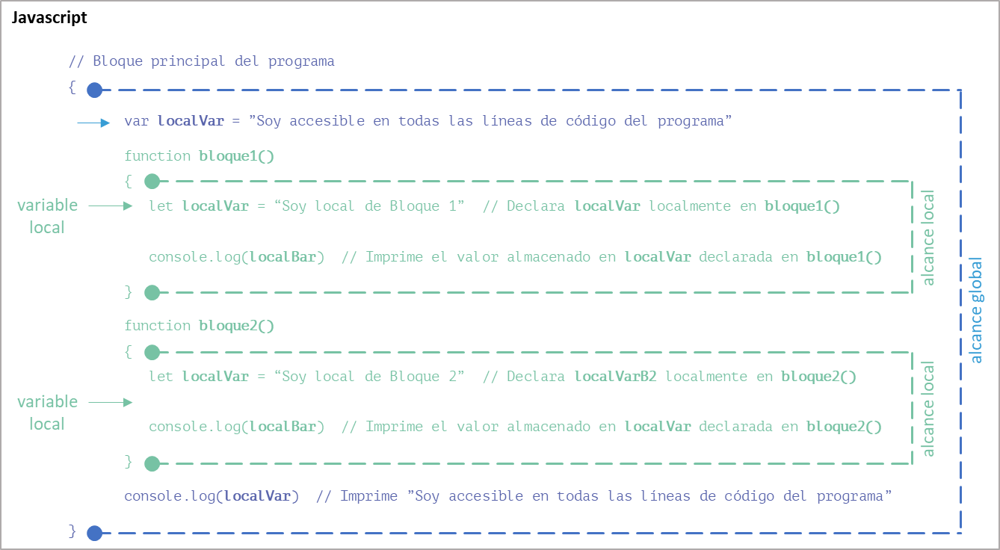

title: Alcance de las variables

## Definición

Un concepto muy importante en programación es lo que llamamos alcance de una variable (variable scope). Por definición, no es posible acceder a todas las variables desde cualquier parte de un programa

!!! success "¡Importante!"
    El alcance de una variable se refiere a la región del programa donde la variable es visible y accesible para ser utilizada.

    En otras palabras, dependiendo de su alcance, una variable puede ser accesible desde cualquier parte del programa o no.  

Así, el alcance de una variable está determinado por el ámbito de aplicación, la parte del programa, donde esta es declarada. Es el límite, dentro de un programa, donde vive una variable.

Cuando hablamos de ciclo de vida de una variable nos referimos a las fases desde que es declarada hasta que es destruida una variable durante la ejecución de un programa.

## Introducción a los diferentes ámbitos del alcance

Básicamente podemos dividir a las variables en función del ámbito donde son accesibles como **locales** o **globales**. 

Luego, dependiendo del lenguaje podemos identificar otros ámbitos como **Bloque (Block)**, **Función (Function)**, **Instancia (Instance)** o **Clase (Class)** entre otros.

En Python, por ejemplo, hay cuatro tipos principales de alcance que son la base de la regla _LEGB_. 
_LEGB_ significa Local (Local) &#x2192; Envolvente, Padre o Superior (Enclosing) &#x2192; Global (Global) &#x2192; Integrado o Incorporado (_Built-in_) y es la lógica seguida por un intérprete de Python cuando ejecuta su programa.

{: class="center back-white border-round"}

## Diferentes ámbitos de alcance de una variable

Como dijimos, en programación, el alcance de una variable se refiere a la parte del código donde esta es declarada y puede ser accedida. Los tipos más comunes de alcances en la programación son:

1. **Ámbito global (Global)**: las variables declaradas como globales en el bloque principal del programa, afuera de una función, método, clase, instancia o bloque de código, tienen un ámbito y una duración global, y son accesibles durante toda la ejecución del programa desde cualquier lugar del bloque principal del programa, función, clase, instancia o bloque de código. 

1. **Ámbito local (Local)**: las variables declaradas dentro de una función, método, clase, instancia o bloque de código tienen un ámbito local. Solo son accesibles dentro de esa función, método, clase, instancia o bloque de código y tienen una duración que se extiende desde el punto de declaración hasta el final de la mencionada función, método, clase, instancia o bloque de código.

1. **Ámbito envolvente (Enclosing)**: todas las variables locales declaradas dentro de un bloque son accesibles dentro de los bloques internos que este bloque contenga, por no viceversa. Es decir que todas las variables locales declaradas dentro del bloque interno no son accesibles en el bloque externo. Al **ámbito envolvente** se lo considera un **ámbito anidado (Nested scope)**.

1. **Ámbito de bloque (Block)**: algunos lenguajes de programación, como C, C++ y JavaScript, permiten ámbitos de nivel de bloque. Las variables declaradas dentro de un bloque, como dentro de una estructura alternativa o de un bucle, tienen un alcance limitado a ese bloque. Solo son accesibles dentro del bloque y sus bloques anidados. La vida útil de las variables de ámbito de bloque depende del idioma y el contexto específico.

1. **Ámbito de función (Function)**: las variables declaradas dentro de una función se comportan como variables locales. Solo son accesibles dentro de esa función y tienen una duración que se extiende desde el punto de declaración hasta el final de la mencionada función.

1. **Ámbito de clase (Class)**: en la programación orientada a objetos, las variables declaradas dentro de una clase pero fuera de cualquier método se conocen como variables de clase o variables estáticas. Estas variables pertenecen a la clase misma en lugar de instancias de la clase. Son accesibles para todas las instancias de la clase y tienen una duración vinculada a la duración del programa.

1. **Ámbito de instancia (Instance)**: las variables de instancia se declaran dentro de una clase y se asocian con instancias u objetos específicos de esa clase. Cada instancia de la clase tiene su propio conjunto de variables de instancia, y solo se puede acceder a ellas a través de la instancia misma. Las variables de instancia tienen una vida útil vinculada a la vida útil del objeto correspondiente.

1. **Ámbito integrado (Built-in)**: El ámbito integrado está comprendido por la colección de identificadores y funciones predefinidos que están automáticamente disponibles para cualquier parte del programa sin necesidad de una declaración o importación explícita. Estos identificadores y funciones son parte de la biblioteca estándar o funcionalidad principal de cada lenguaje de programación e incluyen operaciones fundamentales, tipos de datos, estructuras de control y funciones de utilidad que se usan comúnmente en la programación. 

    Esta colección puede variar según el lenguaje de programación, pero algunos ejemplos comunes son:

    1. Tipos de datos básicos: el ámbito integrado suele incluir tipos de datos estándar, como números enteros, números de punto flotante, valores booleanos, caracteres, cadenas, matrices y, en ocasiones, estructuras de datos más complejas, como listas o diccionarios.
    1. Funciones matemáticas: muchos lenguajes de programación proporcionan funciones matemáticas integradas, como funciones trigonométricas (sin, cos, tan), funciones logarítmicas (log, exp) y operaciones aritméticas (suma, resta, multiplicación, división, etc.).
    1. Funciones de entrada/salida: las funciones integradas suelen estar disponibles para realizar operaciones de entrada/salida, como leer o escribir en la consola, leer y escribir archivos y manejar la entrada del usuario.
    1. Estructuras de control: las estructuras de control básicas como alternativas (if, switch) y bucles (for, while) suelen formar parte del ámbito integrado.
    1. Manejo de errores: la funcionalidad integrada a menudo incluye mecanismos para manejar las excepciones o los errores que pueden ocurrir durante la ejecución del programa, como los bloques try-catch o las funciones de informe de errores.
    1. Manipulación de cadenas: las funciones para operaciones de cadenas como la concatenación, la extracción de sub cadenas, la búsqueda y el reemplazo a menudo se proporcionan en el ámbito integrado.
    1. Funciones de fecha y hora: muchos lenguajes de programación incluyen funciones integradas para manejar fechas, horas y zonas horarias, lo que permite operaciones como formateo de fechas, cálculo de horas y conversiones de zonas horarias.

Los elementos y las funcionalidades específicas pueden variar significativamente entre los lenguajes de programación, por lo que es importante consultar la documentación o los recursos específicos del lenguaje para explorar el alcance integrado de un lenguaje de programación en particular.

## ¿Cómo identificar el ámbito de una variable?

Cada variable solo existe y es accesible dentro del ámbito en el que ha sido declarada. Cuando hablamos de la existencia y accesibilidad dentro de un ámbito, nos referimos a su **alcance**. 

Para determinar su ámbito, hay que identificar las marcas de apertura y cierre de bloque de código más cercanas que rodean la declaración de la variable. 

!!! info "Recuerda"
    La mayoría de los lenguajes de programación utilizan llaves ({ }) para marcar el principio y el final de un bloque de código.

    Una **variable global** estará disponible en todos los bloques de código dentro del programa.

    Y una **variable local** solo estará disponible dentro del bloque de código en el que se haya declarado. Si este bloque contiene a su vez otros bloques, la **variable local** también será accesible dentro de ellos. 

{: class="center back-white border-round"}

Aquí vemos que la variable _soyGlobal_ ha sido declarada entre las dos llaves marcadas con un círculo azul. El alcance de esa variable es todo lo que se encuentra entre esas dos llaves. 
El mismo concepto se aplica para las variables _localVarB1_ y _localVarB2_, cuyos alcances están limitados por las llaves de cada función marcadas con un círculo verde.

!!! question "Para pensar:"
    ¿Qué ocurre, entonces, con las variables _localVarB1_ y _localVarB2_ cuando son accedidas dentro de las funciones _bloque1()_ y _bloque2()_?

En caso de que se utilice el mismo nombre de variable declarado en varios niveles de anidamiento (significa que hay al menos un bloque dentro de otro bloque), prevalecerá la declaración del bloque más interno, evitando el acceso, durante la ejecución del bloque interno, a la variable declarada en el bloque externo.

{: class="center back-white border-round"}

!!! question "Para pensar:"
    ¿Qué ocurre ahora, en cada caso, con la variable declarada dentro de cada bloque con el mismo nombre _localVar_ cuando se accede a su valor?

!!! warning "Importante"
    Dada su escasa legibilidad, las declaraciones anidadas de un mismo nombre de variable son situaciones que nunca deberían ocurrir en un programa bien diseñado.

## Alcance global

``` js title="Javascript"
function mostrarNombre() {
   // Acceder a la variable global
   console.log("Mi nombre es " + nombre)
}
// Bloque principal (main)
{
// Definición de variable global
   var nombre = "Juan"

   mostrarNombre()  // Salida: Mi nombre es Juan
}
```

> En este ejemplo, la variable nombre se declara como global fuera de cualquier tipo de bloque de código.  
> Sin embargo, al ser global, la función mostrarNombre() puede acceder a ella y mostrar su valor en la consola

## Alcance local

``` js title="Javascript"
function calcularSuma(a, b) {
   // Definición de variable local
   let suma = a + b
   return suma
}
// Bloque principal (main)
{ 
   console.log(calcularSuma(5, 3))  // Salida: 8
   console.log(suma); // Error: suma no está definida (solo existe dentro de la función calcularSuma)
}
```

> En este ejemplo, la variable suma se declara dentro de la función calcularSuma() y, por lo tanto, tiene un alcance local.  
> La variable solo puede ser accedida dentro de la función y no está disponible fuera de ella.

## Alcance de bloque

``` js title="Javascript"
function verificarNumero(numero) {
   if (numero >= 0) {
      let info = "El número es positivo"; // Definición de variable de bloque
      console.log(info)
   } else {
      let info = "El número es negativo"; // Definición de variable de bloque
      console.log(info)
   }
}
// Bloque principal (main)
{
   verificarNumero(5)  // Salida: El número es positivo
   verificarNumero(-3)  // Salida: El número es negativo
   console.log(info)  // Error: mensaje no está definido (fuera de ambos bloques de la estructura if)
}
```

> En este ejemplo, se declaran dos variables, una dentro de un bloque verdadero y el otra dentro del bloque falso de la estructura alternativa, con el mismo nombre info.  
> Al tener, cada una, un alcance de bloque (local), solo existirán dentro del bloque de código donde fueran declaradas.  }
> Fuera de su bloque, cada variable no está disponible, produciendo un error al intentar acceder a ellas.

## Caso práctico 1 de análisis e identificación de ámbitos de variables

!!! question "¿Para pensar?"
    ¿Puedes analizar y entender como funciona este programa?
    
    Guíate por los colores. Si no, continúa leyendo y ¡lograrás entenderlo!

{: class="center back-white border-round"}


```{.js .blue title="Javascript" linenums="1"}
// Global scope (main)
{
   var g = 0  // Declara x como global en el cuerpo principal del programa (main)
   outer()  // Llama a la función outer() dentro del cuerpo principal del programa
   console.log("La variable global g vale ", x)  // Imprime 0
}
```
```{.js .green .consecutive  linenums="7"}
function outer() {  // Es una función (equivale a un bloque de código) llamada en main
   // Local scope de outer() y Enclosing scope respecto de inner()
   let x = 1  // Declara x localmente en outer()
   let y = 1  // Declara y localmente en outer()
```
```{.js .purple .consecutive  linenums="11"}
   function inner() {  // Es una función (equivale a un bloque de código) dentro de outer()
      // Local scope de inner()
      let x = 2  // declara x localmente en inner()
      console.log("La variable local x dentro de inner() vale ", x)  // Imprime 2
      console.log("La variable local y declarada en outer() vale ", y)  // Imprime 1
   }
```
```{.js .green .consecutive  linenums="17"}
   inner()  // Llama a la función inner() dentro de outer()
   console.log("La variable local x dentro de outer() vale ", x)  // Imprime 1
   console.log("La variable global g dentro de outer() vale ", x)  // Imprime 0
}
```

``` title="Terminal (Entrada/Salida)"
Esto se ejecuta en el ámbito de inner():
La variable local x dentro de inner() vale  2
La variable local y declarada en outer() vale  1

Esto se ejecuta en el ámbito de outer():
La variable local x dentro de outer() vale  1
La variable global g dentro de outer() vale  0

Esto se ejecuta en el ámbito principal del programa:
La variable global x vale  0
```

## Caso práctico 2 de análisis e identificación de ámbitos de variables

!!! question "¿Para pensar?"
    Aquí existe una ligera diferencia en la declaración de una variable,
    
    ¿Puedes analizar y entender cuál es el error de este programa?
    
    Si no, continúa leyendo y ¡lograrás entenderlo!


```{.js .blue title="Javascript" hl_lines="3" linenums="1"}
// Global scope (main)
{
   let g = 0  // Declara x como local en el cuerpo principal del programa (main)
   outer()  // Llama a la función outer() dentro del cuerpo principal del programa
   console.log("La variable local g vale ", x)  // Imprime 0
}
```
```{.js .green .consecutive linenums="7"}
function outer() {  // Es una función (equivale a un bloque de código) llamada en main
   // Local scope de outer() y Enclosing scope respecto de inner()
   let x = 1  // Declara x localmente en outer()
   let y = 1  // Declara y localmente en outer()
```
```{.js .purple .consecutive linenums="11"}
   function inner() {  // Es una función (equivale a un bloque de código) dentro de outer()
      // Local scope de inner()
      let x = 2  // declara x localmente en inner()
      console.log("La variable local x dentro de inner() vale ", x)  // Imprime 2
      console.log("La variable local y declarada en outer() vale ", y)  // Imprime 1
   }
```
```{.js .green .consecutive hl_lines="3" linenums="17"}
   inner()  // Llama a la función inner() dentro de outer()
   console.log("La variable local x dentro de outer() vale ", x)  // Imprime 1
   console.log("La variable local g dentro de outer() vale ", x)  // ¿ Imprime 0 ?
}
```

```title="Terminal (Entrada/Salida)"
Esto se ejecuta en el ámbito de inner():
La variable local x dentro de inner() vale  2
La variable local y declarada en outer() vale  1

Esto se ejecuta en el ámbito de outer():
La variable local x dentro de outer() vale  1

```
```{.js .consecutive}
index.js:19
  console.log("La variable local g dentro de outer() vale ", g)
                                                             ^
ReferenceError: g is not defined
```

## Uso de variables globales en funciones locales

``` py title="Python"
global_var = 10

def local_function():
    global global_var
    local_var = 20
        
    print("Var local:", local_var)
    print("Var global:", global_var)

local_function()
```

> En Python se utiliza la palabra clave global seguida del nombre de la variable dentro de la función local para poder tener alcance a la variable.  
> Esto permite que la función tenga acceso tanto a las variables locales definidas dentro de ella como a las variables globales definidas fuera de ella.

``` c++ title="C++"
#include <iostream>

int global_Var = 10;

void local_function() {
    int local_Var = 20;
    std::cout << "Var local: " << local_Var << std::endl;
    std::cout << "Var global: " << global_Var << std::endl;
}

int main() {
    local_function();
    return 0;
}
```

``` js title="Javascript"
function localFunction() {
    let localVar = 20
    console.log("Var local:", localVar)
    console.log("Var global:", globalVar)
}

// Bloque principal (main)
{ 
   var globalVar = 10
   localFunction();
}
```

> En JavaScript y C++ se accede directamente a la variable global dentro de la función local para poder utilizarla.  
> Esto permite que la función tenga acceso tanto a las variables locales definidas dentro de ella como a las variables globales definidas fuera de ella.

En todos los ejemplos, se obtendría el siguiente resultado:

``` title="Terminal (Entrada/Salida)"
Var local: 20
Var global: 10
```

## Modificación de variables globales en funciones locales

``` py title="Python"
global_var = 10

def modify_global():
    global global_var
    global_var += 5

def use_global_locally():
    local_var = global_var * 2
    print("Var local:", local_var)

modify_global()
use_global_locally()

print("Var global:", global_var)
```

``` js title="Javascript"
function modifyGlobal() {
    globalVar += 5
}

function useGlobalLocally() {
    let localVar = globalVar * 2
    console.log("Var local:", localVar)
}

// Bloque principal (main)
{ 
   var globalVar = 10
   modifyGlobal()
   useGlobalLocally()
   console.log("Var global:", globalVar)
}

```

``` c++ title="C++"
#include <iostream>
int global_var = 10;

void modifyGlobal() {
    global_var += 5;
}
void useGlobalLocally() {
    int local_var = global_var * 2;
    std::cout << "Var local: " << local_Var << std::endl;
}
int main() {
    modifyGlobal();
    useGlobalLocally();
    std::cout << "Var global: " << global_Var << std::endl;
    return 0;
}
```

> En estos ejemplos, la función modify_global() o modifyGlobal() según el lenguaje, incrementa el valor de la variable global, mientras que la función use_global_locally() o useGlobalLocally() utiliza la variable global en una variable local y la imprime.  
> Al ejecutar el código, puedes ver cómo los cambios en la variable global se reflejan tanto dentro como fuera de la función.

En todos los ejemplos, se obtendría el siguiente resultado:

``` title="Terminal (Entrada/Salida)"
Var local: 30
Var global: 15
```

## Conversión de variables globales en locales

``` py title="Python"
global_var = 10

def convert_global_to_local():
    global_var = 20
    print("Var local:", global_var)

convert_global_to_local()

print("Var global:", global_var)
```

``` js title="Javascript"
function convertGlobalToLocal() {
    let globalVar = 20;
    console.log("Var local:", globalVar);
}

// Bloque principal (main)
{ 
   var globalVar = 10
   convertGlobalToLocal();
   console.log("Var global:", globalVar);
}

```

``` c++ title="C++"
#include <iostream>
int global_var = 10;

void convertGlobalToLocal() {
    int global_var = 20;
    std::cout << "Var local: " << global _Var << std::endl;
}
int main() {
    convertGlobalToLocal();

    std::cout << "Var global: " << global_Var << std::endl;

    return 0;
}
```

> En estos ejemplos, la función convert_global_to_local() declara una nueva variable local llamada global_var con un valor de 20. Dentro del ámbito de la función, cuando se hace referencia a global_var, se hace referencia a la variable local en lugar de la variable global.  
> Fuera de la función, la variable global mantiene su valor original de 10.

``` title="Terminal (Entrada/Salida)"
Var local: 20
Var global: 10
```

## ¿Puede una variable local reemplazar a una global?

!!! success "¡Recuerda!"
   Los conceptos vistos solo afectan a la variable dentro del ámbito de la función o del bloque en los que se declara la variable local.

   Fuera de esa función o bloque, la variable global seguirá existiendo y mantendrá su valor original.

   Asimismo, la variable local será destruida al finalizar la función o el bloque donde fuera creada. Así, su acceso o modificación será imposible a partir de dicha finalización.

Veamos el siguiente ejemplo:

``` py title="Python"
global_var = 10

def modify_global():
    global global_var
    global_var += 5

def use_global_locally():
    local_var = global_var * 2
    print("Var local:", local_var)

print("Var global:", global_var)

modify_global()
use_global_locally()

print("Var global:", global_var)
print("Var local:", local_var)
```

!!! question ¿¿Qué ocurrirá cuando se ejecute la última línea del programa?

``` title="Terminal (Entrada/Salida)"
Var global: 10
Var local: 20
Var global: 10
```
``` {.py .consecutive}
Error: NameError: name ‘local_var' is not defined
```

## Error al acceder a una variable local fuera de su alcance (scope)

Cuando intentas acceder a una variable local fuera de su alcance, es posible que encuentres un error dependiendo del lenguaje de programación que estés utilizando. Por lo general, las variables locales tienen un alcance limitado dentro del bloque de código donde se definen. Una vez que el flujo de ejecución sale de ese bloque, las variables locales ya no son accesibles.

En el siguiente ejemplo, local_var se define dentro del ámbito de la función local_function(). Cuando intentemos acceder a ella fuera de la función, recibiremos un error de ReferenceError o de NameError (el nombre del error dependerá del lenguaje empleado) porque la variable no está definida en el ámbito (scope) actual.

``` py title="Python" linenums="1"
def local_function():
    local_var = 10
    return local_var

result = local_function()

print(result)  
print(local_var)  
```

``` title="Terminal (Entrada/Salida)"
10 # Imprime la línea 7
Error: NameError: name 'local_var' is not defined # Error devuelto por la línea 8
```

``` js title="Javascript" linenums="1"
function local_function() {
  let local_var = 10
  return local_var
}
// Bloque principal (main)
{
   let result = myFunction();
   console.log(result);  
   console.log(local_var); 
}
```

``` title="Terminal (Entrada/Salida)"
10 # Imprime la línea 8
Error: ReferenceError: local_var is not defined # Error devuelto por la línea 9
```

Para resolver este problema, es necesario que el código devuelva el valor almacenado en la variable local desde la función y para ser almacenado en un variable en el ámbito de llamada. 

En el ejemplo, devolvemos el valor de local_var desde la función local_function() y lo asignamos a la variable result en el ámbito de la llamada. Así, podremos acceder y utilizar el valor fuera de la función sin encontrar un error.
