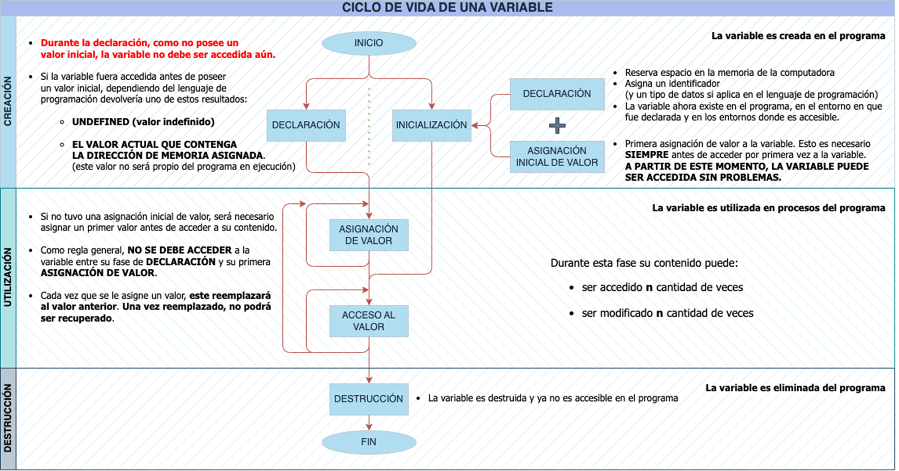

title: Ciclo de vida de una variable

## Ciclo de vida de una variable durante la ejecución de un programa

Durante la ejecución de un programa, el ciclo de vida de una variable consta de 3 etapas:
* Creación
* Utilización
* Destrucción

### Etapa de creación de una variable

1. **Creación**: en la etapa de creación de una variable, que **se ejecuta por única vez al inicio del ciclo de vida**, se realizan una serie de acciones para definir y asignar un nombre y un tipo de datos a esta, y hasta eventualmente asignarle un valor inicial:

    * **Declaración**: la creación de una variable generalmente comienza con la declaración, donde se especifica el tipo de datos que contendrá esta. Los lenguajes de programación suelen tener diferentes tipos de datos, como enteros, flotantes, caracteres, booleanos, etc. La declaración también incluye el nombre de la variable. 
    
        * **Asignación de memoria**: después de declarar una variable, se produce la asignación (reserva de espacio) de memoria para almacenar el valor de la variable. La cantidad de memoria asignada dependerá del tipo de datos de la variable. Por ejemplo, una variable entera (int) puede requerir 4 bytes de memoria, mientas que una variable de caracater (char) requiere 1 byte de memora. Es importante definir correctamente el tipo de dato para que la memora reservada sea correcta.
    
    * **Inicialización**: en muchos lenguajes de programación, se puede inicializar una variable durante su creación. La inicialización implica asignar un valor inicial a la variable. Siempre que se pueda es recomendable que la creación de una variable se efectúe mediante su inicialización. 

!!! success "¡Recuerda!"
    Una vez creada una variable, esta existirá hasta que termine el alcance o bloque de código donde haya sido creada; hasta que sea destruida o; hasta que finalice el programa.

    En algunos lenguajes, es obligatorio declarar una variable antes de utilizarla. 

!!! warning "¡Desconocer este concepto puede hacer que tu programa se comporte de manera inesperada!"
    Cabe aclarar que, al declarar una variable, la asignación de memoria no implica la asignación de un valor inicial. Así, al acceder a la variable antes de una primera asignación de valor, esta devolverá dependiendo del lenguaje de programación:

    * valor indefinido (_undefined_), 
    * un valor predeterminado, que puede ser cero o nulo dependiendo del tipo de datos, o 
    * el valor que se encuentre en la posición reservada de memoria, previamente almacenado por otro programa.

### Etapa de utilización de una variable

2. **Utilización**: en la etapa de utilización de una variable, después de crearla, esta puede ser usada para almacenar, manipular y recuperar datos durante la ejecución de expresiones y operaciones (declaración de control de flujo, llamada de función, etc.) durante la ejecución del programa:

    * **Asignación de valor**: una vez creada la variable, se puede asignar un valor específico a la variable utilizando el operador de asignación simple (=) o cualquier operador de asignación compuesta. Por ejemplo, si tienes una variable llamada edad de tipo entero, puedes asignarle un valor a partir de la expresión edad = 25.

      * **Modificación (actualización) de valor**: durante la ejecución del programa, es posible modificar el valor almacenado en una variable. Esta acción se comporta de igual manera que la **asignación de valor**, solo que se la denomina así porque el concepto es el de reasignación de un nuevo valor. Puedes utilizar operadores aritméticos o de asignación compuestos para realizar cálculos y actualizar el valor de la variable. Por ejemplo, si tienes una variable **contador** y deseas incrementar su valor en uno, puedes utilizar **contador = contador + 1** o la forma abreviada **contador += 1**.

    * **Acceso (lectura) de valor**: después de asignar un valor a la variable, puedes leer su contenido para utilizarlo en el programa. Puedes utilizar el nombre de la variable para acceder a su valor y utilizarlo en expresiones y operaciones para realizar cálculos o mostrar el valor en la salida del programa, por ejemplo.

    * **Uso en expresiones y operaciones**: una variable se utiliza ampliamente en expresiones y operaciones dentro del programa. Puedes realizar operaciones matemáticas, comparaciones, asignaciones y muchas otras manipulaciones utilizando la variable en combinación con operadores y funciones definidas en el lenguaje de programación.

!!! success "¡Recuerda!"
    Mientras la variable exista y sea accesible, todas estas acciones arriba definidas pueden ser ejecutadas tantas veces como sea necesario a lo largo de la ejecución del programa.

### Etapa de destrucción de una variable

3. **Destrucción**: en la etapa de destrucción de una variable, cuando la variable ya no será utilizada en el programa, se llevan a cabo las acciones para liberar los recursos asociados a ella (el espacio reservado de la memoria) y finalizar su existencia en el programa:

    * **Liberación de memoria**: una de las acciones más comunes en la destrucción de una variable es la liberación de la memoria que se asignó para almacenar su valor. Esto ocurre especialmente en lenguajes de programación que gestionan manualmente la asignación y liberación de memoria, como C o C++. La liberación de memoria garantiza que los recursos utilizados por la variable se devuelvan al sistema y estén disponibles para otros usos.

    * **Finalización del ámbito o alcance**: en muchos lenguajes de programación, las variables tienen un ámbito definido, que es la región del programa donde la variable es válida y accesible. Cuando el ámbito de la variable llega a su fin, ya sea **al finalizar una función o un bloque de código, la variable se destruye automáticamente**. Esto implica que la variable ya no estará disponible para su uso y se liberarán los recursos asociados a ella.

    * **Ejecución del recolector de basura (_garbage collector_)**: es un componente que se encuentra en muchos lenguajes de programación con gestión automática de memoria, como Java o Python. Este componente es responsable de administrar automáticamente la memoria durante la ejecución de un programa ya que su función principal es **identificar y liberar la memoria de los objetos que ya no se necesitan**, es decir, **recolectar la "basura"**. Por lo tanto, realiza un seguimiento de los objetos que se han asignado en la memoria y determina cuáles de ellos aún están siendo utilizados por el programa. Los objetos que ya no son accesibles o referenciados por el programa se consideran “basura” y se pueden eliminar de forma segura. Así, **la destrucción de una variable está relacionada con el proceso de recolección de basura**.

!!! success "¡Recuerda!"
    Esta etapa, que solo se ejecuta una vez al final del ciclo de vida de la variable, generalmente ocurre cuando la variable ya no es necesaria o cuando el ámbito en el que se ha creado finaliza. Luego de la destrucción, la variable ya no estará disponible para su uso y se liberarán los recursos asociados a ella.

### ¿Por qué el _garbage collector_ es tan importante?

Es un componente que se encuentra en muchos lenguajes de programación con gestión automática de memoria, como Java o Python, y en muchos entornos de ejecución. 

Es responsable de administrar automáticamente la memoria en un programa ya que su función principal es identificar y liberar la memoria que ya no se necesita, es decir, recolectar la "basura". 

#### ¿Cómo funciona?

Cuando se ejecuta un programa, se asigna memoria para almacenar objetos y datos utilizados por ese programa. A medida que el programa se ejecuta, puede crear y eliminar objetos en la memoria. Los objetos más generales son las variables. Sin embargo, a veces, estos objetos ya no son necesarios y pasan a ocupar espacio innecesariamente.

Aquí es donde entra en juego el _garbage collector_. Su función principal es identificar y liberar la memoria de objetos que ya no se necesitan. Estos objetos que ya no son accesibles o referenciados por el programa se consideran “basura” y se pueden eliminar de forma segura.

El _garbage collector_ realiza esta tarea periódicamente o cuando se cumple cierta condición, como cuando la memoria disponible se está agotando. 

Escanea la memoria en busca de objetos basura y libera la memoria que ocupan. Esto ayuda a evitar la fragmentación de la memoria y garantiza un uso eficiente de los recursos.

La presencia del _garbage collector_ simplifica la administración de la memoria para los programadores, ya que no necesitan ocuparse explícitamente de la asignación y liberación de memoria. Esto reduce los errores relacionados con la gestión manual de la memoria, como fugas de memoria, corrupción de memoria y problemas de liberación prematura o tardía de objetos. También mejora la productividad del programador, ya que pueden centrarse en la lógica de la aplicación en lugar de preocuparse por la gestión de la memoria.

### Conclusiones del ciclo de vida de una variable durante la ejecución de un programa

El ciclo de vida de una variable puede variar según el lenguaje de programación utilizado y el alcance en el que se utiliza la variable. Por ejemplo, en algunos lenguajes, las variables pueden tener un alcance limitado a una función o bloque de código, mientras que en otros pueden tener un alcance global en todo el programa. Este tema lo veremos más adelante.

Resumiendo, es importante destacar que los detalles específicos de la creación de variables pueden variar según el lenguaje de programación que estés utilizando. Algunos lenguajes tienen reglas y convenciones adicionales para la creación de variables, como restricciones en los nombres o requisitos de ámbito.

Durante la etapa de utilización de una variable, estas se utilizan en expresiones y operaciones como asignación de valores, lectura de valores, modificación de valores y se tiene en cuenta el alcance y el tipo de datos de la variable. Esto permite utilizar las variables para almacenar y manipular datos en el programa de acuerdo con su propósito y alcance.

Por último, en la etapa de destrucción de una variable se llevan a cabo acciones para liberar los recursos asociados a ella y finalizar su existencia en el programa. Esto puede implicar la liberación de memoria asignada o la finalización del ámbito en el que se encuentra. Los detalles específicos de la destrucción pueden variar según el lenguaje de programación utilizado. Algunos lenguajes tienen mecanismos adicionales de gestión de memoria, como destructores o métodos especiales, que permiten ejecutar acciones personalizadas antes de la destrucción de una variable, como liberar otros recursos o realizar tareas de limpieza.

!!! info "Importante"
    Es fundamental comprender correctamente el ciclo de vida de las variables y cuál es su ámbito (_scope_) donde es accesible para evitar errores y optimizar el uso de memoria en el programa.
