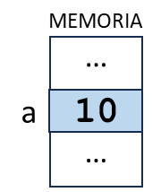

title: Creación y uso de variables

!!! warning "reformular"

!!! success "¡Recuerda!"
    En la mayoría de los lenguajes de programación, antes de que una variable pueda ser usada en un programa, esta debe ser declarada, incluyendo el tipo de datos que serán almacenados en ella. 

### ¿Cuál es la diferencia entre declarar y luego asignar un valor; o inicializar una variable?

#### Declaración

**Declarar** una variable significa **crear una nueva variable** en el programa, definiendo su **identificador** y reservando el espacio necesario en la memoria según el **tipo de datos** que almacenará durante la ejecución del programa, pero **sin asignarle valor**.

```
int a // la variable a es declarada como tipo de dato entero
```

La declaración de una variable es una instrucción que le indica a la computadora que debe reservar un espacio de memoria para almacenar el valor durante la ejecución del programa.

Para declarar una variable, se debe especificar su **nombre** y su **tipo**. 

    * El nombre de una variable identifica al valor que será almacenado. 
    * El tipo de una variable determina el tipo de datos que se pueden almacenar en ella. 

Para crear una variable en programación se utiliza una palabra clave que define su alcance. 
La palabra clave - en general y dependiendo del lenguaje, por ejemplo _var_ o _let_ - debe ir seguida del nombre de variable y el signo igual (=) para asignarle un valor inicial. Veremos este tema más adelante.

``` javascript title="Javascript"
var nombre;  // variable de alcance global
let nombre;  // variable de alcance local
```

#### Inicialización

**Inicializar** una variable significa **declararla y, además, asignarle un valor inicial**.
```
int a // la variable a ES DECLARADA SOLAMENTE como entero
int a = 0 // la variable a ES INICIALIZADA como entero y el valor 0 es asignado a ella en la misma instrucción
```

#### Asignación

**Asignar** un valor a una variable significa **almacenar un valor en el espacio de memoria reservado para ella**.
```
a = 1 // se almacena el valor 1 en la variable a, olvidando todo valor anterior almacenado en ella
```
{: class="center back-white border-round"}

!!! warning "¡Recuerda esto porque es muy importante!"
    Al almacenar un valor en una variable, si esta contenía un valor previo almacenado, este será reemplazado y ya no habrá manera de recuperarlo, perdiéndolo para siempre.

    NO HAY MANERA QUE AMBOS VALORES COEXISTAN PORQUE NO PUEDEN SUPERPONERSE.

Una vez que la variable ha sido declarada o inicializada, podemos asignarle nuevos valores utilizando el operador de asignación igual (=)

``` javascript title="Javascript"
let numero;  // Declaración de la variable numero sin asignarle un valor inicial
numero = 10;  // Asignación del valor 10 a la variable numero utilizando el operador de asignación igual (=)
```

Para cada variable, por única vez en el programa, se puede decir que:

D (eclaración) + A (signación) = I (nicialización)

|Declaración + Asignación | Inicialización |
|:---:|:---:|
| int edad | int edad = 18 |
| edad = 18 | |

## ¿Cómo se reserva el espacio en memoria para una variable?

Veamos el siguiente ejemplo: como se declaran dos variables, y por consiguiente se reserva el espacio en la memoria, para almacenar la edad de una persona y su número de hijos. 

``` py 
int edad
int numero_de_hijos
```

Puesto que las dos variables son del mismo tipo de datos, se podrían declarar en la misma línea separándolas por medio de la coma (,). La coma es un operador que permite crear expresiones compuestas. Veremos este tema más adelante.

```
int edad, numero_de_hijos
```

Así, en la memoria RAM podría ocurrir uno de estos dos casos de asignación de espacio reservado para ambas variables:


Como se ve en la imagen, los espacios de memoria reservados para las variables no tienen por qué estar de manera contigua.

## Sintaxis

``` title="Declaración"

nombre_de_tipo_de_dato nombre_de_variable
```

``` title="Asignación"

nombre_de_variable = expresión (asignación_de_valor)
```

``` title="Inicialización"

nombre_de_tipo_de_dato nombre_de_variable = expresión (asignación_de_valor)
```

La estructura de la sintaxis dependerá de si la acción es una declaración, una inicialización o una asignación.

También dependerá de como se escriba en cada lenguaje particular.

En todos los casos, dependiendo del lenguaje, pueden ser uno o más identificadores separados por coma:

``` js
int a // Declaración
a = 40 // Asignación
int a = 40 // Inicialización
bool acceso = True, escape = False
string nombre, apellido
```

### ¿Cómo se lee la sintaxis?

``` js
int a // Declaración
```

Se lee: Declaro la variable a de tipo entero (en inglés integer)

``` js
a = 40 // Asignación
```

Se lee: Asigno a la variable a el valor 40

``` js
int a = 40 // Inicialización
```

Se lee: Inicializo la variable a de tipo entero con el valor 40

También podría decir: Inicializo la variable a, almacenando el valor 40, de tipo entero

``` js
int b = a
```

Se lee: Inicializo la variable b de tipo entero con el valor almacenado en la variable a

Está mal decir: Inicializo la variable b de tipo entero con a; o b es igual a a (en ambos casos puedo entender: b = "a")

!!! info "Importante"
    En realidad, cualquier lectura que lleve a la correcta interpretación de la instrucción, es válida. Para que ello ocurra, **no puede existir ambigüedad posible**. Si la lectura puede interpretarse de dos o maneras diferentes, entonces será inválida.

### Declaración de variables en diferentes lenguajes

A continuación, se presentan ejemplos de cómo **declarar** variables con tipos de datos en algunos lenguajes de programación comunes:

``` c title="C"
int edad;
float precio;
char inicial;
``` 

``` java title="JAVA"
int edad;
double precio;
char inicial;
``` 

``` js title="Javascript"
let edad
let precio
let inicial
``` 

``` php title="PHP"
$edad;
$precio;
$inicial;
``` 

En todos estos casos, se está declarando una variable con un nombre y un tipo de dato específico si lo requiere el lenguaje. El nombre se utiliza para hacer referencia a la variable en el código, y el tipo de dato se utiliza para definir el tipo de valor que se puede almacenar en la variable. 

### Inicialización de variables en diferentes lenguajes

A continuación, se presentan ejemplos de cómo **inicializar** variables con tipos de datos en algunos lenguajes de programación comunes:

``` c title="C"
int edad = 25;
float precio = 9.99;
char inicial = ‘a’;
```

``` java title="JAVA"
int edad = 25;
double precio = 9.99;
char inicial = ‘A’;
```

``` py title="Python"
edad = 25
precio = 9.99
inicial = 'A'
```

``` js title="Javascript"
let edad = 25
let precio = 9.99
let inicial = ‘A’
```

``` php title="PHP"
$edad = 25;
$precio = 9.99;
$inicial = ‘A’;
```

En todos estos casos, se está inicializando una variable, declarándola con un nombre y un tipo de dato específico, y se le está asignando un valor inicial mediante el operador de asignación igual (=) seguido del valor que se desear.


## Intercambio de valores almacenados entre dos variables

Como dijimos, una variable es un espacio reservado de la memoria RAM que pueda almacenar un dato.

Reforcemos:

!!! warning "Una variable es un espacio reservado de la memoria RAM que pueda almacenar un dato ¡A LA VEZ!"

Por lo tanto, no es posible hacer un intercambio de valores entre dos variables de esta manera:

``` py title="Código generalizado"
a = 5
b = 10

a = b

b = a

print("a vale", a)
print("b vale", b)
```

Porque si luego accedemos a los valores almacenado en `a` y en `b` ocurrirá lo siguiente:

``` title="Terminal (Entrada/Salida)"
a vale 10
b vale 10
```

!!! question "¿Qué ha ocurrido aquí?"

Resulta que si se ejecuta `a = b` esto significa que se almacena el valor de `b` en `a`.  
Así, el valor que se encontraba almacenado en `a` es reemplazado por el nuevo valor que viene de `b`.  
Y por supuesto, el valor antiguo que tenía `a` se pierde **¡para siempre!**

A continuación, cuando se ejecuta `b = a`  esto significa que se almacena el valor de `a` en `b`.  
Pero `a` en este momento tiene almacenado el valor que había recibido de `b` en la línea de ejecución anterior.  
Así, en realidad `b` estaría recibiendo y almacenando su propio valor.

!!! question "¿Cómo se resuelve este problema?"

### Uso de variables temporales

Ahora, si empleamos una variable temporal para almacenar uno de los valores almacenados, podremos reemplazarlo luego por otro valor sin perderlo.
Veamos el código para entenderlo mejor.

``` py title="Código generalizado"
a = 5
b = 10

temp = a # Se almacena 5 en temp

a = b # Se almacena 10 en a

b = temp # Se almacena 5 en b

print("a vale", a)
print("b vale", b)
```

Si ahora accedemos a los valores almacenado en `a` y en `b` ocurrirá lo siguiente:

``` title="Terminal (Entrada/Salida)"
a vale 10
b vale 5
```
