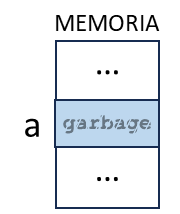
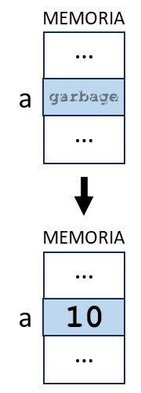
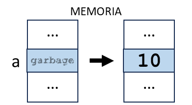
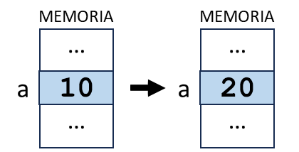

title: Utilización de variables en un programa

# Utilización de variables en un programa

<label class="revision">Rev. 11/01/2024</label>

La utilización de una variable en un programa es cuando una instrucción de código accede a la variable para realizar alguna operación o acción con ella. 

## Sintaxis

La sintaxis se refiere a las reglas y convenciones que se deben seguir al declarar, inicializar y utilizar variables en un lenguaje de programación específico. Estas reglas pueden variar de un lenguaje a otro, pero generalmente incluyen lo siguiente:

**Declaración de variables**: La sintaxis para declarar una variable generalmente incluye un tipo de dato y un identificador. 

``` title="Declaración"
tipo_de_dato identificador_de_variable
```

Por ejemplo, en Java, puedes declarar una variable de tipo entero llamada `a` de la siguiente manera: 

``` Java title="Java"
int a;
```

**Inicialización de variables**: La inicialización se refiere a la asignación de un valor inicial a una variable en el momento de la declaración. 

``` title="Inicialización"
identificador_de_variable = valor_para_asignar
```

Por ejemplo, en Python, puedes declarar e inicializar una variable `a` con el valor `10` de la siguiente manera: 

``` py title="Python"
a = 10
```

En algunos lenguajes de programación es posible declarar e inicializar una variable en la misma línea de código.

``` title="Inicialización en la declaración"
tipo_de_dato identificador_de_variable = valor_para_asignar
```

Por ejemplo, podemos unir la declaración y la inicialización que hemos visto en una sola línea de código en Java o C++:

``` Java title="Java / C++"
int a = 10;
```

**Asignación de variables**: La asignación se refiere a cambiar el valor de una variable ya declarada. 

``` title="Asignación"
identificador_de_variable = valor_para_asignar
```

Por ejemplo, en JavaScript, puedes cambiar el valor de una variable `a` con un valor almacenado de `10` a otro valor de `20` de la siguiente manera: 

``` js title="JavaScript" 
a = 10;
a = 20;
```

**Uso de variables**: Las variables se pueden utilizar en expresiones y sentencias. La sintaxis para utilizar una variable depende de la operación que se esté realizando. Por ejemplo, en C++, puedes utilizar la variable `a` en una operación de suma de la siguiente manera: 

``` C++ title="C++"
int b = a + 5;
```

Como puedes observar en cada caso, la sintaxis parece ser la misma. Es decir, la misma manera de escribir. Pero ten cuidado porque no siempre ocurre esto.

!!! important "¡Para recordar!"
    Es importante seguir la sintaxis correcta para evitar errores de compilación y de tiempo de ejecución.

Dependiendo del lenguaje, es posible declarar, inicializar o asignar dos o más variables en una misma línea de código, separadas por una coma:

``` C++ title="C++" 
int num_1, num_2, num_3;  // Declaración

int num_1 = 5, num_2 = 10, num_3 = 20;  // Declaración e inicialización

int num_1, num_2, num_3;  // Declaración
num_1 = 5, num_2 = 10, num_3 = 20;  // Inicialización

num_1 = 15, num_2 = 20, num_3 = 30;  // Asignación
```

### ¿Cómo se lee la sintaxis?

``` C++
int a;  // Declaración
```

> Se lee:  
> Se declara la variable `a` de tipo entero (en inglés integer)

``` C++
int a = 40;  // Declaración e inicialización
```

> Se lee:   
> Se declara la variable `a` de tipo entero (en inglés integer) y se inicializa con el valor cuarenta.

``` C++
int a;  // Declaración
a = 40;  // Inicialización
```

> Se lee:  
> Se declara la variable `a` de tipo entero (en inglés integer).  
> Luego, se inicializa con el valor cuarenta.

``` C++
a = 40;  // Asignación
```

> Se lee:  
> Se asigna a la variable `a` el valor cuarenta.

``` C++
int a;  // Declaración
a = 40;  // Inicialización
int b = a;  // Declaración e inicialización
```

> Se lee:  
> Se declara la variable `a` de tipo entero (en inglés integer).  
> Luego, se inicializa con el valor cuarenta. 
> Se declara la variable `b` de tipo entero (en inglés integer) y se inicializa con el valor almacenado en la variable `a`.
>
> Está mal decir: Inicializo la variable `b` de tipo entero con a; o b es igual a a (en ambos casos puedo entender: b = "a")

!!! info "Importante"
    En realidad, cualquier lectura que lleve a la correcta interpretación de la instrucción, es válida. Para que ello ocurra, **no puede existir ambigüedad posible**. Si la lectura puede interpretarse de dos o maneras diferentes, entonces será inválida.

A continuación, veremos todos estos temas en profundidad:

## Declaración de una variable

Empecemos por el principio. Para poder utilizar una variable en un programa, dicha variable debe existir y ser accesible al momento de su utilización.

En todos de los lenguajes de programación, antes de que una variable pueda ser utilizada debe ser declarada. 

En términos simples, **declarar** una variable significa **crear una nueva variable** en el programa, especificando su **identificador** y el **tipo de dato** asociado:

  * El identificador de una variable es su nombre. Debe ser único y referencial del dato que almacenará.  

  * El tipo de dato de una variable define el espacio que se reserva en memoria para almacenar el dato correctamente y de manera completa. 

### ¿Cómo se reserva el espacio en memoria para una variable?

Cada vez que se crea una variable, se reserva el espacio necesario en memoria para que esa variable pueda almacenar un valor de un determinado tipo de dato.

Por lo tanto, la declaración de una variable es la acción de reservar el espacio necesario en la memoria central (RAM) para almacenar un valor según el **tipo de dato**, asociando dicho espacio a un  **identificador** que se utilizará en el código para acceder a esa porción de memoria, durante la ejecución del programa o hasta que la variable se destruya, pero **sin asignarle un valor inicial**.  

Si no asignas un valor a la variable al declararla, lo que se almacena en ese espacio de memoria depende del lenguaje de programación:

  * En algunos lenguajes de programación, como C y C++, si no inicializas una variable al declararla, su valor es indeterminado y puede contener "basura", es decir, cualquier valor que estuviera previamente en ese espacio de memoria.

  * En otros lenguajes de programación, como Java, si no inicializas una variable al declararla, se le asignará un valor predeterminado, como 0 para los tipos numéricos, false para el tipo booleano, y null para los tipos de objeto.

  * En Python, debes asignar un valor a la variable al declararla. Si no quieres asignar un valor específico, puedes asignarle None, que es un valor especial que indica la ausencia de valor.

Por ejemplo, en el lenguaje de programación C++, una declaración de variable podría verse así:

``` C++ title="C++"
int a;
```

> La variable `a` es declarada como tipo de dato entero.

{: class="center back-white border-round"}

!!! warning "¡Para recordar!"
    Luego de cada declaración de variable se habrá reservado espacio suficiente en la memoria central (RAM) para almacenar el valor de un tipo de dato específico en ella, pero no tendrá un valor inicial asignado aún.

    **Dependiendo del lenguaje de programación**, el **espacio reservado tendrá asignado** un valor predeterminado que en general representa **neutralidad**, **falsedad** o **nulidad**; o mucho peor aun, **un valor indeterminado pudiendo contener "basura"**, es decir, cualquier valor que estuviera previamente en ese espacio de memoria.

Una vez que asignas un valor a la variable, ese valor se almacena en el espacio de memoria reservado para la variable.

### Declaración de múltiples variables

Veamos el siguiente ejemplo: 

``` 
int edad;
int numero_de_hijos;
```

Puesto que las dos variables son del mismo tipo de dato, se podrían declarar en la misma línea separándolas por medio de la coma (,).  
La coma es un operador que permite crear expresiones compuestas.

```
int edad, numero_de_hijos;
```

En el ejemplo, La declaración `int edad, numero_de_hijos;` se llama **declaración de múltiples variables**.  

Esta es una manera común de declarar varias variables del mismo tipo en una sola línea en muchos lenguajes de programación, incluyendo C, C++, Java y C#.

En la declaración del ejemplo, se crean dos variables, `edad` y `numero_de_hijos`, ambas del tipo de dato entero, y se reserva el espacio en la memoria central (RAM) necesario para almacenar la edad de una persona y su número de hijos.

Así, en la memoria RAM podría ocurrir uno de estos dos casos de asignación de espacio reservado para ambas variables:


Como se ve en la imagen, los espacios de memoria reservados para las variables no tienen por qué estar de manera contigua.

### Uso de palabras clave para definir el alcance

En algunos lenguajes, para crear una variable se utiliza una palabra clave que, además, define su alcance, seguida del identificador de la variable.  
En el caso de JavaScript, las palabras clave son  `var` para definir una variable global o `let` para definir una variable local. 

Por ejemplo,

``` JavaScript title="JavaScript"
var nombre;  // variable de alcance global
let nombre;  // variable de alcance local
```

> En este código, se declaran dos variables, una de alcance global (accesible desde cualquier bloque del programa) y otra de alcance local (accesible solo desde el bloque donde fue declarada y desde los bloques dentro de este bloque).

### Ejemplos de aplicación

A continuación, se presentan ejemplos de aplicación en algunos lenguajes de programación:

``` C++ title="C++"
int edad;
float precio;
char primera_vocal;
``` 

``` java title="Java"
int edad;
double precio;
char primera_vocal;
``` 

``` js title="JavaScript"
let edad  // variable local
let precio  // variable local
var primera_vocal  // variable global
``` 

``` php title="PHP"
$edad;
$precio;
$primera_vocal;
``` 

En todos estos ejemplos, se declaran variables. Es decir, se define el identificador y se asocia el tipo de dato específico si el lenguaje lo requiere (como en los dos primeros ejemplos) pero no se asigna ningún valor inicial a cada una.


## Inicialización de una variable

**Inicializar** una variable significa asignarle un valor por primera vez. 

Cuando se declara una variable, se reserva espacio en la memoria para ella. Sin embargo, hasta que no se le asigna un valor, esa variable no tiene un valor definido o puede contener basura (un valor residual de la memoria).

Por ejemplo, en el lenguaje de programación C++, una inicialización luego de la declaración de variable podría verse así:

``` C++ title="C++"
int a;
a = 10;
```

> En este código, primero se declara la variable `a` de tipo entero y luego, en otra línea de código, se inicializa con el valor `10`.  
> Esto significa que en la memoria reservada para `a`, se almacena el valor `10` como valor inicial.

{: class="center back-white border-round"}

!!! success "Buena práctica"
    Siempre debes inicializar tus variables. Esto es muy importante porque asegura que cada variable tenga un valor inicial definido antes de que sea utilizada en el programa, evitando así comportamientos impredecibles.

## ¿Declaración e inicialización en la misma instrucción?

Cuando se declara e inicializa una variable en una sola línea de código, se llama a esta _unidad de ejecución_[^1^] como "inicialización en la declaración" ("_declaration with initialization_" o "_definition with initialization_"). 

No existe un término técnico específico para esta _unidad de ejecución_ en la mayoría de los lenguajes de programación, simplemente se describe como declarar e inicializar una variable al mismo tiempo.

Por ejemplo, en C++, una inicialización en la declaración se vería así: 

``` C++ title="C++"
int a = 10;
```

> En este código, se declara la variable `a` de tipo entero y se inicializa con el valor `10` en la misma unidad de ejecución.  

{: class="center back-white border-round"}

### Ejemplos de aplicación

A continuación, se presentan ejemplos de aplicación en algunos lenguajes de programación:

``` C++ title="C++"
int edad = 25;
float precio = 9.99;
char primera_vocal = 'a';
```

``` java title="Java"
int edad = 25;
double precio = 9.99;
char primera_vocal = 'a';
```

En ambos ejemplos, se inicializan variables durante su declaración. Es decir, se define el identificador, se asocia el tipo de dato y se asigna el valor inicial a cada una.

!!! important "¡Para recordar!"
    Es importante notar que algunos lenguajes de programación, como Python o JavaScript, no distinguen entre la declaración y la inicialización de una variable; simplemente se le asigna un valor a un nombre de variable, y si ese nombre no es una variable al momento de la asignación, se crea una nueva variable.

``` py title="Python"
edad = 25
precio = 9.99
primera_vocal = 'a'
```

``` js title="JavaScript"
let edad = 25  // variable local
let precio = 9.99  // variable local
var primera_vocal = 'a'  // variable global
```

## Utilización de una variable

Una vez que la variable ha sido declarada e inicializada, se puede utilizar en el código durante la ejecución del programa.

Volviendo a los posibles usos que puede tener una variable en un programa, vamos explicar los siguientes dado que son los más básicos pero más importantes; y los necesitarás para escribir cualquier programa:

* **Asignar su valor a otra variable**: Por ejemplo, `b = a` donde `a` es la variable que estamos utilizando.

    Analicemos un ejemplo práctico:

    ``` py title="Python"
    # Primero, inicializamos una variable con el valor 10
    a = 10

    # Luego, inicializamos una segunda variable con el valor de la primera
    b = a
    ```

    En este código, primero se declara la variable `a` y se le asigna el valor `10` (a esto se lo llama _inicializar_). Luego, se declara una segunda variable `b` y se le asigna el valor de `a` (_inicialización_).  

    Esta asignación de valor a `b` no es el valor original de `a` si no una copia de este valor. 

    ??? question "¿Cómo es esto?"
        Cuando asignas el valor de una variable a otra, lo que realmente estás haciendo es copiando el valor de la primera variable en la segunda. No estás creando una conexión o enlace entre las dos variables.

        En el código estamos copiando el valor actual de `a` en `b`. Pero `a` y `b` son dos variables completamente independientes. Si cambiamos el valor de `a` después de la asignación, no afectará el valor de `b`.

    
    !!! important "¡Para recordar!"
        Aquí está el concepto clave: `a` y `b` son contenedores separados que pueden almacenar valores. Cuando haces `b = a`, estás diciendo "haz que el contenido del contenedor `b` sea igual al contenido del contenedor `a`". Pero después de eso, los dos contenedores son independientes. Puedes cambiar el contenido de `a` sin que afecte a `b`, y viceversa.

        En términos de identidad, `a` y `b` son diferentes porque son contenedores diferentes, aunque puedan contener el mismo valor. Es como tener dos tazas de café: aunque ambas contengan café, son dos tazas diferentes. Si viertes más café en una taza, no afectará la cantidad de café en la otra taza.

    Por lo tanto, es importante notar que `b` no está vinculada a `a` de ninguna manera después de la asignación. Si cambias el valor de `a` después de la asignación, el valor de `b` no cambiará. Por ejemplo:

    ``` py title="Python"
    a = 20
    print(b)  # Esto imprimirá '10', no '20'
    ```

    En este caso, aunque hemos cambiado el valor de `a` a `20`, el valor de `b` sigue siendo `10` porque `b` conserva una copia del valor que `a` tenía en el momento de la asignación.

* **Usarla en una operación matemática**: Por ejemplo, `b = a + 3` donde `a` es la variable que estamos utilizando.

    Analicemos un ejemplo práctico:

    ``` py title="Python"
    # Inicialización de la variable
    a = 5

    # Uso de la variable en una operación matemática
    b = a + 3
    ```

    En este código, primero se declara la variable `a` y se le asigna el valor `5` (_inicialización_). Luego, se declara una segunda variable `b` y se le asigna el resultado de la operación matemática `a + 3`.

    Dado que el valor de `a` es `5`, la operación `a + 3` resulta en `8`. Por lo tanto, después de ejecutar este código, la variable `b` tendrá el valor `8`.

    Es importante notar que el valor de `a` no cambia como resultado de esta operación. Aunque se usa en la operación matemática, su valor sigue siendo `5` después de que se ejecuta el código.

    ``` py title="Python"
    # Impresión de los valores almacenados en ambas variables
    print(a)  # Output : 5
    print(b)  # Output : 8
    ```

* **Usarla en una condición**: Por ejemplo, en una estructura alternativa condicional `if`, cuya condición sea `a > 10` donde `a` es la variable que estamos utilizando.

    Analicemos un ejemplo práctico:

    ``` py title="Python"
    # Inicialización de la variable
    a = 5

    # Uso de la variable en una estructura alternativa condicional
    if a > 10:
        print("a es mayor que 10")
    else:
        print("a no es mayor que 10")
    ```

    En este código, primero se declara la variable `a` y se le asigna el valor `5` (_inicialización_). Luego, se usa `a` en una declaración `if` para verificar si `a` es mayor que `10`. Si `a` es mayor que `10`, se imprime "a es mayor que 10". Si `a` no es mayor que `10`, se imprime "a no es mayor que 10".

    Dado que el valor de `a` es `5`, que no es mayor que `10`, al ejecutar este código se imprimirá "a no es mayor que 10".

* **Usarla en un bucle**: Por ejemplo, en una estructura repetitiva `while`, como `while a <= 10` donde `a` es la variable que estamos utilizando.

    Analicemos un ejemplo práctico:
    
    ``` py title="Python"
    # Inicialización de la variable
    a = 1

    # Uso de la variable en una estructura repetitiva
    while a <= 10:
        print(a)
        a += 1
    ```

    En este código, inicializamos `a` con el valor `1`. Luego, entramos en un bucle `while` que continuará ejecutándose mientras `a` sea menor o igual a `10`. Dentro del bucle, imprimimos el valor actual de `a` y luego incrementamos `a` en `1`. Cuando `a` se convierte en `11`, la condición del bucle `while` ya no se cumple, por lo que el bucle termina.

* **Pasarla como argumento a una función**: Por ejemplo, `print(a)` donde `a` es la variable que estamos utilizando.

    Analicemos un ejemplo práctico:

    ``` py title="Python"
    # Inicialización de la variable
    a = "¡Hola, mundo!"

    # Uso de la variable en una función print
    print(a)
    ```

    En este código, se imprime el texto "¡Hola, mundo!" en la consola. Esto es porque la función `print` toma la variable `a` como argumento y luego imprime su valor.

* **Asignarle un nuevo valor**: Por ejemplo, teniendo `a = 10` en algún momento de la ejecución del programa se modifica el valor almacenado en `a` al valor `20` con la instrucción `a = 20` donde `a` es la variable que estamos utilizando. 

    !!! abstract "Definición"
        **Asignar** un valor a una variable significa **almacenar un valor** en el espacio de memoria reservado para ella, reemplazando el valor anterior. 

        Esta operación se realiza empleando el operador de asignación igual (=).

    Analicemos un ejemplo práctico:

    ``` py title="Python"
    # Primero, inicializamos una variable con el valor 10
    a = 10

    # Imprimimos el valor almacenado en la variable
    print(a)  # Output: 10

    # Modificamos el valor almacenado en la variable
    a = 20

    # Imprimimos el nuevo valor almacenado en la variable
    print(a)  # Output: 20
    ```

    En este código, la variable `a` es declarada e inicializada con el valor `10` en la misma instrucción. Python define, a partir del valor en cuestión, que la variable `a` es del tipo entero.

    Luego, se imprime el valor almacenado en `a`, es decir, `10`.

    A continuación, se asigna el valor `20` a la variable `a` reemplazando el valor `10` que contenía previamente. En esta operación, el valor previo, `10`, es eliminado para siempre, sin posibilidad de recuperarlo.  

    Por último, cuando se vuelve a imprimir el valor almacenado en `a`, ahora se imprime el valor `20`.

{: class="center back-white border-round"}

!!! warning "¡Aprende esto porque es muy importante!"
    Al almacenar un valor en una variable, si esta contenía un valor previo almacenado, el mismo será reemplazado y ya no habrá manera de recuperarlo, perdiéndolo para siempre.

    NO HAY MANERA QUE AMBOS VALORES COEXISTAN PORQUE NO PUEDEN SUPERPONERSE.

### Modificación del valor almacenado en una variable

Desde que se crea y hasta que se destruye, el valor almacenado en una variable puede cambiar durante la ejecución del programa. 

Esto puede deberse a diversos motivos de la lógica del programa, siempre con el objetivo de almacenar un nuevo valor porque el viejo valor ya no será de utilidad.

Y esta operación se realiza, como hemos visto en el uso anterior, a partir de la asignación de un nuevo valor. 

!!! important "¡Para recordar!"
    Cada vez que se modifica el valor almacenado en una variable, en realidad se está reemplazando por un valor nuevo, eliminando para siempre el valor viejo.

### Intercambio de valores almacenados entre dos variables

Como dijimos, una variable es un espacio reservado de la memoria RAM que pueda almacenar un dato.

Reforcemos:

!!! warning "Una variable es un espacio reservado de la memoria RAM que pueda almacenar un dato ¡A LA VEZ!"

Por lo tanto, no es posible hacer un intercambio de valores entre dos variables de esta manera:

``` py title="Código generalizado"
a = 5
b = 10

a = b

b = a

print("a vale", a)
print("b vale", b)
```

Porque si luego accedemos a los valores almacenado en `a` y en `b` ocurrirá lo siguiente:

``` title="Terminal (Entrada/Salida)"
a vale 10
b vale 10
```

!!! question "¿Qué ha ocurrido aquí?"

Resulta que si se ejecuta `a = b` esto significa que se almacena el valor de `b` en `a`.  
Así, el valor que se encontraba almacenado en `a` es reemplazado por el nuevo valor que viene de `b`.  
Y por supuesto, el valor antiguo que tenía `a` se pierde **¡para siempre!**

A continuación, cuando se ejecuta `b = a`  esto significa que se almacena el valor de `a` en `b`.  
Pero `a` en este momento tiene almacenado el valor que había recibido de `b` en la línea de ejecución anterior.  
Así, en realidad `b` estaría recibiendo y almacenando su propio valor.

!!! question "¿Cómo se resuelve este problema?"

### Uso de variables temporales

Ahora, si empleamos una variable temporal para almacenar uno de los valores almacenados, podremos reemplazarlo luego por otro valor sin perderlo.
Veamos el código para entenderlo mejor.

``` py title="Código generalizado"
a = 5
b = 10

temp = a # Se almacena 5 en temp

a = b # Se almacena 10 en a

b = temp # Se almacena 5 en b

print("a vale", a)
print("b vale", b)
```

Si ahora accedemos a los valores almacenado en `a` y en `b` ocurrirá lo siguiente:

``` title="Terminal (Entrada/Salida)"
a vale 10
b vale 5
```

## Destrucción de la variable

La vida de una variable termina cuando se sale del alcance en el que fue declarada, cuando el programa termina o cuando la variable se elimina de la memoria. 

Las primeras dos opciones son naturales de la ejecución del programa, mientras que la tercera dependerá de la capacidad del lenguaje para poder eliminar una variable a partir de un comando u operación.

En Python, por ejemplo, las variables locales (declaradas dentro de una función) se destruyen cuando la función termina, mientras que las variables globales existen hasta que el programa termina. Si se quisiera eliminar una variable global antes de la finalización del programa, o incluso eliminar una variable local dentro de su ámbito de creación, tendrías que utilizar un comando específico para ello:

``` py title="Python" numlines="1"
# Inicializa la variable
a = 10
print(a)

# Destruye la variable
del a
print(a)
```

``` title="Terminal (Entrada/Salida)"
10
Traceback (most recent call last):
  File "…", line 7, in <module>
    print(a)
          ^
NameError: name 'a' is not defined    
```

> Después de ejecutar `del a`, la variable `a` ya no existe. Al intentar acceder a ella, Python lanzará un `NameError` indicando que `a` no está definida.

---

Acabamos de estudiar una gran cantidad de temas relacionados con la utilización de variables en un programa. Todos son muy importantes y deberás tenerlos muy incorporados para poder programar de manera eficiente.

A continuación profundizaremos en conceptos más avanzados como el _ciclo de vida de las variables_, que incluye entender cuándo y cómo se asigna y libera la memoria para las variables, y cómo el alcance de una variable afecta su disponibilidad en diferentes partes del código.

**Referencias**

[^1^]:
    Una unidad de ejecución, en el contexto de la programación, puede referirse a cualquier segmento de código que se puede ejecutar como una entidad única. Esto puede ser una instrucción individual, una sentencia, una función o método, o incluso un programa completo, dependiendo del contexto.  
    Por ejemplo, `int a = 10` es una sentencia que declara la variable `a` como entero y la inicializa con el valor `10` en la misma unidad de ejecución.