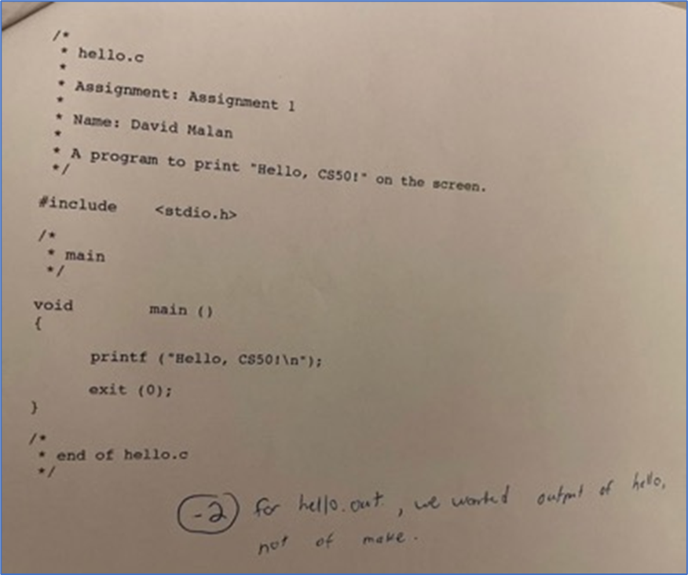

title: Introducción al Pensamiento Computacional

# Introducción al Pensamiento Computacional

## Introducción

El ser humano piensa y se comporta como tal siguiendo una secuencia lógica de acciones.
El pensamiento computacional es una habilidad fundamental en la programación y en la resolución de problemas en general.
Se basa en la aplicación de la lógica, el razonamiento y la capacidad de descomponer problemas complejos en componentes más pequeños y manejables para llegar a un resultado exitoso.

!!! info "¡Bienvenidos y Bienvenidas!"
    ¡Esta materia es más que programación de computadoras!

Resulta que la informática se trataba menos de programación que de resolución de problemas. De hecho, ¡esta materia trata sobre la resolución de problemas de una manera que es extremadamente enriquecedora! 
Es probable que tomes la resolución de problemas que aprendas aquí y que la apliques instantáneamente a tu trabajo más allá de esta clase e incluso a tu vida en general.
Sin embargo, ¡no será fácil! Estarás “bebiendo de la manguera” del conocimiento durante cada clase. Y aunque puede haber frustración por sentirse atascado o cometer errores, también habrá una gran sensación de gratificación y orgullo por hacer que algo funcione o completar alguna tarea. Te sorprenderás de lo que podrás lograr semana a semana.

Entonces, se trata mucho más de que avances a nivel personal que de alcanzar algún nivel estandarizado y generalizado a nivel colectivo. Lo que finalmente importa no es tanto dónde terminas en relación con tus compañeros de clase, sino dónde terminas en relación contigo mismo cuando comenzaste.
La consideración más importante es que te des el tiempo que necesites para aprender a lo largo del año. Todo el mundo aprende de manera diferente. 
Si algo no funciona bien al principio, debes saber que con el tiempo irás creciendo en conocimientos y mejorando tus habilidades para resolver todos los problemas que se presenten.

A lo largo de la materia aprenderás sobre Pilas Bloques, un lenguaje de programación visual.
Luego, aprenderás sobre lenguaje C. Se verá así:

``` C title="C"
#include <stdio.h>

int main(void)
{
    printf("hello, world\n");
}
```

Y aunque este código (escrito en un lenguaje de programación en lugar de un lenguaje como el castellano) parece críptico al principio, pueden pasar semanas o meses antes de que podamos comprender los conceptos principales de programación e incluso aprender nuevos idiomas.
Seguramente te estés preguntando que es críptico: un lenguaje críptico en programación es un tipo de lenguaje de programación diseñado para ser extremadamente difícil de entender o leer, generalmente con el objetivo de complicar la comprensión del código fuente por parte de otras personas.
Sin embargo, es importante destacar que el uso de lenguajes crípticos en programación no es común en el desarrollo de software convencional y no se considera una buena práctica. La legibilidad y la mantenibilidad del código son aspectos fundamentales en el desarrollo de software de calidad, y los lenguajes crípticos van en contra de estos principios al dificultar la comprensión del código por parte de otros programadores.
Así que no te preocupes, con tiempo y práctica irás sintiendo al lenguaje de programación como algo menos críptico y más natural, ¡Esa es la idea!

!!! info "Para programar, ¡Debes “hablar” en lenguaje de programación”!"

A medida que avancen las semanas, aprenderás sobre algoritmos.
Aprenderás sobre la memoria.
Aprenderás sobre el código con errores y las causas de los bloqueos de la computadora.
Aprenderás sobre estructuras de datos.
Luego, haremos la transición a un nuevo lenguaje de nivel superior llamado Python. Su código se verá algo como esto:

``` py title="Python"
print("hello, world")
```

## ¡No temas! ERES el programador. Escribe el código. Corre el código. 

Como dijimos, puede haber frustración por sentirse atascado o cometer errores, pero también habrá una gran sensación de gratificación y orgullo por hacer que algo funcione o completar alguna tarea.
De hecho, David (profesor titular de la cátedra de Computer Science en la Universidad de Harvard) perdió dos puntos en su primera tarea por no seguir todas las instrucciones correctamente.
De hecho, dos tercios de los estudiantes de CS50 en Harvard nunca antes habían tomado un curso de informática. Y seguramente (casi) ninguno de ustedes aquí tampoco lo hicieron.


