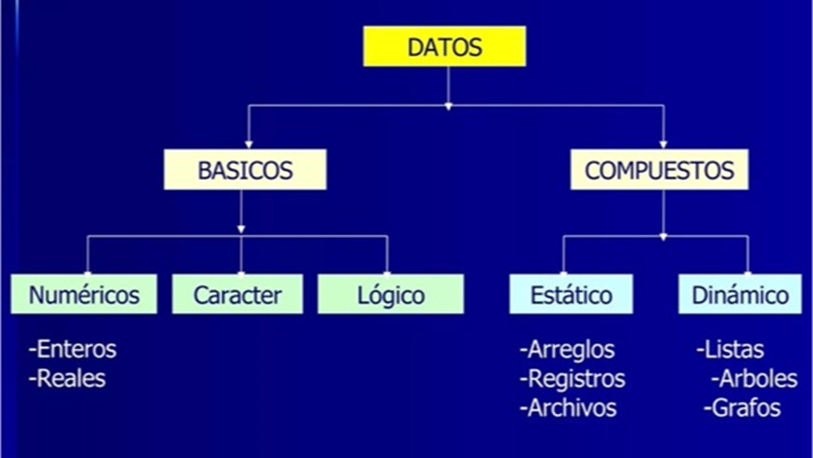
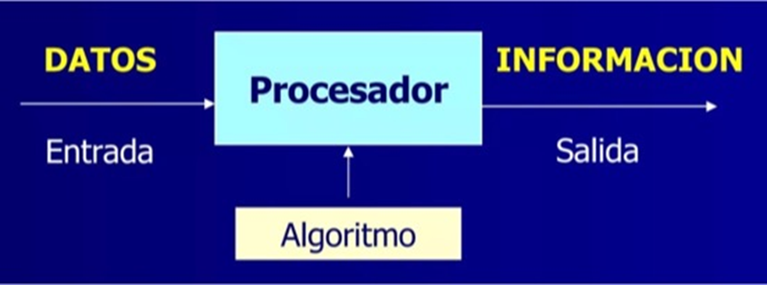

title: Representación de datos en la computadora

# Representación de datos en la computadora

## Introducción

Unario, decimal, binario. Números, texto, emojis, imágenes, videos y sonidos.

Todas estas ideas son solo ceros y unos, interpretadas y utilizadas por el software que escribiremos, para interpretarlas de la manera que queramos.

## Datos vs. Información

### Dato
Es la representación simbólica de un hecho, atributo o característica de una entidad.
Por ejemplo, nota de un alumno, nombre de un docente, color de un auto, etc.

### Información
Es un **dato útil, procesado, que adquiere significado**.
Por ejemplo, El promedio final de un alumno para un curso, el número de aprobados en un examen, el nombre de los primeros alumnos de cada especialidad por cada ciclo.

!!! info
    La información se obtiene mediante el procesamiento de los datos dentro de un contexto determinado que les otorga un significado concreto y específico.

## tipos de dato reconocidos por la computadora

{: class="center back-white border-round"}

## Procesamiento de datos

{: class="center back-white border-round"}

El procesamiento de datos puede ser:

* **Manual**
* **Mecanizada**: uso de calculadora, sumadora, etc.
* **Automatizado**: realizado por el procesador de la computadora, el cual ejecuta un conjunto de pasos previamente definidos (algoritmo)
