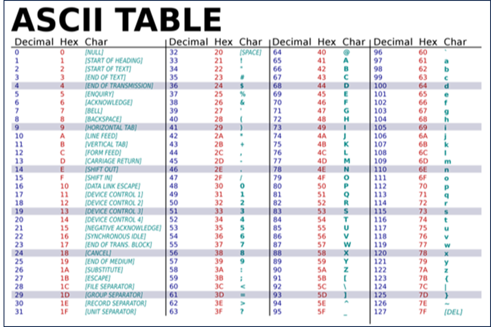
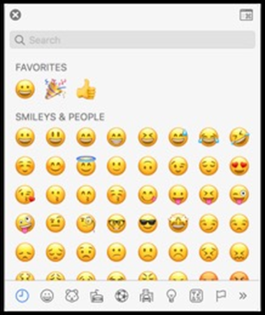

title: Sistemas de representación

## Representando números: sistema unario

Veamos un ejemplo donde necesitemos tomar asistencia para una clase. Para contar el número de alumnos, podríamos comenzar usando los dedos, uno a la vez. Este sistema se llama **sistema unario**.

El sistema unario es un sistema de numeración que **emplea un único símbolo**, como una barra o un punto, para **representar el valor “uno”**. **Los demás números se expresan mediante la repetición de este símbolo**.

El sistema unario es considerado uno de los sistemas de numeración más simples, pero también el menos eficiente en términos de representación compacta de números. Esto se debe a que para representar números más grandes se requiere una cantidad cada vez mayor de símbolos repetidos.

Por ejemplo, para representar el número tres en el sistema unario, se utilizarían tres repeticiones del símbolo elegido, mientras que para el número diez se requerirían diez repeticiones. 

```
El número 1 se representa con un único símbolo "|"
El número 2 se representa con dos símbolos "||"
El número 3 se representa con tres símbolos "|||"
El número 4 se representa con cuatro símbolos "||||"
El número 5 se representa con cinco símbolos "|||||"
```

**Cada símbolo adicional representa un incremento de uno en el valor numérico**. Así, el sistema unario puede volverse engorroso y poco práctico para representar números grandes.
Por lo tanto, este sistema solo se utiliza en algunas aplicaciones específicas, como en ciertas áreas de la informática teórica y en la lógica matemática, donde se utiliza para simplificar algunos problemas y demostraciones. Sin embargo, en la vida cotidiana y en la mayoría de los contextos prácticos, se utilizan otros sistemas de numeración más eficientes, como el **sistema decimal** o el **sistema binario**.

## Representando números: sistema decimal

Para representar **números grandes**, es preciso utilizar un sistema que posea una **mayor cantidad de símbolos distintos que representen diferentes valores** de manera más simple y práctica. 

El sistema decimal es un sistema de numeración que utiliza **diez símbolos distintos**, conocidos como **dígitos**, para representar cualquier valor. Estos dígitos son el 0, 1, 2, 3, 4, 5, 6, 7, 8 y 9. 

Este sistema se basa en el valor posicional, lo que significa que el valor de cada dígito depende de su posición en el número. Utilizando lugares de valor creciente de derecha a izquierda, cada lugar tiene un valor diez veces mayor que el lugar a su derecha. Para representar cantidades mayores que nueve, se utilizan múltiplos de diez. Entonces, decimos que el número 10 se compone de un 1 en el lugar de las decenas y un 0 en el lugar de las unidades; el número 100 se compone de un 1 en el lugar de las centenas y ceros en los lugares de las decenas y las unidades, y así sucesivamente. 

Por ejemplo, sabemos que el siguiente número en decimal representa ciento veintitrés:

```
123
```

Cada lugar de un dígito representa una potencia de diez, ya que hay diez dígitos posibles para cada lugar. El lugar más a la derecha es para 10^0^, el del medio 10^1^ y el lugar más a la izquierda 10^2^:

```
 10^2^ 10^1^ 10^0^ 
 1     2     3 
```

El 1 está en el lugar de las centenas, el 2 está en el lugar de las decenas y 3 está en el lugar de las unidades.
Así 123 es 10^2^ x 1 + 10^1^ x 2 + 10^0^ x 3 = 100 × 1 + 10 × 2 + 1 × 3 = 100 + 20 + 3 = 123

> El sistema decimal es ampliamente utilizado en todo el mundo para realizar operaciones matemáticas y expresar cantidades en la vida cotidiana.

## Representando números: sistema binario

Las computadoras funcionan con electricidad. Pueden encenderse o apagarse. Con este concepto, dentro de las computadoras modernas hay miles de millones de pequeños interruptores llamados transistores que pueden encenderse o apagarse como si fueran “lamparitas”, para representar diferentes valores. Dado que una “lamparita” no puede estar más encendida ni menos apagada, el sistema de numeración de las computadoras solo puede utilizar **dos símbolos distintos** para representar cualquier valor. 

!!! info
    Definido así, las computadoras utilizan el sistema binario, con solo dos dígitos, **0** (apagado) y **1** (encendido). 
    Cada dígito binario se llama **bit** (**bi**nary **d**igit) y es la **mínima unidad de información**.

El patrón para contar en binario con múltiples bits es el mismo que el patrón en decimal con múltiples dígitos. 
Por ejemplo, si imaginas usar una sola lamparita, esta puede contar de cero (apagada) a uno (encendida). Sin embargo, si tuvieras tres lamparitas, ¡habría más opciones de combinación! 

Entonces, usando tres lamparitas y si pensamos en sistema binario, lo siguiente representaría el 0 (cero):

```
0 0 **0**
```

Del mismo modo, lo siguiente representaría el 1 (uno):

```
0 0 **1**
```

No necesitamos los ceros iniciales, pero los incluiremos para ver los patrones más fácilmente.

Por esta lógica, como no hay un dígito para el 2, necesitaremos cambiar otro dígito del patrón para representar el siguiente número:

```
0 **1** 0
```

Extendiendo esta lógica aún más, ”agregamos 1” para representar el 3:

```
0 1 **1**
```

Siguiendo con el patrón, el 4 se representaría como:

```
**1** 0 0
```

El 5 se representaría como:

```
1 0 **1**
```

El 6 se representaría como:

```
1 **1** 0 
```

¡Podríamos, de hecho, usando solo tres lamparitas contar hasta siete!


```
1 1 **1**
```

¿Cómo puede ser que el número binario 111 represente el número decimal 7, o viceversa? ¿Cómo llegamos a esta conclusión?

Dijimos que en el sistema decimal, cada lugar de un dígito representa una potencia de diez, ya que hay diez dígitos posibles para cada lugar. Esto se denomina **base-10**. El lugar más a la derecha es para 10^0^, el del medio 10^1^ y el lugar más a la izquierda 10^2^:

```
 102 101 100 
 1   2   3 
```

Por otro lado, en el sistema binario, cada lugar de un dígito representa una potencia de 2, ya que hay dos dígitos posibles para cada valor posicional. Esto se denomina **base-2**. El lugar más a la derecha es para 2^0^, el del medio 2^1^ y el lugar más a la izquierda 2^2^:

```
 22 21 20 
 4  2  1 
```

Así el 000 binario es 22 x 0 + 21 x 0 + 20 x 0 = 4 × 0 + 2 × 0 + 1 × 0 = 0 + 0 + 0 = 0 decimal
Y el 111 binario es 22 x 1 + 21 x 1 + 20 x 1 = 4 × 1 + 2 × 1 + 1 × 1 = 4 + 2 + 1 = 7 decimal

Por lo tanto, se podría decir que se requieren tres bits (el lugar del cuatro, el lugar del dos y el lugar del uno) para representar un número tan alto como siete. Para contar más de 7, necesitaríamos otro bit a la izquierda para representar un valor entre el 8 y el 15. Y así sucesivamente, para valores más altos.

!!! info
    Las computadoras generalmente usan **ocho bits** para representar un número. Por ejemplo, el **código** o **patrón binario** 00000101 es el número 5 en decimal. 
    Estos **ocho bits** se denominan **byte**, conocido como la **mínima unidad de palabra**.

## Representanto texto: código ASCII

Así como los números son patrones binarios de unos y ceros, **¡las letras también se representan usando unos y ceros!**

Para representar letras, todo lo que tenemos que hacer es decidir cómo se asignan los números a las letras. 

Dado que existe una superposición entre los unos y los ceros que representan números y letras, algunas personas, hace muchos años, decidieron colectivamente un mapeo estándar de números a letras. La letra **A**, por ejemplo, es el número **65**, la **B** es el **66**, y así sucesivamente. En binario, la letra **A** es el código o patrón **01000001**. Al usar este código en un contexto, como el formato de archivo, diferentes programas pueden interpretar y mostrar los mismos bits como números o texto.

Este mapeo estándar, llamado **código ASCII** o estándar ASCII, se creó para asignar caracteres específicos (letras mayúsculas y minúsculas, números, puntuación y símbolos) a números específicos.

{: class="center back-white border-round"}

¡Gracias a Dios por estándares como ASCII que nos permiten estar de acuerdo con estos valores!

Cuando recibimos un mensaje de texto, mapeándolo en ASCII, obtenemos 3 patrones de bits que tienen los valores decimales 72, 73 y 33. Esos patrones se asignarían a los caracteres HI! y las secuencias de bits se verían como 01001000, 01001001 y 00100001, 8 bits (1 byte) para cada carácter:

```
 H         I         !
 72        73        33
 01001000  01001001  00100001
```

!!! info
    Con 8 bits, o 1 byte, podemos tener 28 = 256 valores diferentes (desde 0 hasta 255, el valor más alto que se puede formar con 8 bits).

Y es posible que ya estemos familiarizados con el uso de bytes como unidad de medida de datos, como en megabytes o gigabytes, para millones o miles de millones de bytes.

Otros caracteres, como letras con acentos y símbolos en otros idiomas, forman parte de un estándar llamado Unicode, que utiliza más bits que ASCII para acomodar todos estos caracteres.

> Puedes conocer más del código de caracteres ASCII [haciendo clic aquí](https://es.wikipedia.org/wiki/ASCII)

> Puedes conocer más del estándar de codificación UNICODE [haciendo clic aquí](https://es.wikipedia.org/wiki/Unicode)

## Representando emojis

A medida que pasa el tiempo, hay más y más formas de comunicarse a través de mensajes de texto.

Dado que no había suficientes dígitos en binario para representar todos los diversos caracteres que podían representar los humanos, el estándar Unicode amplió la cantidad de bits que las computadoras pueden transmitir y comprender.

Cuando recibimos un emoji , nuestra computadora en realidad solo recibe un número en binario que luego asigna a la imagen del emoji según el estándar Unicode.

Por ejemplo, el emoji de “cara con mascarilla médica” tiene solo cuatro bytes:

```
11110000 10011111 10011000 10110111
```

{: class="center back-white border-round"}

{: class="center back-white border-round"}

Hay emojis que probablemente uses todos los días, como los que están aquí representados.

Los informáticos se enfrentaron a un desafío al querer asignar varios tonos de piel a cada emoji para permitir que la comunicación se personalizara aún más. En este caso, los creadores y colaboradores de los emojis decidieron que las partes iniciales serían la estructura del emoji en sí, seguida del tono de la piel.

Cada vez se agregan más funciones al estándar Unicode para representar más caracteres y emojis.

Y resulta que las diferentes empresas que crean software para sus dispositivos tendrán imágenes ligeramente diferentes que representan cada emoji, ya que solo se han estandarizado las descripciones.

> Puedes conocer más de los Emoji [haciendo clic aquí](https://es.wikipedia.org/wiki/Emoji)

## Representando imágenes, videos y sonidos

Con bits, también podemos asignar números a colores. Hay muchos sistemas diferentes para representar los colores, pero el sistema más conocido es RGB, que representa la cantidad de rojo, verde y azul que componen a un color específico:

{: class="center back-white border-round"}

Por ejemplo, nuestro patrón de bits anterior, 72, 73 y 33, que decía HI! a través de texto, indicaría la cantidad de rojo (72), verde (73) y azul (33) en un color. Y nuestros programas sabrían que esos bits se asignan a un color (lo interpretarían como un tono claro de amarillo) si abriéramos un archivo de imagen, en lugar de recibirlos en un mensaje de texto:

{: class="center back-white border-round"}

Los puntos en nuestras pantallas se denominan píxeles, y las imágenes también se componen de muchos miles o millones de esos píxeles. 

Entonces, al usar tres bytes para representar el color de cada píxel, podemos crear imágenes. 

Podemos ver píxeles en un emoji si hacemos zoom, por ejemplo:

{: class="center back-white border-round"}

* Las imágenes son simplemente colecciones de valores RGB.

* Los videos son secuencias de muchas imágenes, que cambian varias veces por segundo para darnos la apariencia de movimiento, como lo haría un flipbook. Puedes ver un ejemplo en YouTube [haciendo clic aquí](https://www.youtube.com/watch?v=sz78_07Xg-U)
  
* La música también se puede representar con bits. MIDI es uno de esos formatos que representa la música con números para cada una de las notas y su duración y volumen. Puedes saber más sobre el estándar MIDI [hacindo clic aquí](https://es.wikipedia.org/wiki/MIDI)
