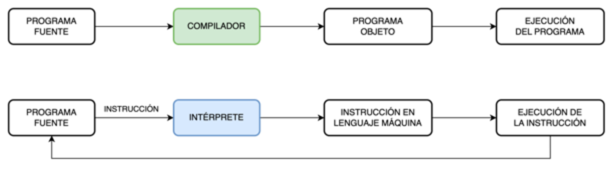

title: Lenguajes de programación

## Introducción

Un lenguaje de programación es un conjunto de reglas y símbolos utilizados para escribir programas de computadora.

Los programas escritos en un lenguaje de programación son instrucciones que le dicen a una computadora qué hacer.

Cada lenguaje de programación tiene su propia sintaxis y semántica, que determinan cómo se deben escribir y entender esas instrucciones.

## ¿Qué es un lenguaje de programación?

!!! abstract "Definición"
    Un lenguaje de programación es un lenguaje formal, artificial, formado por un conjunto de reglas gramaticales  y símbolos que le proporcionan al programador las herramientas necesarias para poder escribir una serie de instrucciones de manera ordenada, denominado programa informático, a partir de un algoritmo, con el fin de controlar el comportamiento físico y/o lógico de un sistema informático, de manera que este pueda resolver un problema de manera eficiente, devolviendo resultados procesados a partir de una serie de datos de entrada.

Los programas escritos en un lenguaje de programación son instrucciones que le dicen a una computadora qué hacer. 

Cada lenguaje de programación tiene su propia sintaxis y semántica, que determinan cómo se deben escribir esas instrucciones para que la computadora pueda ejecutarlas correctamente.

Cada lenguaje de programación tiene sus propias características y propósitos específicos. Algunos lenguajes están especializados en ciertos dominios, como el desarrollo web, el análisis de datos, la inteligencia artificial o la programación de sistemas. Otros lenguajes son más generales y se pueden utilizar en una amplia gama de aplicaciones.

Cada lenguaje tiene su propia documentación, tutoriales y recursos disponibles para ayudarte a profundizar en su estudio. 

!!! info
    recuerda que la práctica es fundamental para mejorar tus habilidades de programación.

## Teoría de los lenguajes de programación

La teoría de los lenguajes de programación es un campo de estudio que se enfoca en el diseño, la implementación, la semántica y el análisis de los lenguajes de programación. A través de la teoría de los lenguajes de programación, se busca comprender cómo los lenguajes de programación funcionan y cómo se pueden desarrollar de manera efectiva.

Algunos conceptos clave dentro de la teoría de los lenguajes de programación son:

||||
|:---:|:---:|:---:|
| Sintaxis | tipos de dato | Teoría de la complejidad |
| Semántica | Compiladores e intérpretes | Teoría de la computabilidad |
|  | Análisis léxico y análisis sintáctico |  |

La teoría de los lenguajes de programación es fundamental para comprender y desarrollar lenguajes de programación, diseñar compiladores e intérpretes, y analizar y optimizar programas. 

Ayuda a los programadores a comprender los fundamentos teóricos detrás de los lenguajes que utilizan y proporciona herramientas para abordar problemas de programación de manera más efectiva.

## Categorías de los lenguajes de programación

Los lenguajes de programación se pueden clasificar en tres categorías principales:

* **Lenguajes de bajo nivel**: estos lenguajes están más cerca del lenguaje de la máquina y proporcionan un mayor control directo sobre el hardware de la computadora. Ejemplos de lenguajes de programación de bajo nivel incluyen el lenguaje ensamblador y el lenguaje de máquina. Estos lenguajes suelen ser más difíciles de aprender y de utilizar, pero ofrecen un mayor rendimiento y eficiencia.

* **Lenguajes de alto nivel**: estos lenguajes están más alejados del lenguaje de la máquina y se centran en la facilidad de uso y la legibilidad del código. Ejemplos de lenguajes de programación de alto nivel populares incluyen Python, Java, JavaScript, C# y muchos otros. Estos lenguajes suelen ser más fáciles de aprender y de utilizar, ya que están diseñados para ser más cercanos al lenguaje humano.

* **Lenguajes de nivel intermedio**: el término "lenguaje de nivel intermedio" a menudo se utiliza para describir lenguajes que se encuentran entre los lenguajes de alto nivel y los lenguajes de bajo nivel. Estos lenguajes combinan características y elementos de ambos extremos del espectro.

!!! warning "Atención"
    Es importante tener en cuenta que el nivel de un lenguaje no es una clasificación absoluta y puede variar dependiendo del contexto y de las características específicas del lenguaje.

### Lenguajes de bajo nivel

Estos lenguajes suelen tener una correspondencia directa con las instrucciones del procesador y no proporcionan abstracciones de alto nivel.

* **Lenguaje máquina**: es el conjunto de instrucciones directamente entendibles y ejecutables por el procesador de una computadora. Estas instrucciones están escritas en código binario (0 y 1) y representan operaciones básicas a nivel de hardware, como cargar datos en registros o realizar operaciones aritméticas. Aunque el lenguaje máquina es el lenguaje de más bajo nivel, no es práctico para la programación manual debido a su complejidad y falta de legibilidad.

* **Lenguaje ensamblador (assembler)**: Es el lenguaje de más cercano al lenguaje máquina. Utiliza mnemónicos para representar las instrucciones que entiende directamente el procesador y realizar optimizaciones a nivel de bit. Es específico de la arquitectura del procesador y se utiliza para programación de bajo nivel, optimización y desarrollo de controladores de hardware. Cada instrucción ensambladora se traduce directamente a una instrucción de máquina. 

* **Lenguaje C**: aunque el lenguaje C es considerado un lenguaje de nivel intermedio, también puede ser considerado un lenguaje de bajo nivel en comparación con lenguajes de más alto nivel. C proporciona un control más cercano al hardware y permite la manipulación directa de memoria y punteros.

### Lenguajes de alto nivel

Estos lenguajes ofrecen un alto nivel de abstracción y se alejan de los detalles específicos del hardware de la computadora. Están diseñados para facilitar la programación y permitir un enfoque más orientado al problema en lugar de preocuparse por la implementación a nivel de máquina.

* **Python**: es un lenguaje ampliamente utilizado que se destaca por su sintaxis clara y legible, lo que lo hace muy accesible para principiantes. Python ofrece una amplia gama de bibliotecas y marcos de trabajo que facilitan el desarrollo rápido de aplicaciones.

* **Java**: es un lenguaje orientado a objetos. Se enfoca en la portabilidad y la capacidad de ejecutar programas en diferentes plataformas sin tener que preocuparse por los detalles de bajo nivel. Se utiliza ampliamente en el desarrollo de aplicaciones empresariales y en el desarrollo de aplicaciones para dispositivos móviles.

* **C#**: pronunciado "C sharp”, es un lenguaje de programación orientado a objetos que se utiliza comúnmente en el desarrollo de aplicaciones para Windows y el entorno .NET.

* **JavaScript**: es un lenguaje de programación de alto nivel utilizado principalmente para el desarrollo Web. JavaScript permite la interactividad en los navegadores y se ha convertido en un lenguaje fundamental para el desarrollo Web front-end.

### Lenguajes de nivel intermedio

Estos lenguajes combinan características y elementos de los lenguajes de bajo y de alto nivel, ofreciendo, generalmente, un equilibrio entre el control de bajo nivel y las abstracciones de alto nivel.

* **C**: El lenguaje C se considera a menudo un lenguaje de nivel intermedio, ya que ofrece un mayor control de bajo nivel en comparación con los lenguajes de alto nivel, como Python o Java. C permite la manipulación directa de memoria y el uso de punteros, lo que lo convierte en una opción popular para tareas que requieren un control cercano al hardware.

* **C++**: C++ es una extensión del lenguaje C que agrega características de programación orientada a objetos. Si bien C++ ofrece un nivel de abstracción más alto que el lenguaje C, también permite el control de bajo nivel y la manipulación directa de memoria y punteros, considerándolo un lenguaje de nivel intermedio.

* **Pascal**: Pascal es un lenguaje de programación estructurado que proporciona un equilibrio entre la facilidad de uso y el control de bajo nivel. Fue diseñado para fomentar la claridad y la legibilidad del código, lo que lo hace especialmente popular en entornos educativos.

* **Ada**: Ada es un lenguaje de programación de propósito general que se utiliza en aplicaciones críticas, como sistemas embebidos y aeroespaciales. Combina características de alto nivel y control de bajo nivel para garantizar la seguridad y la fiabilidad de los sistemas.

## Cada lenguaje, un lenguaje

Es importante comprender que cada lenguaje posee su propia sintaxis. En algunos casos, esta sentencia puede ser idéntica, en otros casos puede variar levemente, y en otros casos ser completamente diferente:

``` c++ title="C++"
std::cout << "Hola Mundo!" << std::endl;
```
``` py title="Pyton"
print("Hola Mundo!")
```
``` java title="Java"
System.out.println("Hola Mundo!");
```
``` php title="PHP"
echo "Hola Mundo!";
```
``` c# title="C#"
Console.WriteLine("Hola Mundo!");
```
``` js title="JavaScript"
console.log("Hola Mundo!");
```
``` ruby title="Ruby"
puts "Hola Mundo!”
```
``` go title="Go"
fmt.Println("Hola Mundo!")
```
``` swift title="Swift"
print("Hola Mundo!")
```
``` perl title="Perl"
print "Hola Mundo!\n";
```
``` r title="R"
print("Hola Mundo!")
```
``` matlab title="MATLAB"
disp('Hola Mundo!')
```

Estos son solo algunos ejemplos adicionales. Hay una amplia variedad de lenguajes de programación, cada uno con su propia sintaxis para imprimir **"Hola Mundo!"**.

## Tipos de programas según el lenguaje de programación

!!! warning "sección en desarrollo

Cada programa tiene un formato ejecutable que la computadora puede utilizar directamente para ejecutar las instrucciones. El mismo programa en su formato de código fuente legible para humanos, del cual se derivan los programas ejecutables (por ejemplo, compilados), le permite a un programador estudiar y desarrollar sus algoritmos. 

Una colección de programas de computadora y datos relacionados se conoce como software.

* PROGRAMA FUENTE: también llamado código fuente, es el conjunto de líneas de texto con los pasos que debe seguir la computadora para realizar una tarea. Este código se escribe en un lenguaje de programación que sigue uno de los paradigmas de programación y que puede ser convertido en un archivo ejecutable (usualmente llamado un programa ejecutable) por un compilador y más tarde ejecutado por una computadora.

* PROGRAMA OBJETO: Programa escrito en lenguaje de máquina. Es el que ejecuta la computadora.

## Traductores de lenguaje: compiladores vs. intérpretes

Un compilador y un intérprete son dos tipos de software usados para ejecutar programas de computadora. Traducen programas fuente a lenguaje de máquina.

Un **compilador** traduce todo el código fuente de un programa en un lenguaje de programación determinado a un lenguaje de bajo nivel, generalmente en forma de código máquina, que puede ser ejecutado directamente por el hardware de la computadora. El proceso de compilación se realiza antes de la ejecución y genera un archivo ejecutable independiente. 

El **código fuente** se compila una sola vez, lo que puede llevar más tiempo, pero el programa compilado se ejecuta de manera más eficiente. Los ejemplos de compiladores incluyen GCC para C/C++ y Java JDK para Java.

Por otro lado, un *intérprete* lee y ejecuta el código fuente de un programa línea por línea durante la ejecución. No se genera un archivo ejecutable independiente antes de la ejecución. El intérprete traduce y ejecuta cada instrucción a medida que se encuentra en el código fuente. Esto permite una ejecución más rápida del programa, pero puede llevar más tiempo en general, ya que la traducción y ejecución ocurren repetidamente durante la ejecución del programa. Los ejemplos de intérpretes incluyen Python, JavaScript y Ruby.

!!! important "¡Para recordar!"
    En resumen, un compilador traduce el código fuente a un lenguaje de bajo nivel antes de la ejecución, lo que resulta en una ejecución más eficiente, pero lleva más tiempo en la fase de compilación. Un intérprete lee y ejecuta el código fuente línea por línea durante la ejecución, lo que permite una ejecución más rápida, pero puede llevar más tiempo en general.



## Resumen

!!! Warning
    Es igual al resumen de conceptos-basicos-de-la-programacion.md

Es importante tener una **comprensión clara de los conceptos básicos de la programación**, como variables, estructuras de control de flujo, funciones y programación orientada a objetos, entre otros. 
Dedica tiempo a aprender estos conceptos y asegúrate de que los comprendes antes de avanzar.

Hay muchos lenguajes de programación diferentes para elegir, como Python, Java, JavaScript, C ++, entre otros. **Elige un lenguaje que sea adecuado para tus objetivos y que te resulte cómodo de usar**.

Busca **recursos en línea disponibles para aprender programación**, como videos de tutoriales, documentación y foros de programación. Toma ventaja de estos recursos para profundizar tu aprendizaje.

Busca **ejercicios y desafíos en línea para practicar** lo que has aprendido. Intenta resolver los ejercicios y retos por ti mismo y luego compara tu solución con la solución proporcionada.

**Trabaja en proyectos**. Es una excelente manera de aplicar lo que has aprendido y desarrollar tus habilidades de programación. Comienza con proyectos pequeños y luego aumenta gradualmente la complejidad.

La programación requiere práctica y perseverancia para dominarla. **Dedica tiempo a practicar periódicamente y no te desanimes** si encuentras obstáculos en el camino.