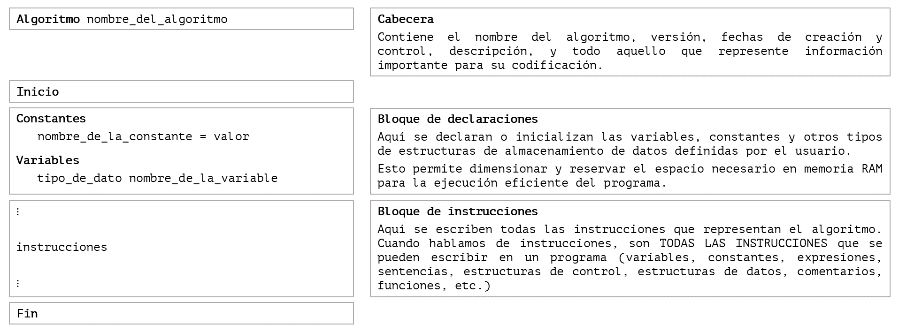
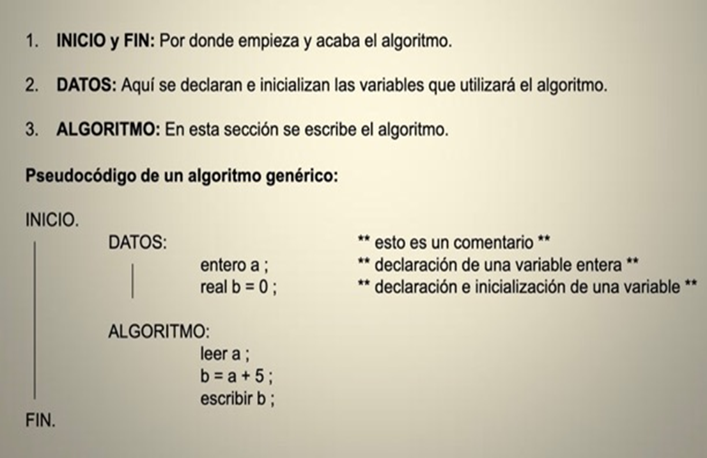

title: Conceptos básicos de pseudocódigo

## Introducción

El pseudocódigo es una herramienta valiosa en el desarrollo de software, ya que facilita la planificación, el diseño y la comunicación de algoritmos en idioma natural antes de su implementación en un lenguaje de programación real.

!!! abstract "Definición"
    El pseudocódigo es una versión legible, en lenguaje humano natural, de un algoritmo. Es decir, que es una representación de dicho algoritmo en castellano preciso (o algún otro idioma humano). Es para ser leído por personas, por lo tanto no se enfoca en detalles sintácticos.


Recordemos el problema de tratar de localizar un solo nombre en una guía telefónica impresa. 

El mejor algoritmo para resolverlo podría ser abrir la guía telefónica por la mitad, y preguntar:

“¿El nombre que estoy buscando está a la izquierda o a la derecha?” 

Decidir si el nombre estará en la mitad izquierda o derecha del libro (porque el libro está alfabetizado) y reducir el tamaño de nuestro problema a la mitad. 

Luego, repetir este proceso hasta encontrar nuestro nombre, dividiendo el problema por la mitad cada vez.

La capacidad de crear **pseudocódigo es fundamental** para el éxito en el proceso de creación de un algoritmo.

## Elementos de un algoritmo empleados en pseudocódigo

Como dijimos, **el pseudocódigo es una manera de escribir algoritmos de forma poco estricta** (con una sintaxis relajada) o estructuras de datos poco detalladas, pero **intentando acercar las ideas del algoritmo a estructuras y sintaxis parecidas a las de los lenguajes de programación** en los que vamos a programar el algoritmo.

Al ser un lenguaje de especificación de algoritmos, pero muy parecido a cualquier lenguaje de programación por lo que luego su traducción a cualquiera de estos será muy sencilla, y con la ventaja de no regirse por las normas de un lenguaje en particular, se centra más en la lógica del problema que en su implementación.

Para diseñar algoritmos en pseudocódigo, se pueden utilizar los siguientes elementos, utilizando una serie de palabras claves o palabras especiales que van a ir indicando el significado y funcionamiento del algoritmo:

* Tipos de datos
* Variables
* Constantes
* Operadores
* Expresiones
* Instrucciones

## ¿Cuál es la sintaxis de un algoritmo en pseudocódigo?

En programación, la **sintaxis** completa para escribir un algoritmo en pseudocódigo es:

``` title="pseudocódigo algoritmo: < nombre_del_algoritmo >"
[ constantes
     <declaraciones_de_constantes> ]
[ variables
     <declaraciones_de_variables> ]
[ tipos_de_datos
     <declaraciones_de_tipos_de_datos> ]
[ funciones
     <declaraciones_de_funciones> ]

inicio
   <bloque_de_sentencias>
fin
```

## Ejemplo de sintaxis de un algoritmo en pseudocódigo

El algoritmo de un programa que pida por teclado el radio de una circunferencia y muestre por pantalla el área de la misma, se puede escribir como se muestra a continuación:

``` title="pseudocódigo algoritmo: Area de una circunferencia"
constantes
   PI = 3.141592

variables
   flotante area, radio

inicio
   escribir("Introduzca el radio: ")
   radio ← ingresar valor del radio por teclado
   area ← PI * radio ** 2
   escribir("El área de la circunferencia es: " + area)
fin
```
## Estructura general de un algoritmo representado en pseudocódigo

!!! warning "Mejorar"

{: class="center back-white border-round"}

!!! success "¡Recueda!"
     Recuerda que Inicio y Fin no tienen un equivalente en código. 

     La primera línea de código indica el Inicio y la última línea de código indica el Fin del programa, aunque no tienen por qué ser la primera y la última línea en ejecutarse obligatoriamente. Esto lo vas a ir entendiendo más adelante cuando avancemos en las diferentes metodologías de programación.

