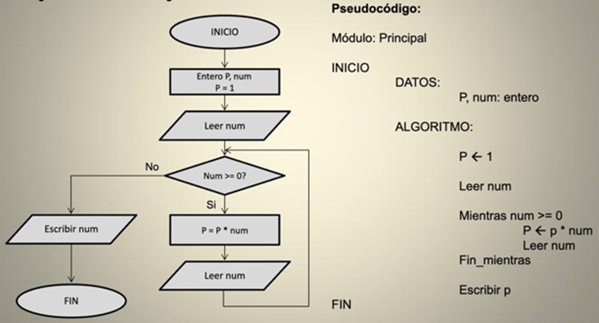

title: Sintaxis empleada en pseudocódigo

## Inicio y Fin, líneas de flujo, instrucciones, comentarios, entradas y salidas

{: class="center back-white border-round"}

``` title="Pseudocódigo"
Inicio
Declarar n1 como entero

# Solicita un número ingresado por teclado
Asignar a n1 un número ingresado por teclado

*/
Muestra en pantalla la frase compuesta por
un texto literal concatenado con el valor de la variable
/*
Imprimir en pantalla "El número ingresado es" + n1
Fin
```

!!! important "¡Para recordar!"
    Al igual que los diagramas de flujo, todo pseudocódigo tiene un **Inicio** y un **Fin**.

    Las *líneas de flujo* y los *conectores* no tienen un pseudocódigo asociado. Las primeras se representan como la continuación del _salto de línea_ que identifica el final de una instrucción y el comienzo de otra; y los segundos se identifican tácitamente siguiendo la lectura del pseudocódigo.

## Estructuras de control

Al igual en los diagramas de flujos, podemos encontrar en un pseudocódigo las siguientes estructuras de control que definen el flujo de ejecución de las instrucciones a lo largo del programa:

* Estructura de control secuencial

* Estructura de control selectiva
    * Selectiva (o alternativa) simple 
    * Selectiva (o alternativa) doble
    * Selectiva (o alternativa) doble anidada
    * Selectiva (o alternativa) múltiple
  
* Estructura de control iterativa (repetitiva)
    * Repetir Mientras (_While_) con la expresión condicional a la entrada o a la salida
    * Repetir Hasta (_Until_) con la expresión condicional a la entrada o a la salida
    * Repetir Para…Siguiente (_For…Next_)

## Estructura selectiva (o alternativa) simple

{: class="center back-white border-round"}

``` title="Pseudocódigo"
Inicio
⋮
Si (EXPRESIÓN_CONDICIONAL == VERDADERO) Entonces
	BLOQUE DE SENTENCIAS QUE SE EJECUTAN SI VERDADERO
Fin Si
⋮
Fin
```
!!! important "¡Para recordar!"
    El bloque de sentencias se ejecuta solo si la expresión condicional es verdadera.

## Estructura selectiva (o alternativa) doble

{: class="center back-white border-round"}

``` title="Pseudocódigo"
Inicio
⋮
Si (EXPRESIÓN_CONDICIONAL == VERDADERO) Entonces
	BLOQUE DE SENTENCIAS QUE 
	SE EJECUTAN SI VERDADERO
Sino
	BLOQUE DE SENTENCIAS QUE 
	SE EJECUTAN SI FALSO
Fin Si
⋮
Fin
```

!!! important "¡Para recordar!"
    Si la expresión condicional es verdadera, se ejecuta el bloque de sentencias verdadero.

    Si la expresión condicional es falsa, se ejecuta el bloque de sentencias falso.

## Estructura selectiva (o alternativa) doble anidada

!!! warning "Corregir que el else puede ser vacio"

{: class="center back-white border-round"}

``` title="Pseudocódigo" hl_lines="7-13"
Inicio
⋮
Si (EXPRESIÓN_CONDICIONAL_1 == VERDADERO) Entonces
	BLOQUE DE SENTENCIAS QUE 
	SE EJECUTAN SI_1 VERDADERO
Sino
    Si (EXPRESIÓN_CONDICIONAL_2 == VERDADERO) Entonces
		BLOQUE DE SENTENCIAS QUE 
		SE EJECUTAN SI_2 VERDADERO
	Sino
		BLOQUE DE SENTENCIAS QUE 
		SE EJECUTAN SI_2 FALSO
    Fin Si
Fin Si
⋮
Fin
```
> El bloque de sentencias resaltadas corresponde al bloque de sentencias falso de la primera estructura selectiva y contiene otra estructura selectiva.

!!! important "¡Para recordar!"
    Esta estructura puede contener tantas estructuras selectivas como sea necesario. 

    La regla de cálculo para saber la cantidad de estructuras selectivas doble necesarias es:

    CANTIDAD DE ESTRUCTURAS = CANTIDAD DE BLOQUES DE SENTENCIAS DISTINTOS – 1

    Y recuerda que el último bloque de sentencias siempre se ejecuta por el camino falso de la última estructura selectiva doble.

## Estructura selectiva (o alternativa) múltiple

{: class="center back-white border-round"}

``` title="Pseudocódigo"
Inicio
⋮
Según (EXPRESIÓN_CONDICIONAL)
   Caso 1:
      BLOQUE DE SENTENCIAS QUE SE EJECUTAN
      SI EXP. CONDICIONAL == Caso 1
   Fin Caso 1
   Caso 2:
      BLOQUE DE SENTENCIAS QUE SE EJECUTAN
      SI EXP. CONDICIONAL == Caso 2
   Fin Caso 2
   ⋮
   Caso n:
      BLOQUE DE SENTENCIAS QUE SE EJECUTAN
      SI EXP. CONDICIONAL == Caso n
   Fin Caso n

   Caso por Defecto:
      BLOQUE DE SENTENCIAS QUE SE EJECUTAN
      SI EXP. CONDICIONAL != Todos los Casos
   Fin Caso por Defecto
Fin Según
⋮
Fin
```

!!! important "¡Para recordar!"
    Esta estructura puede contener tantos casos como sean necesarios. 

    Puede caber la posibilidad que exista un bloque de sentencias por defecto (default) que se ejecute en el caso que la expresión condicional no valide ninguno de los casos existentes. 

## Estructura iterativa (o repetitiva) _Mientras (While)_ con la condición a la entrada

{: class="center back-white border-round"}

``` title="Pseudocódigo"
Inicio
⋮
Repetir Mientras (EXPRESIÓN_CONDICIONAL == VERDADERO)
	BLOQUE DE SENTENCIAS QUE SE EJECUTA (UNA Y OTRA VEZ)
	MIENTRAS LA EXPRESIÓN CONDICIONAL ES VERDADERA
Fin Repetir
⋮
Fin
```

!!! important "¡Para recordar!"
    Al evaluarse la expresión condicional al principio del bucle, antes de ejecutar por primera vez el bloque de sentencias, si esta no es válida (falso), nunca será ejecutado el bloque de sentencias.

    Por lo tanto, esta estructura con la condición a la entrada se utiliza obligatoriamente en el caso de que exista la posibilidad de que el bucle pueda no ejecutarse nunca (es decir, ejecutarse 0 veces). Pero, en caso de ser válida la expresión condicional, las sucesivas repeticiones dependerán del resultado de esta, en cada repetición.

## Estructura iterativa (o repetitiva) _Mientras (While)_ con la condición a la salida

{: class="center back-white border-round"}

``` title="Pseudocódigo"
Inicio
⋮
Hacer
	BLOQUE DE SENTENCIAS QUE SE EJECUTA AL MENOS UNA VEZ
	(Y LUEGO, TAL VEZ UNA Y OTRA VEZ)
	MIENTRAS LA EXPRESIÓN CONDICIONAL ES VERDADERA
Repetir Mientras (EXPRESIÓN_CONDICIONAL == VERDADERO)
⋮
Fin
```

!!! important "¡Para recordar!"
    Al evaluarse la expresión condicional al final del bucle, el bloque de sentencias se ejecuta al menos una vez, incluso aunque luego el resultado de la expresión condicional no sea válido (falso).
    
    Por lo tanto, esta estructura con la condición a la salida se utiliza obligatoriamente en el caso de que el bucle deba ejecutarse, si o si, una vez. Luego, las sucesivas repeticiones dependerán del resultado de la expresión condicional en cada repetición.

    Cuando NO se conoce el número de repeticiones del bucle, se usa esta estructura.

## Estructura iterativa (o repetitiva) _Hasta (Until)_ con la condición a la entrada

{: class="center back-white border-round"}

``` title="Pseudocódigo"
Inicio
⋮
Repetir Hasta (EXPRESIÓN_CONDICIONAL == VERDADERO)
	BLOQUE DE SENTENCIAS QUE SE EJECUTA (UNA Y OTRA VEZ)
	HASTA QUE LA EXPRESIÓN CONDICIONAL ES VERDADERA
Fin Repetir
⋮
Fin
```

!!! important "¡Para recordar!"
    Al evaluarse la expresión condicional al principio del bucle, antes de ejecutar por primera vez el bloque de sentencias, si esta ES válida (verdadero), nunca será ejecutado el bloque de sentencias.

    Por lo tanto, esta estructura con la condición a la entrada se utiliza obligatoriamente en el caso de que exista la posibilidad de que el bucle pueda no ejecutarse nunca (es decir, ejecutarse 0 veces). Pero, en caso de NO ser válida la expresión condicional, las sucesivas repeticiones dependerán del resultado de esta, en cada repetición.

    Cuando NO se conoce el número de repeticiones del bucle, se usa esta estructura.

## Estructura iterativa (o repetitiva) _Hasta (Until)_ con la condición a la salida

{: class="center back-white border-round"}

``` title="Pseudocódigo"
Inicio
⋮
Hacer
	BLOQUE DE SENTENCIAS QUE SE EJECUTA AL MENOS UNA VEZ
	(Y LUEGO, TAL VEZ UNA Y OTRA VEZ)
	HASTA QUE LA EXPRESIÓN CONDICIONAL ES VERDADERA
Repetir Hasta (EXPRESIÓN_CONDICIONAL == VERDADERO)
⋮
Fin
```

!!! important "¡Para recordar!"
    Al evaluarse la expresión condicional al final del bucle, el bloque de sentencias se ejecuta al menos una vez, incluso aunque luego el resultado de la expresión condicional SI sea válido (verdadero).

    Por lo tanto, esta estructura con la condición a la salida se utiliza obligatoriamente en el caso de que el bucle deba ejecutarse, si o si, una vez. Luego, las sucesivas repeticiones dependerán del resultado de la expresión condicional en cada repetición.

    Cuando NO se conoce el número de repeticiones del bucle, se usa esta estructura.

## Estructura iterativa (o repetitiva) _Para…Siguiente (For…Next)_

{: class="center back-white border-round"}

``` title="Pseudocódigo"

# Vi = Valor_inicial
# Vc = Valor_de_control
# EXPRESIÓN_CONDICIONAL: Es una expresión evaluada respecto de Vc

Inicio
⋮
Para Vc = Vi ; EXPRESIÓN_CONDICIONAL == VERDADERO ; Vc = Siguiente_Vc
	BLOQUE DE SENTENCIAS QUE SE EJECUTA (UNA Y OTRA VEZ)
	HASTA QUE LA EXPRESIÓN CONDICIONAL ES FALSA
Siguiente_Vc
⋮
Fin
```

!!! important "¡Para recordar!"
    A diferencia de las estructuras anteriores donde, según el caso, no se ejecutaban nunca o lo hacían, si o si, al menos una vez, el espíritu de esta estructura es el de SI ejecutarse siempre, y el de hacerlo un número conocido de veces.

    Se asigna un valor inicial a la variable de control, que debe cumplir con la expresión condicional que controla la cantidad de repeticiones del bloque de sentencias.

    Tras cada ejecución de dicho bloque, a la variable de control se le asignará el siguiente valor de control y se volverá a efectuar la validación de la expresión condicional.

    Este procedimiento se continuará repitiendo hasta que el valor de la variable de control no valide la expresión condicional (verdadero). 

    Cuando SI se conoce el número de repeticiones del bucle, se usa esta estructura.

## Ejemplo de conversión de diagrama de flujo a pseudocódigo

!!! warning "mejorar"

Mostrar el producto de números enteros positivos entrados por teclado hasta el ingreso de un número negativo.



## Ejemplo de resolución de un problema con pseudocódigo

!!! warning "Completar y embellecer"

!!! question "¿Cómo podemos encontrar a una persona en la guía telefónica?

``` pseudo title="Pseudocódigo"
Inicio
    Recoger guía telefónica
    Abrir la guía telefónica en el medio
    Mira la página
    Si la persona está en la página entonces
       Llamar a la persona
    Si no, si la persona está antes de la página abierta en la guía entonces
       Abrir en el medio de la mitad izquierda previamente abierta
       Ir a la línea 3
    Si no, si la persona está después de la página abierta en la guía entonces
       Abrir en el medio de la mitad derecha previamente abierta
       Ir a la línea 3
    Si no
       Indicar que la persona no se encuentra en la guía
    Fin Si
Fin
```

Hay que tener en cuenta que el lenguaje dentro de nuestro pseudocódigo tiene algunas características únicas:

Primero, algunas de estas líneas comienzan con acciones o verbos como recoger, abrir, llamar, mirar, indicar. Más adelante, llamaremos a estos verbos  funciones.

Segundo, observa que algunas líneas incluyen declaraciones como Si o Si no. Estas, se denominan condicionales y representan ramas que conducen a diferentes caminos, como bifurcaciones en el flujo de ejecución del programa.

Tercero, lugar, observa cómo hay expresiones que pueden declararse como verdaderas o falsas, como “si la persona está antes de la página abierta en la guía”. Llamamos a estas expresiones booleanas.

Finalmente, observa la declaración ”Ir a la línea 3”. Llamamos a esta declaración bucle, que permite crear ciclos, donde podemos repetir partes de nuestro programa.

No te olvides que todo programa tiene un INICIO y un FIN.

Con estos pasos, revisamos la página del medio, decidimos qué hacer y repetimos el proceso. Si la persona no está en la página y no quedan más páginas en el libro, entonces nos detenemos. Y ese último caso es particularmente importante de recordar: cuando los programas o el código no incluyen ese caso final, puede parecer que se congelan o dejan de responder, o continúan repitiendo el mismo trabajo una y otra vez sin lograr ningún progreso.


## Ventajas de escribir primero en pseudocódigo

El pseudocódigo es un lenguaje intermedio entre el lenguaje natural humano y el lenguaje de programación real, principalmente utilizado en la etapa de diseño y planificación de algoritmos. 

Aunque no es un lenguaje de programación formal, sirve como una herramienta útil para describir el flujo de un algoritmo de manera clara y comprensible antes de ser implementado en un lenguaje de programación específico.

Aquí hay algunas razones por las que se utiliza el pseudocódigo:


* **Diseño de algoritmos**: el pseudocódigo permite a los desarrolladores diseñar algoritmos paso a paso de manera estructurada y comprensible. Ayuda a visualizar el flujo de control, la secuencia de acciones y las estructuras de datos necesarias para resolver un problema.

* **Comunicación y colaboración**: el pseudocódigo proporciona un medio de comunicación entre los miembros de un equipo de desarrollo o entre un programador y un cliente. Al describir el algoritmo en un lenguaje más cercano al inglés u otro idioma natural, se facilita la comprensión y la revisión conjunta.

* **Documentación**: el pseudocódigo también se utiliza para documentar algoritmos. Puede servir como una referencia para otros desarrolladores que trabajen en el mismo proyecto en el futuro, ayudándoles a comprender la lógica y la estructura del algoritmo.

* **Flexibilidad**: el pseudocódigo no está vinculado a un lenguaje de programación específico, lo que proporciona flexibilidad al programador. Puede ser utilizado como base para implementar un algoritmo en diferentes lenguajes de programación, según las necesidades o preferencias del desarrollador.

* **Enseñanza y aprendizaje**: el pseudocódigo se utiliza ampliamente en la enseñanza de programación, especialmente para principiantes. Permite a los estudiantes centrarse en los conceptos y la lógica detrás de un algoritmo antes de preocuparse por la sintaxis y los detalles de un lenguaje de programación en particular.

